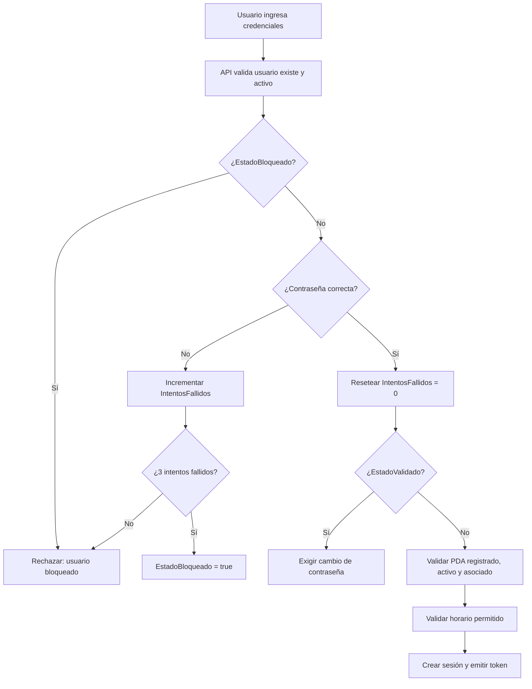
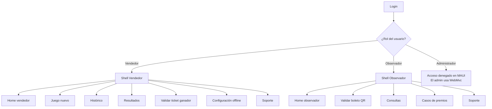

# Plan de Desarrollo — NewRich

> **Versión:** 1.0  
> **Fecha:** 2026-09-06  
> **Autor:** Plan generado con asistencia de IA (Gemini)  
> **Estado:** Pendiente de revisión por el usuario

---

## 1. Contexto y decisiones técnicas

### 1.1. Stack tecnológico confirmado

| Componente | Tecnología | Versión |
| --- | --- | --- |
| Lenguaje principal | C# | .NET 10 (SDK 10.0.301) |
| Aplicación administrador | ASP.NET Core MVC | .NET 10 |
| API central | ASP.NET Core Web API | .NET 10 |
| Aplicación móvil (Vendedor + Observador) | .NET MAUI (Multi-platform App UI) — una sola app que muestra UI según el perfil | .NET 10 |
| Base de datos | Microsoft SQL Server 2025 | Enterprise Developer Edition (17.0.1000.7) |
| Servidor BD | `localhost` | Autenticación de Windows (Integrated Security) |
| Herramienta BD | SQL Server Management Studio | 22.7.2 |
| Servidor web | IIS (despliegue) | — |
| Impresión | Impresora térmica integrada del PDA | — |
| QR | Generación y lectura QR | — |
| Seguridad | HTTPS/TLS + autenticación + criptografía | — |

### 1.2. Decisiones de arquitectura

- **Arquitectura en capas** según la skill `swapuestas-mvc-layered-architecture`:

```text
src/
  NewRich.WebMvc/          → Administrador (ASP.NET Core MVC)
  NewRich.Api/             → API central (ASP.NET Core Web API)
  NewRich.Application/     → Casos de uso, DTOs, interfaces
  NewRich.Domain/          → Entidades, reglas de negocio, enums
  NewRich.Infrastructure/  → Persistencia EF Core, repositorios, SQL Server
  NewRich.Shared/          → Constantes, helpers, resultados
tests/
  NewRich.UnitTests/
  NewRich.IntegrationTests/
```

- **Flujo de datos:** `WebMvc/MAUI → Api → Application → Domain` con `Infrastructure → Application y Domain`.
- **Una sola aplicación MAUI** para vendedor y observador. Al autenticarse, la app detecta el rol del usuario y muestra las vistas correspondientes (Vendedor u Observador).
- **SQL Server es la fuente central definitiva.** El PDA con MAUI usa una base local Lite solo para códigos offline preasignados (A5), nunca como autoridad.
- **Entity Framework Core** como mecanismo de persistencia estándar para la API → SQL Server.
- **Autenticación de Windows (Integrated Security)** para la conexión de la aplicación a SQL Server: `Server=localhost;Database=NewRich;Trusted_Connection=True;TrustServerCertificate=True;`.

---

## 2. Fase 0 — Preparación del entorno

### 2.1. Verificaciones iniciales

| # | Tarea | Comando / Acción | Criterio de éxito |
| --- | --- | --- | --- |
| 0.1 | Verificar SDK .NET | `dotnet --list-sdks` | SDK 10.0.301 visible |
| 0.2 | Verificar SQL Server | `sqlcmd -S localhost -E -C -Q "SELECT @@VERSION"` | SQL Server 2025 Enterprise Developer Edition responde |
| 0.3 | Verificar acceso con autenticación de Windows | Conectar desde SSMS con `localhost` y Windows Auth | Conexión exitosa |
| 0.4 | Crear carpeta `src/` y `tests/` | `mkdir src tests` | Carpetas creadas |

### 2.2. Creación de la solución .NET

```bash
dotnet new sln -n NewRich
dotnet new classlib -n NewRich.Domain -o src/NewRich.Domain
dotnet new classlib -n NewRich.Application -o src/NewRich.Application
dotnet new classlib -n NewRich.Infrastructure -o src/NewRich.Infrastructure
dotnet new classlib -n NewRich.Shared -o src/NewRich.Shared
dotnet new webapi -n NewRich.Api -o src/NewRich.Api
dotnet new mvc -n NewRich.WebMvc -o src/NewRich.WebMvc
dotnet new xunit -n NewRich.UnitTests -o tests/NewRich.UnitTests
dotnet new xunit -n NewRich.IntegrationTests -o tests/NewRich.IntegrationTests
dotnet new maui -n NewRich.Maui -o src/NewRich.Maui
```

**Referencias entre proyectos:**

```text
NewRich.Application → NewRich.Domain, NewRich.Shared
NewRich.Infrastructure → NewRich.Application, NewRich.Domain, NewRich.Shared
NewRich.Api → NewRich.Application, NewRich.Infrastructure, NewRich.Shared
NewRich.WebMvc → NewRich.Application, NewRich.Shared
NewRich.Maui → NewRich.Application, NewRich.Shared
NewRich.UnitTests → NewRich.Domain, NewRich.Application
NewRich.IntegrationTests → NewRich.Infrastructure, NewRich.Application
```

**Paquetes NuGet necesarios:**

| Proyecto | Paquete |
| --- | --- |
| NewRich.Infrastructure | `Microsoft.EntityFrameworkCore.SqlServer` (versión compatible con .NET 10) |
| NewRich.Infrastructure | `Microsoft.EntityFrameworkCore.Design` |
| NewRich.Infrastructure | `Microsoft.EntityFrameworkCore.Tools` |
| NewRich.Api | `Microsoft.AspNetCore.Authentication.JwtBearer` |
| NewRich.Api | `Swashbuckle.AspNetCore` (Swagger) |
| NewRich.WebMvc | `Microsoft.AspNetCore.Authentication.Cookies` (incluido en MVC) |
| NewRich.UnitTests | `xunit`, `Moq`, `FluentAssertions` |
| NewRich.IntegrationTests | `Microsoft.EntityFrameworkCore.InMemory` o `Testcontainers` |

---

## 3. Fase 1 — Base de datos (PRIMERA ENTREGA)

> **Objetivo:** Crear la base de datos `NewRich` en SQL Server 2025 con todas las tablas, restricciones, índices y procedimientos almacenados necesarios para las apuestas A1-A6.

### 3.1. Creación de la base de datos

```sql
-- Script: 001_CreateDatabase.sql
IF DB_ID(N'NewRich') IS NULL
BEGIN
    CREATE DATABASE NewRich;
END
GO

USE NewRich;
GO
```

**Cadena de conexión (appsettings.json):**

```json
{
  "ConnectionStrings": {
    "NewRichDatabase": "Server=localhost;Database=NewRich;Trusted_Connection=True;TrustServerCertificate=True;"
  }
}
```

> **Nota:** `TrustServerCertificate=True` es necesario porque SQL Server 2025 usa cifrado SSL por defecto y el certificado local no es emitido por una CA de confianza. En producción se debe usar un certificado válido y eliminar esta opción.

### 3.2. Esquema de base de datos

#### 3.2.1. Tablas de identidad y acceso

| Tabla | Columnas principales | Restricciones |
| --- | --- | --- |
| `Usuarios` | `UsuarioId` (GUID PK), `NombreCompleto`, `Usuario`, `Alias`, `Documento`, `Celular`, `Email`, `PasswordHash`, `PasswordSalt`, `Rol` (enum), `Estado` (Activo/Inactivo), `EstadoValidado` (bit), `EstadoBloqueado` (bit), `IntentosFallidos` (int), `FechaCreacion`, `FechaUltimoAcceso` | `UNIQUE(Usuario)`, `UNIQUE(Documento)` |
| `Roles` | `RolId` (int PK), `Nombre` | `UNIQUE(Nombre)` |
| `UsuariosRoles` | `UsuarioId` (FK), `RolId` (FK) | `PK(UsuarioId, RolId)` |
| `Sesiones` | `SesionId` (GUID PK), `UsuarioId` (FK), `Token`, `FechaInicio`, `FechaExpiracion`, `Activa` (bit), `DispositivoId` (FK nullable) | Índice en `Token` |
| `IntentosFallidos` | `IntentoId` (int PK identity), `UsuarioId` (FK), `FechaIntento`, `Exitoso` (bit) | Índice en `UsuarioId` |
| `Grupos` | `GrupoId` (GUID PK), `Nombre`, `Descripcion`, `FechaCreacion` | `UNIQUE(Nombre)` |
| `UsuariosGrupos` | `UsuarioId` (FK), `GrupoId` (FK) | `PK(UsuarioId, GrupoId)` |

#### 3.2.2. Tablas de dispositivos

| Tabla | Columnas principales | Restricciones |
| --- | --- | --- |
| `Dispositivos` | `DispositivoId` (GUID PK), `CodigoDispositivo` (ej. `PDA-042`), `Tipo` (Vendedor/Observador), `Estado` (Activo/Inactivo), `Modelo`, `NumeroSerie`, `CapacidadCodigosOffline` (int, 3000-5000), `FechaRegistro` | `UNIQUE(CodigoDispositivo)`, `UNIQUE(NumeroSerie)` |
| `DispositivosUsuarios` | `DispositivoId` (FK), `UsuarioId` (FK), `FechaAsociacion`, `Activo` (bit) | `PK(DispositivoId, UsuarioId)` |

#### 3.2.3. Tablas de juego y ventas

| Tabla | Columnas principales | Restricciones |
| --- | --- | --- |
| `Loterias` | `LoteriaId` (GUID PK), `Nombre`, `Estado` (Activo/Inactivo), `FechaCreacion` | `UNIQUE(Nombre)` |
| `Ventas` | `VentaId` (GUID PK), `UsuarioId` (FK vendedor), `DispositivoId` (FK), `FechaVenta`, `Total`, `TipoApuesta` (COMBINADA/INDIVIDUAL), `EstadoSincronizacion` | Índice en `FechaVenta`, `UsuarioId` |
| `Boletos` | `BoletoId` (GUID PK), `VentaId` (FK), `CodigoPublico` (char(7)), `ClaveValidacionHash`, `EstadoBoleto` (enum), `EstadoDelPremio` (enum nullable), `FechaEntregaPremio` (nullable), `FechaCreacion`, `VigenciaDias` (int) | `UNIQUE(CodigoPublico)`, índice en `EstadoBoleto` |
| `Juegos` | `JuegoId` (GUID PK), `BoletoId` (FK), `Numero` (char(4)), `Valor` (decimal), `TipoJuego` (COMBINADA/INDIVIDUAL) | Índice en `Numero` |
| `JuegoLoteria` | `JuegoId` (FK), `LoteriaId` (FK) | `PK(JuegoId, LoteriaId)` |
| `EstadosBoleto` | `EstadoBoletoId` (int PK), `Nombre` (Por jugar, Jugado, Ganador, No ganador, Vencido, Pagado/cobrado, Premio entregado) | `UNIQUE(Nombre)` |
| `NumerosGanadores` | `NumeroGanadorId` (GUID PK), `LoteriaId` (FK), `FechaJuego` (date), `Numero` (char(4)), `FechaRegistro` | **`UNIQUE(FechaJuego, LoteriaId)`** — restricción crítica |

#### 3.2.4. Tablas de seguridad de boleto

| Tabla | Columnas principales | Restricciones |
| --- | --- | --- |
| `ClavesValidacionBoleto` | `ClaveId` (GUID PK), `BoletoId` (FK), `ClaveHash` (hash de la clave de validación), `Version` (int), `IdentificadorClave` (GUID), `FechaCreacion` | `UNIQUE(BoletoId)`, `UNIQUE(IdentificadorClave)` |
| `CodigosPreventaOffline` | `CodigoId` (GUID PK), `ConsecutivoUnico` (string, clave única — ej. `NR-000001`), `UsuarioId` (FK), `DispositivoId` (FK), `PayloadCifrado` (varbinary), `EstadoDelCodigo` (Generado/Descargado/Utilizado/Registrado), `FechaCreacion`, `FechaDescarga` (nullable), `FechaVentaOffline` (nullable), `FechaRegistro` (nullable), `AdminQueRegistro` (FK nullable), `VentaId` (FK nullable) | **`UNIQUE(ConsecutivoUnico)`** — único en toda la aplicación, índice en `EstadoDelCodigo`, `UsuarioId`, `DispositivoId` |

#### 3.2.5. Tablas de configuración y operación

| Tabla | Columnas principales | Restricciones |
| --- | --- | --- |
| `Configuraciones` | `ConfiguracionId` (GUID PK), `Clave` (ej. `HoraCierre`, `VigenciaPremiosDias`, `MaxJuegosCombinada`, `MaxLineasIndividual`, `AlertaRepeticionNumero`, `AlertaValorMinimo`), `Valor`, `FechaActualizacion` | `UNIQUE(Clave)` |
| `Notificaciones` | `NotificacionId` (GUID PK), `UsuarioId` (FK), `Tipo` (enum), `Mensaje`, `Leida` (bit), `FechaCreacion` | Índice en `UsuarioId`, `Leida` |
| `Sincronizaciones` | `SincronizacionId` (GUID PK), `DispositivoId` (FK), `FechaSincronizacion`, `Tipo` (enum), `Resultado` | Índice en `DispositivoId` |

#### 3.2.6. Tablas de soporte (chat)

| Tabla | Columnas principales | Restricciones |
| --- | --- | --- |
| `Conversaciones` | `ConversacionId` (GUID PK), `UsuarioIniciadorId` (FK), `UsuarioDestinoId` (FK), `FechaInicio`, `FechaCierre` (nullable), `Estado` (Abierta/Cerrada) | Índice en `UsuarioIniciadorId`, `UsuarioDestinoId` |
| `Mensajes` | `MensajeId` (GUID PK), `ConversacionId` (FK), `UsuarioEmisorId` (FK), `Texto`, `FechaEnvio`, `Permanente` (bit — para evidencia offline) | Índice en `ConversacionId` |
| `AdjuntosChat` | `AdjuntoId` (GUID PK), `MensajeId` (FK), `RutaArchivo`, `NombreOriginal`, `FechaCarga` | Índice en `MensajeId` |

#### 3.2.7. Tablas de premios (A6)

| Tabla | Columnas principales | Restricciones |
| --- | --- | --- |
| `CasosGanadores` | `CasoId` (GUID PK), `BoletoId` (FK), `TicketCode` (char(7)), `Estado` (Reportado/Validado/Asignado/EnProceso/Registrado/Rechazado), `FechaReporte`, `FechaValidacionAdmin` (nullable), `FechaAsignacion` (nullable), `FechaRegistro` (nullable), `VendedorQueReporto` (FK), `AdminQueValido` (FK nullable), `ObservadorAsignado` (FK nullable), `AdminQueAsigno` (FK nullable) | `UNIQUE(BoletoId)` — un boleto solo puede tener un caso |
| `EntregasGanadores` | `EntregaId` (GUID PK), `CasoId` (FK), `NombreGanador`, `ApellidoGanador`, `NumeroContacto`, `LugarGano`, `NombreVendedor`, `ValorTotalGanado` (decimal), `PersonaQueEntrega` (FK → Usuarios), `FechaEntrega` | `UNIQUE(CasoId)` |
| `EvidenciasGanador` | `EvidenciaId` (GUID PK), `EntregaId` (FK), `TipoEvidencia` (TicketConQR/GanadorConTicket/CedulaIdentidad), `RutaImagen`, `FechaCaptura` | Índice en `EntregaId` |

### 3.3. Índices y restricciones críticas

| Restricción | Tabla | Propósito |
| --- | --- | --- |
| `UNIQUE(CodigoPublico)` | `Boletos` | Impide códigos duplicados de 7 dígitos |
| `UNIQUE(FechaJuego, LoteriaId)` | `NumerosGanadores` | Solo un ganador por lotería y fecha |
| `UNIQUE(BoletoId)` | `CasosGanadores` | Un boleto solo puede tener un caso de premio |
| `UNIQUE(ConsecutivoUnico)` | `CodigosPreventaOffline` | Consecutivo único e inmutable del código offline, visible en la tirilla |
| `UNIQUE(Usuario)` | `Usuarios` | Nombres de usuario únicos |
| `UNIQUE(CodigoDispositivo)` | `Dispositivos` | Códigos de PDA únicos |
| Índice `(FechaVenta, UsuarioId)` | `Ventas` | Consultas de ventas por período y vendedor |
| Índice `(Numero)` | `Juegos` | Búsqueda por número apostado |
| Índice `(EstadoDelCodigo, UsuarioId, DispositivoId)` | `CodigosPreventaOffline` | Consultas de códigos offline |

### 3.4. Procedimientos almacenados

| Procedimiento | Responsabilidad |
| --- | --- |
| `sp_ConfirmarVenta` | Transacción atómica: registra venta, boleto, juegos, genera código público único (con reintento ante colisión), genera clave de validación y guarda su hash |
| `sp_RegistrarResultado` | Registra número ganador validando `UNIQUE(FechaJuego, LoteriaId)` |
| `sp_ValidarBoletoQR` | Descifra/valida payload QR, verifica boleto, código, hash de clave, vigencia y estado de cobro |
| `sp_RegistrarCodigoOffline` | Registra venta offline escaneada: crea venta, boleto, actualiza estado del código a `Registrado` |
| `sp_GenerarCodigosOffline` | Genera N códigos offline con payload cifrado para un usuario/PDA |
| `sp_DesbloquearUsuario` | Pone `EstadoBloqueado = false`, `EstadoValidado = true`, resetea intentos fallidos, cierra sesiones |
| `sp_RestablecerContrasena` | Genera contraseña temporal, pone `EstadoValidado = true`, cierra sesiones |
| `sp_CambiarGrupoVendedor` | Reemplaza grupo del vendedor conservando histórico |
| `sp_EliminarUsuario` | Eliminación en cascada: accesos, PDA, ventas, boletos, juegos, relaciones |
| `sp_RegistrarEntregaPremio` | Transacción: crea entrega, marca boleto `Premio entregado`, actualiza caso a `Registrado` |

### 3.5. Scripts de migración

Los scripts SQL se organizan en `src/NewRich.Infrastructure/Persistence/Migrations/`:

```text
001_CreateDatabase.sql
002_CreateIdentityTables.sql
003_CreateDeviceTables.sql
004_CreateLotteryAndSalesTables.sql
005_CreateTicketSecurityTables.sql
006_CreateOfflineCodeTables.sql
007_CreateConfigurationTables.sql
008_CreateSupportChatTables.sql
009_CreatePrizeTables.sql
010_CreateStoredProcedures.sql
011_CreateIndexes.sql
012_SeedData.sql
```

> **Regla:** Nunca modificar una migración aplicada. Crear una nueva migración para cada cambio de esquema.

### 3.6. Datos semilla (Seed)

| Tabla | Datos |
| --- | --- |
| `Roles` | `Administrador`, `Vendedor`, `Observador` |
| `EstadosBoleto` | `Por jugar`, `Jugado`, `Ganador`, `No ganador`, `Vencido`, `Pagado/cobrado`, `Premio entregado` |
| `Configuraciones` | `HoraCierre = 20:00:00`, `VigenciaPremiosDias = 30`, `MaxJuegosCombinada = 1`, `MaxLineasIndividual = 6`, `AlertaRepeticionNumero = 10`, `AlertaValorMinimo = 0` |
| `Loterias` | `Bogotá`, `Medellín`, `Cali`, `Armenia`, `Pasto` |
| `Grupos` | `Grupo Norte`, `Grupo Sur`, `Grupo Centro` |
| `Usuarios` | Un administrador inicial con contraseña temporal (hash seguro) |

---

## 4. Fase 2 — Seguridad de autenticación

> **Objetivo:** Documentar e implementar todas las capas de seguridad del sistema.

### 4.1. Autenticación de Windows para SQL Server

| Aspecto | Detalle |
| --- | --- |
| **Mecanismo** | Integrated Security (`Trusted_Connection=True`) |
| **Cadena de conexión** | `Server=localhost;Database=NewRich;Trusted_Connection=True;TrustServerCertificate=True;` |
| **Usuario** | El usuario de Windows que ejecuta el proceso (IIS AppPool o consola de desarrollo) |
| **Ventaja** | No se almacenan credenciales SQL en archivos de configuración |
| **Riesgo** | El usuario de Windows debe tener permisos mínimos sobre la BD (no `sysadmin`) |
| **Recomendación** | Crear un login de Windows dedicado (ej. `IIS APPPOOL\NewRichAppPool`) con permisos `db_datareader`, `db_datawriter`, `db_ddladmin` sobre `NewRich` |

**Script de permisos mínimos:**

```sql
-- Crear login para el AppPool de IIS (ejecutar como sysadmin)
USE [master];
GO
CREATE LOGIN [IIS APPPOOL\NewRich] FROM WINDOWS;
GO

USE [NewRich];
GO
CREATE USER [IIS APPPOOL\NewRich] FOR LOGIN [IIS APPPOOL\NewRich];
GO
ALTER ROLE db_datareader ADD MEMBER [IIS APPPOOL\NewRich];
ALTER ROLE db_datawriter ADD MEMBER [IIS APPPOOL\NewRich];
ALTER ROLE db_ddladmin ADD MEMBER [IIS APPPOOL\NewRich];
GO
```

### 4.2. Autenticación de usuarios de la aplicación

#### 4.2.1. Almacenamiento de contraseñas

| Aspecto | Decisión |
| --- | --- |
| **Algoritmo** | PBKDF2 (Rfc2898DeriveBytes) con 100.000 iteraciones o superior |
| **Sal** | Salt aleatorio de 16 bytes por usuario |
| **Almacenamiento** | `PasswordHash` + `PasswordSalt` en tabla `Usuarios` |
| **Nunca** | Almacenar contraseñas en texto plano, MD5, SHA1 o SHA256 sin salt |

#### 4.2.2. Flujo de autenticación



#### 4.2.3. Tokens de sesión

| Aspecto | Decisión |
| --- | --- |
| **API (MAUI)** | JWT (JSON Web Token) con `Microsoft.AspNetCore.Authentication.JwtBearer` |
| **WebMvc (Administrador)** | Cookies de autenticación (`Microsoft.AspNetCore.Authentication.Cookies`) |
| **Expiración** | JWT: 8 horas de trabajo; Cookie: 8 horas con renovación deslizante |
| **Almacenamiento del token** | El PDA guarda el JWT en almacenamiento seguro (SecureStorage de MAUI) |
| **Cierre de sesión** | Al restablecer contraseña o desbloquear, se invalidan todas las sesiones del usuario |

#### 4.2.4. Estados de usuario

| Estado | Significado | Control |
| --- | --- | --- |
| `Estado` (Activo/Inactivo) | Puede operar o no | Administrador |
| `EstadoValidado` (true/false) | Debe cambiar contraseña temporal | true al crear/restablecer; false al establecer definitiva |
| `EstadoBloqueado` (true/false) | Bloqueo permanente por 3 intentos fallidos | Solo administrador desbloquea |

### 4.3. Seguridad de boletos y QR

| Aspecto | Decisión |
| --- | --- |
| **Cifrado QR** | AES-GCM (cifrado autenticado) |
| **Clave maestra** | Solo en servidor, nunca en QR, PDA o tirilla |
| **Payload QR** | Identificador interno (GUID), código público (7 dígitos), clave de validación, versión, identificador de clave |
| **Clave de validación** | Aleatoria y única por boleto; se almacena solo su hash en BD |
| **Código público** | 7 dígitos con ceros a la izquierda, índice único, generado dentro de transacción con reintento ante colisión |
| **Validación** | El servidor descifra el QR, verifica autenticidad, compara hash de clave, valida vigencia y estado |

### 4.4. Seguridad de códigos offline (A5)

| Aspecto | Decisión |
| --- | --- |
| **Generación** | El administrador genera N códigos con payload cifrado/firmado en el servidor |
| **Almacenamiento local** | Base Lite del PDA (3.000-5.000 códigos) con payload cifrado |
| **Uso offline** | El PDA usa el payload precifrado sin re-cifrar |
| **Registro** | El administrador escanea el QR fotografiado, valida autenticidad e integridad, y registra oficialmente |
| **Trazabilidad** | Consecutivo único inmutable (`ConsecutivoUnico`) + estados: Generado → Descargado → Utilizado → Registrado |
| **Visibilidad en tirilla** | El `ConsecutivoUnico` del código offline se imprime en la tirilla, **por encima o debajo del código QR**, para identificación visual única del código offline |

### 4.5. Seguridad de transporte y datos

| Aspecto | Decisión |
| --- | --- |
| **Transporte** | HTTPS/TLS obligatorio en API y WebMvc |
| **SQL Server** | Cifrado SSL habilitado (por defecto en SQL Server 2025) |
| **Datos del comprador** | No se almacenan datos personales del comprador |
| **Logs** | Nunca registrar contraseñas, tokens, claves de validación ni datos innecesarios |
| **Inyección SQL** | Uso exclusivo de EF Core con parámetros; nunca concatenar input de usuario |
| **Concurrencia** | Ventas transaccionales e idempotentes; soporte de múltiples vendedores concurrentes |

---

## 5. Fase 3 — Implementación por apuestas

### 5.1. A1 — Venta y boleto seguro (6 semanas)

| # | Tarea | Capa |
| --- | --- | --- |
| 1.1 | Entidades de dominio: `Usuario`, `Venta`, `Boleto`, `Juego`, `Loteria`, `Dispositivo` | Domain |
| 1.2 | Reglas de dominio: validación de horario, tipos de apuesta, máximos, estados de boleto | Domain |
| 1.3 | DTOs: `CrearVentaRequest`, `VentaResponse`, `BoletoResponse` | Application |
| 1.4 | Servicio de aplicación: `IVentaService` con confirmación idempotente | Application |
| 1.5 | Repositorios: `IVentaRepository`, `IBoletoRepository`, `IUsuarioRepository`, `IDispositivoRepository` | Application (interfaces) |
| 1.6 | Implementación EF Core: `NewRichDbContext`, configuraciones, repositorios | Infrastructure |
| 1.7 | Servicio de cifrado QR: `IQRCodeService` (AES-GCM) | Infrastructure |
| 1.8 | Servicio de generación de códigos públicos con reintento ante colisión | Infrastructure |
| 1.9 | `sp_ConfirmarVenta` | Infrastructure |
| 1.10 | Endpoints API: `POST /api/ventas`, `GET /api/ventas/{id}`, `GET /api/boletos/{codigo}` | Api |
| 1.11 | Autenticación JWT para PDA | Api |
| 1.12 | Pruebas unitarias: reglas de dominio, cálculo de totales, estados | UnitTests |
| 1.13 | Pruebas de integración: `sp_ConfirmarVenta`, concurrencia, colisión de códigos | IntegrationTests |

### 5.2. A2 — Resultados y validación (4 semanas)

| # | Tarea | Capa |
| --- | --- | --- |
| 2.1 | Entidad `NumeroGanador` con restricción `UNIQUE(FechaJuego, LoteriaId)` | Domain |
| 2.2 | Servicio `IResultadoService` para registrar y consultar resultados | Application |
| 2.3 | Servicio `IValidacionBoletoService` para validación QR completa | Application |
| 2.4 | `sp_RegistrarResultado`, `sp_ValidarBoletoQR` | Infrastructure |
| 2.5 | Endpoints API: `POST /api/resultados`, `GET /api/resultados`, `POST /api/boletos/validar-qr` | Api |
| 2.6 | Estados visuales: `GANADOR`, `PAGADO`, `NO GANADOR`, `BOLETO VENCIDO`, `NO SE ENCONTRÓ INFORMACIÓN` | Api |
| 2.7 | Pruebas: restricción única, validación QR, vigencia, cobro | UnitTests + IntegrationTests |

### 5.3. A3 — Administración y supervisión (6 semanas)

| # | Tarea | Capa |
| --- | --- | --- |
| 3.1 | CRUD de usuarios, grupos, PDA, loterías, configuraciones | Application + Infrastructure |
| 3.2 | `sp_DesbloquearUsuario`, `sp_RestablecerContrasena`, `sp_CambiarGrupoVendedor`, `sp_EliminarUsuario` | Infrastructure |
| 3.3 | Endpoints API de administración | Api |
| 3.4 | **WebMvc**: Login de administrador con cookies | WebMvc |
| 3.5 | **WebMvc**: Vistas de usuarios, grupos, PDA, loterías, resultados, configuraciones | WebMvc |
| 3.6 | **WebMvc**: Consultas de ventas, boletos, tirillas | WebMvc |
| 3.7 | **WebMvc**: KPI con filtro dinámico por grupos y descarga PDF | WebMvc |
| 3.8 | **WebMvc**: Notificaciones con contador de pendientes | WebMvc |
| 3.9 | Pruebas: permisos por rol, flujos de restablecimiento/desbloqueo, KPI | UnitTests + IntegrationTests |

### 5.4. A4 — Conectividad obligatoria y soporte (4 semanas)

| # | Tarea | Capa |
| --- | --- | --- |
| 4.1 | Detección de conexión en MAUI (Connectivity.NetworkAccess) | MAUI |
| 4.2 | Conservación de borrador en memoria | MAUI |
| 4.3 | Confirmación idempotente en API (Idempotency-Key) | Api |
| 4.4 | Tablas de chat: `Conversaciones`, `Mensajes`, `AdjuntosChat` | Infrastructure |
| 4.5 | Endpoints API de chat: iniciar, enviar, adjuntar, cerrar | Api |
| 4.6 | **WebMvc**: Vista de soporte con chat y descarga de imágenes | WebMvc |
| 4.7 | **MAUI**: Vista de soporte con chat y adjuntos | MAUI |
| 4.8 | Pruebas: idempotencia, cierre de conversación, mensajes permanentes | UnitTests + IntegrationTests |

### 5.5. A5 — Operación offline empresarial (6 semanas)

| # | Tarea | Capa |
| --- | --- | --- |
| 5.1 | Tabla `CodigosPreventaOffline` | Infrastructure |
| 5.2 | `sp_GenerarCodigosOffline`, `sp_RegistrarCodigoOffline` | Infrastructure |
| 5.3 | Servicio `ICodigoOfflineService` | Application |
| 5.4 | **WebMvc**: Módulo "Ventas Offline" (generar, consultar, registrar por escaneo) | WebMvc |
| 5.5 | **MAUI**: Base Lite local (SQLite) con capacidad 3.000-5.000 códigos | MAUI |
| 5.6 | **MAUI**: Sincronización manual/automática de códigos | MAUI |
| 5.7 | **MAUI**: Venta offline con consumo de código y envío de evidencia al chat | MAUI |
| 5.7a | **Tirilla offline**: Mostrar el `ConsecutivoUnico` del código offline en la tirilla, por encima o debajo del QR, para identificación visual única | MAUI + WebMvc |
| 5.8 | **MAUI**: Retorno automático a modo online | MAUI |
| 5.9 | Pruebas: ciclo de vida del código, capacidad, trazabilidad, duplicados | UnitTests + IntegrationTests |

### 5.6. A6 — Validación y entrega de premios (6 semanas)

| # | Tarea | Capa |
| --- | --- | --- |
| 6.1 | Tablas `CasosGanadores`, `EntregasGanadores`, `EvidenciasGanador` | Infrastructure |
| 6.2 | `sp_RegistrarEntregaPremio` | Infrastructure |
| 6.3 | Servicio `ICasoGanadorService` | Application |
| 6.4 | **MAUI**: Prevalidación de ticket ganador por vendedor | MAUI |
| 6.5 | **WebMvc**: Módulo "Casos de premios ganadores" (validar, asignar observador) | WebMvc |
| 6.6 | **MAUI**: Registro de ganador por observador con 3 fotos obligatorias | MAUI |
| 6.7 | Bloqueo irreversible de ticket con `Premio entregado` | Domain |
| 6.8 | Pruebas: flujo completo de estados, bloqueo de reclamación múltiple | UnitTests + IntegrationTests |

---

## 6. Fase 4 — Aplicación MAUI (una sola app)

> **Decisión:** Una sola aplicación MAUI que muestra la UI según el perfil autenticado (Vendedor u Observador).

### 6.1. Proyecto MAUI (NewRich.Maui)

| Aspecto | Decisión |
| --- | --- |
| **Lenguaje** | C# con .NET MAUI |
| **Arquitectura** | MVVM + Clean Architecture (similar a las capas .NET) |
| **Navegación por rol** | Al autenticarse, la app consulta el rol del usuario y carga el shell de navegación correspondiente (Vendedor u Observador) |
| **Base local** | SQLite (sqlite-net-pcl) para códigos offline |
| **Red** | HttpClient + Refit |
| **Autenticación** | JWT almacenado en SecureStorage de MAUI |
| **QR** | ZXing.Net.Maui para generación/lectura |
| **Impresión** | SDK de impresora térmica integrada del PDA |
| **PDF** | Generación de PDF de contingencia |
| **Cámara** | MediaPicker de MAUI para captura de evidencias (3 fotos obligatorias) |

### 6.2. Estructura de vistas por perfil

```text
NewRich.Maui/
  Views/
    Shared/           → Login, cambio de contraseña, soporte
    Vendedor/         → Home vendedor, Juego nuevo, Histórico, Resultados, Validar ticket, Configuración offline
    Observador/       → Home observador, Validar boleto QR, Consultas, Casos de premios
  ViewModels/
    Shared/
    Vendedor/
    Observador/
  Services/
    ApiClient/
    AuthService/
    QrService/
    OfflineCodeService/
    PrinterService/
    PdfService/
  Models/
  Data/
    LocalDatabase/    → SQLite para códigos offline
```

### 6.3. Flujo de navegación por rol



---

## 7. Fase 5 — Pruebas y calidad

### 7.1. Estrategia de pruebas

| Nivel | Herramienta | Cobertura |
| --- | --- | --- |
| Unitarias | xUnit + Moq + FluentAssertions | Reglas de dominio, cálculos, estados, validaciones |
| Integración | xUnit + SQL Server real (Testcontainers o BD local) | Repositorios, procedimientos almacenados, transacciones |
| API | Postman / Swagger | Endpoints, autenticación, respuestas HTTP |
| E2E | Playwright (WebMvc) | Flujos completos del administrador |
| MAUI | xUnit + MAUI UI Tests | Flujos de vendedor y observador (una sola app) |

### 7.2. Criterios de aceptación por apuesta

Cada apuesta se considera terminada cuando:

- Está desplegada y sus recorridos mínimos pasan pruebas de aceptación.
- No quedan riesgos críticos abiertos.
- Las pruebas unitarias e integración pasan.
- La documentación de la apuesta está actualizada.

### 7.3. Verificación antes de completar

Según la skill `verification-before-completion`:

- Ejecutar `dotnet build` sin errores.
- Ejecutar `dotnet test` con todas las pruebas pasando.
- Verificar migraciones aplicadas: `dotnet ef database update`.
- Verificar rutas MVC y endpoints API con Swagger.
- Confirmar que los procedimientos almacenados responden correctamente.

---

## 8. Orden de ejecución recomendado

```text
Fase 0: Preparación del entorno (1 día)
    ↓
Fase 1: Base de datos — PRIMERA ENTREGA (3-5 días)
    ↓
Fase 2: Seguridad de autenticación (2-3 días)
    ↓
Fase 3.1: A1 — Venta y boleto seguro (6 semanas)
    ↓
Fase 3.2: A2 — Resultados y validación (4 semanas)
    ↓
Fase 3.3: A3 — Administración y supervisión (6 semanas)
    ↓
Fase 3.4: A4 — Conectividad y soporte (4 semanas)
    ↓
Fase 3.5: A5 — Operación offline (6 semanas)
    ↓
Fase 3.6: A6 — Premios (6 semanas)
    ↓
Fase 4: Aplicación MAUI única (paralelo a Fase 3)
    ↓
Fase 5: Pruebas y calidad (continua)
```

> **Nota:** Las apuestas A1-A6 no se implementan simultáneamente. Cada apuesta se decide al cierre de la anterior, usando el resultado desplegado y los riesgos descubiertos, según la metodología Shape Up del requerimiento.

---

## 9. Riesgos y mitigaciones

| Riesgo | Mitigación |
| --- | --- |
| Colisión de códigos públicos de 7 dígitos | Generación dentro de transacción + índice único + reintento controlado |
| Falsificación de boletos | QR cifrado/autenticado (AES-GCM); el código público no acredita autenticidad |
| Impresora no disponible | Persistir venta primero; PDF como contingencia |
| Pérdida de conexión | Borrador en memoria (A4) o códigos offline preasignados (A5) |
| Cierre durante pago | Permitir terminar venta abierta y cerrar sesión después |
| Doble cobro de premio | Estado `Premio entregado` irreversible + `UNIQUE(BoletoId)` en `CasosGanadores` |
| SQL Server 2025 cifrado SSL | `TrustServerCertificate=True` en desarrollo; certificado válido en producción |
| Permisos excesivos del usuario Windows | Login dedicado con roles mínimos (`db_datareader`, `db_datawriter`, `db_ddladmin`) |

---

## 10. Entregables por fase

| Fase | Entregable |
| --- | --- |
| Fase 0 | Solución .NET creada con referencias y paquetes |
| Fase 1 | Base de datos `NewRich` creada con tablas, índices, restricciones, SPs y seed |
| Fase 2 | Autenticación implementada (JWT + Cookies + hash de contraseñas) |
| Fase 3.1 | API de ventas funcional + boleto seguro con QR |
| Fase 3.2 | API de resultados y validación QR |
| Fase 3.3 | WebMvc de administración completo con KPI |
| Fase 3.4 | Chat de soporte + idempotencia de ventas |
| Fase 3.5 | Módulo Ventas Offline completo |
| Fase 3.6 | Módulo de premios completo |
| Fase 4 | Aplicación MAUI única con UI según perfil (Vendedor/Observador) |
| Fase 5 | Suite de pruebas completa y documentación actualizada |

---

## 11. Próximos pasos inmediatos

1. **Revisar y aprobar este plan** por el usuario.
2. **Ejecutar Fase 0**: crear la solución .NET con las capas definidas.
3. **Ejecutar Fase 1**: crear la base de datos `NewRich` con los scripts SQL.
4. **Verificar** la conexión con autenticación de Windows desde la aplicación.
5. **Iniciar A1** con pruebas unitarias primero (TDD según skill `test-driven-development`).