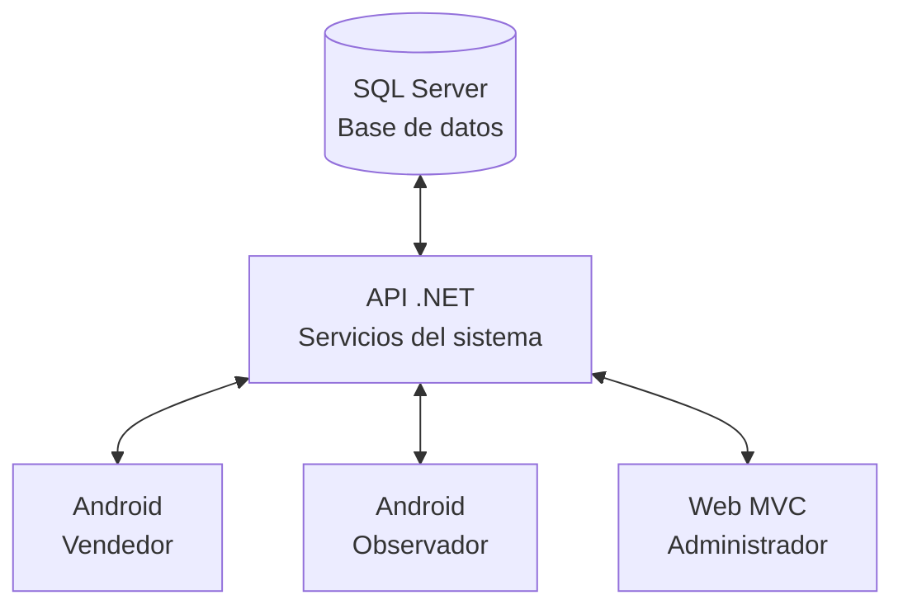
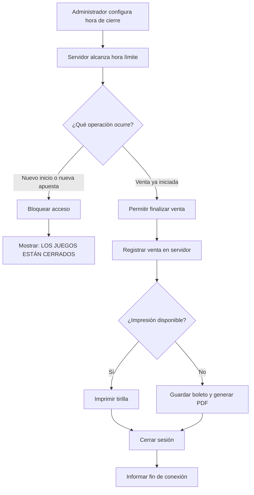
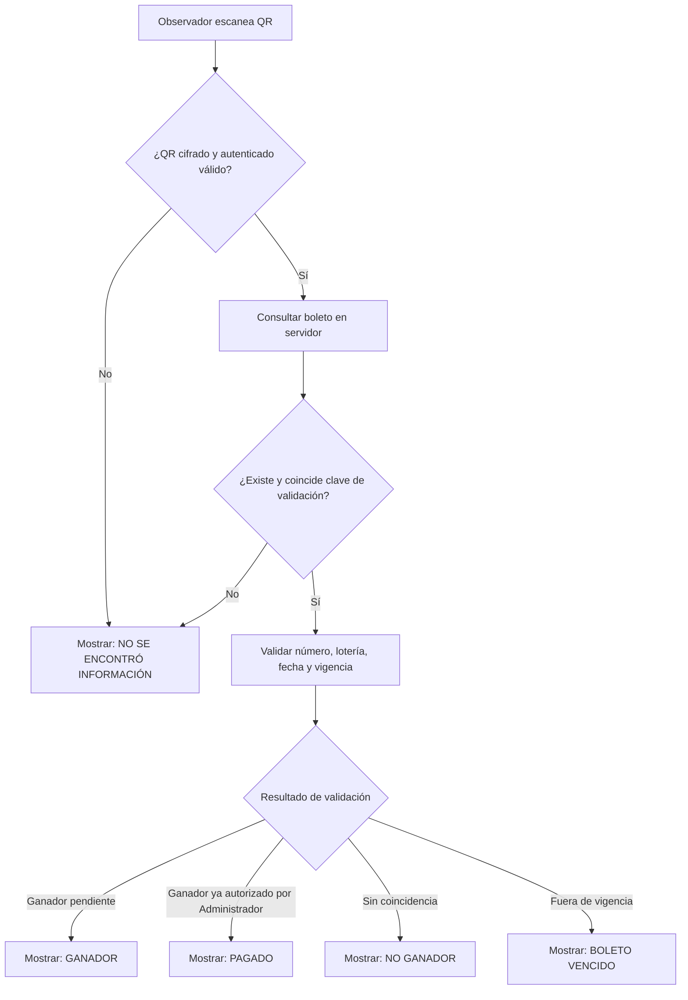
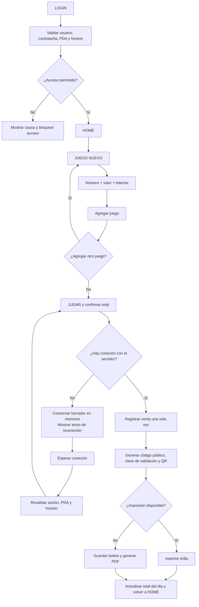

# ESPECIFICACIÓN DE REQUERIMIENTOS DE SOFTWARE

> Versión 1.4. Restablecimiento de contraseña solo por el administrador (`estadoValidado`); chat de soporte vendedor–administrador.

NEW RICH

Versión: 1.4
Estado: Documento para revisión y aprobación del cliente
Tipo de documento: Levantamiento de requerimientos / Especificación de Requerimientos de Software (ERS)

## New Rich

---

## Índice de perfiles

| Bloque | RS | Contenido |
| --- | --- | --- |
| I. Administrador | RS-001 a RS-040A | Gobierno, configuración, seguridad, reglas y aceptación |
| II. Observador | RS-041 a RS-059 | Consulta, validación QR y chat con administrador |
| III. Vendedor | RS-060 a RS-086 | Venta, boleto, histórico, conectividad y flujos |
| IV. Tirilla de impresión | RS-087 | Formato de comprobante |

# I. Perfil Administrador

El administrador usa la aplicación web MVC y es responsable de administrar la operación, configuraciones, seguridad, información central y criterios de aceptación.

---

## RS-001 — 1. INFORMACIÓN GENERAL


### 1.1. Nombre del proyecto

New Rich

### 1.2. Objetivo

Desarrollar una plataforma integral para la gestión de apuestas que permita registrar, almacenar, consultar, imprimir y validar boletos de apuestas, así como administrar vendedores, observadores, dispositivos PDA, loterías, números ganadores, configuraciones, notificaciones, históricos, soporte y KPI administrativos.
### 1.3. Tecnologías

| Componente | Tecnología |
| --- | --- |
| Lenguaje principal | C# |
| Framework | .NET |
| Aplicación vendedor | Android |
| Aplicación observador | Android |
| Aplicación administrador | ASP.NET MVC |
| Servidor web | IIS |
| Base de datos | Microsoft SQL Server |
| Comunicación | API .NET |
| Impresión | Impresora térmica integrada del PDA |
| QR | Generación y lectura QR |
| Seguridad | HTTPS/TLS + autenticación + criptografía |


---

## RS-002 — 2. DESCRIPCIÓN GENERAL DEL SISTEMA

El sistema estará compuesto por tres aplicaciones principales:

- **Aplicación Android — Vendedor:** registra apuestas, crea uno o varios juegos por boleto, selecciona números y loterías, registra valores, imprime o genera PDF de contingencia, consulta históricos/resultados y solicita soporte.
- **Aplicación Android — Observador:** consulta vendedores, ventas, boletos, números ganadores, dispositivos, históricos y configuraciones; valida boletos mediante QR y puede chatear con el administrador. No atiende chats de vendedores.
- **Aplicación Web — Administrador:** administra usuarios, PDA, loterías, números ganadores, horarios, vigencia, notificaciones y configuraciones; consulta ventas/boletos/vendedores, visualiza KPI y autoriza el estado `PAGADO` de un boleto ganador.

---

## RS-003 — 3. ARQUITECTURA GENERAL

La solución estará basada en una arquitectura centralizada. La base de datos SQL Server será la fuente central de información del sistema.



---

## RS-004 — 4. PERFILES DEL SISTEMA

El sistema contará con los perfiles Vendedor, Observador y Administrador. Cada perfil tendrá permisos según la matriz de permisos vigente.

---

## RS-005 — 5. SOLICITUD PARA SER VENDEDOR

La persona interesada en ser vendedor diligenciará un formulario externo. El administrador revisará la solicitud antes de crear el usuario.

---

## RS-006 — 6. CREACIÓN DEL VENDEDOR

El administrador podrá registrar la información del vendedor, asignar su PDA y crear una contraseña temporal. Al crear el usuario, `estadoValidado` quedará en true y deberá cambiar la contraseña en el primer acceso.

---

## RS-007 — 7. GESTIÓN Y AUTENTICACIÓN DEL PDA

El administrador asociará el PDA al vendedor. El acceso requiere usuario activo, contraseña correcta, PDA registrado, activo y asociado, sesión válida y horario permitido.

Abrirá la aplicación.

Ingresará usuario.

Ingresará contraseña temporal.

El servidor validará las credenciales.

El servidor validará el PDA.

El sistema solicitará establecer una nueva contraseña.

El vendedor establecerá su contraseña definitiva.

El sistema habilitará el acceso.

RF-007 – Validación del dispositivo

Para permitir el acceso deberán validarse como mínimo:

Usuario existente.

Usuario activo.

Contraseña correcta.

PDA registrado.

PDA activo.

PDA asociado al usuario.

Sesión válida.

Horario permitido.

Si alguna condición no se cumple, el acceso deberá ser rechazado.


---

## RS-008 — 8. HORARIO DE OPERACIÓN


RF-008 – Configuración de hora de cierre

El administrador podrá configurar la hora máxima en la cual los vendedores podrán operar.

Ejemplo:

Hora de cierre: 20:00:00

RF-009 – Bloqueo después del cierre

Una vez alcanzada la hora configurada:

Los PDA no podrán iniciar nuevas sesiones.

Los vendedores no podrán iniciar nuevas apuestas.

El sistema mostrará:

LOS JUEGOS ESTÁN CERRADOS

RF-008b – Sincronización de hora de cierre al PDA

Cuando el PDA inicia sesión con conexión disponible, deberá descargar y almacenar localmente la hora de cierre configurada en el servidor. Esta descarga ocurrirá:

- Durante el primer inicio de sesión con conexión.
- Cada vez que el PDA se conecta posteriormente.
- Como parte de la sincronización de códigos offline (RS-090).

La configuración descargada incluirá: hora de cierre (HH:MM:SS), timestamp del servidor, versión de configuración. El PDA almacenará esta información en memoria de forma segura y la utilizará como referencia definitiva para validaciones de horario, incluso en modo offline.

RF-010 – Venta en curso durante el cierre

Si un vendedor ya tiene una venta en curso cuando llega la hora de cierre:

El sistema permitirá terminar la venta actual.

La venta será almacenada.

El boleto será generado.

El boleto será impreso o almacenado como PDF si existe una falla de impresión.

Finalizada la operación, el sistema cerrará la sesión del vendedor.

El sistema mostrará:

No está disponible la operación

El vendedor deberá volver a autenticarse cuando el sistema se encuentre habilitado.


---

## RS-009 — 48. PERFIL ADMINISTRADOR


RF-058

El administrador utilizará la aplicación web desarrollada con MVC .NET y desplegada sobre IIS.


---

## RS-010 — 49. LOGIN ADMINISTRADOR


RF-059

El administrador deberá autenticarse mediante:

Usuario.

Contraseña.


---

## RS-011 — 50. ADMINISTRACIÓN DE NÚMEROS GANADORES


RF-060

El administrador podrá registrar:

Número ganador.

Lotería.

Fecha de juego.


---

## RS-012 — 51. MÚLTIPLES NÚMEROS GANADORES


RF-061

El sistema deberá permitir registrar múltiples números ganadores para una misma fecha de juego siempre que correspondan a diferentes loterías.

Ejemplo:

30/08/2026

Medellín → 1234

Bogotá   → 4561

Cali     → 7890

Armenia  → 3456

Pasto    → 5678

Todos estos registros serán válidos.


---

## RS-013 — 52. RESTRICCIÓN DE NÚMERO GANADOR


RF-062

Para una misma combinación:

Fecha de juego + Lotería

solo podrá existir un único número ganador.

Ejemplo válido

30/08/2026 → Medellín → 1234

30/08/2026 → Bogotá   → 4561

30/08/2026 → Cali     → 7890

Ejemplo no válido

Si ya existe:

30/08/2026 → Medellín → 1234

el sistema deberá impedir:

30/08/2026 → Medellín → 4561

y también:

30/08/2026 → Medellín → 9999

El número puede ser diferente, pero la combinación:

Medellín + 30/08/2026

ya tiene un número ganador registrado.

Regla de base de datos

La tabla correspondiente deberá implementar una restricción única equivalente a:

UNIQUE (FechaJuego, LoteriaId)

Esto garantizará que no puedan existir dos números ganadores para la misma lotería y fecha.

Consideración

El mismo número sí podrá aparecer como ganador en diferentes loterías.

Ejemplo:

30/08/2026 → Medellín → 1234

30/08/2026 → Bogotá   → 1234

Esto será válido.


---

## RS-014 — 53. ADMINISTRACIÓN DE USUARIOS


RF-063

El administrador podrá:

Crear usuarios.

Modificar usuarios.

Activar usuarios.

Desactivar usuarios.

Eliminar usuarios.

Asociar PDA.


---

## RS-015 — 54. ADMINISTRACIÓN DE PDA


RF-064

El administrador podrá:

Registrar PDA.

Asociar PDA.

Desasociar PDA.

Activar PDA.

Desactivar PDA.

Consultar estado.

Consultar usuario asociado.


---

## RS-016 — 55. ADMINISTRACIÓN DE LOTERÍAS


RF-065

El administrador podrá:

Crear loterías.

Modificar loterías.

Activarlas.

Desactivarlas.

Eliminarlas cuando las reglas de negocio lo permitan.


---

## RS-017 — 56. CONFIGURACIONES VARIABLES


RF-066

El administrador podrá parametrizar:

Hora de cierre.

Vigencia de premios.

Loterías disponibles.

Notificaciones.

Cantidad máxima de veces que se puede jugar un número antes de generar alerta.

Valor mínimo para generar alerta.

Otros parámetros definidos posteriormente.


---

## RS-018 — 57. NOTIFICACIÓN POR REPETICIÓN DE NÚMERO


RF-067

El administrador podrá configurar una cantidad máxima de veces que un número puede ser jugado para una misma fecha.

Ejemplo:

Alertar cuando un número sea jugado 10 veces para una misma fecha.

Cuando se alcance el valor configurado se generará una notificación.


---

## RS-019 — 58. NOTIFICACIÓN POR VALOR ALTO


RF-068

El administrador podrá establecer un valor de alerta.

Ejemplo:

Valor de alerta: $10.000

Si un vendedor registra una apuesta igual o superior:

$10.000

el sistema generará una notificación.


---

## RS-020 — 59. CENTRO DE NOTIFICACIONES


RF-069

El administrador contará con un módulo:

Notificaciones

Además, existirá un icono de campana en la parte superior derecha.

Ejemplo:

🔔 5

El número representará la cantidad de notificaciones pendientes.


---

## RS-021 — 60. BÚSQUEDA ADMINISTRATIVA


RF-070

El administrador podrá buscar información mediante diferentes criterios.

Por número

Número apostado.

Por vendedor

Cédula.

Nombre.

Alias.

Fecha.

Por boleto

Código.

Número.

Vendedor.

Fecha.

Estado.

Por lotería

Lotería.

Fecha.

Número.


---

## RS-022 — 61. VISUALIZACIÓN DE BOLETO


RF-071

Al seleccionar una venta, número o boleto, el administrador podrá visualizar la información completa de la boleta en un formato similar a la tirilla impresa.


---

## RS-023 — 62. KPI ADMINISTRATIVOS


RF-072

Únicamente el administrador tendrá acceso al módulo de KPI.

Podrá consultar:

Usuarios

Cantidad de vendedores.

Cantidad de observadores.

Usuarios activos.

Usuarios inactivos.

Ventas

Ventas totales.

Ventas por rango de fechas.

Ventas por vendedor.

Ventas por día.

Números

Números jugados.

Números ganadores.

Fechas de números ganadores.


---

## RS-024 — 63. KPI POR VENDEDOR


RF-073

El administrador podrá seleccionar un vendedor y un rango de fechas.

El sistema mostrará:

Cantidad de ventas.

Total vendido.

Cantidad de boletos.

Números jugados.

Loterías utilizadas.


---

## RS-025 — 64. ELIMINACIÓN DE USUARIOS


RF-074

Únicamente el administrador podrá eliminar usuarios.

Deberá buscar previamente al usuario mediante los criterios disponibles.


---

## RS-026 — 65. CONFIRMACIÓN DE ELIMINACIÓN


RF-075

Al seleccionar eliminar usuario, el sistema deberá mostrar:

Al eliminar el usuario se perderá absolutamente todo el histórico perteneciente al usuario junto con loterías vendidas y números ganadores, y ya no podrá recuperarlo. ¿Está seguro de eliminar el usuario?

Opciones:

Sí.

No.


---

## RS-027 — 66. ELIMINACIÓN EN CASCADA


RF-076

Al confirmar la eliminación, el sistema deberá eliminar los datos relacionados con el usuario.

Como mínimo:

Accesos.

Usuario.

Asociación PDA.

Boletos.

Ventas.

Juegos.

Relaciones con loterías.

Información relacionada.

No se requiere conservar auditoría histórica de la eliminación.


---

## RS-028 — 72. SEGURIDAD


El sistema deberá implementar como mínimo:

Autenticación.

Autorización.

Control de roles.

Asociación de dispositivos.

Control de sesiones.

HTTPS/TLS.

Hash seguro de contraseñas.

Protección del QR.

Validación de servidor.

Control de duplicidad.

Protección de información sensible.


---

## RS-029 — 73. SEGURIDAD DEL PDA


Un PDA no será considerado autorizado simplemente por tener instalada la aplicación.

El acceso dependerá de:

Usuario válido

+

Contraseña válida

+

PDA autorizado

+

PDA asociado al usuario

+

Usuario activo

+

Horario permitido

=

ACCESO PERMITIDO


---

## RS-030 — 74. CONTROL DE HORARIO EN EL PDA


El horario de operación deberá ser controlado por el servidor.

La aplicación no deberá confiar únicamente en la hora configurada localmente en el PDA.

**Mecanismo de blindaje contra manipulación de hora local:**

- El servidor sincroniza la hora de cierre al PDA durante el inicio de sesión con conexión.
- El PDA almacena esta hora sincronizada (proveniente del servidor) como referencia definitiva.
- Todas las validaciones de horario en el PDA **utilizan la hora sincronizada, no la hora local del dispositivo**.
- Si hay divergencia entre la hora local y la sincronizada, se confía en la sincronizada.
- El PDA valida periódicamente que la hora sincronizada no haya sido manipulada comparándola con puntos de referencia (timestamp de primer acceso, duración de sesión sin desconexión).
- Si el usuario intenta modificar la hora local del dispositivo para eludir el cierre, el PDA detecta la anomalía mediante la comparación de hora sincronizada vs. hora local y toma las acciones definidas en RS-101 (cierre forzado de sesión).

Esto evita que un usuario malintencionado modifique la hora del dispositivo para intentar continuar realizando apuestas después del cierre.


---

## RS-031 — 75. REQUERIMIENTOS NO FUNCIONALES


RNF-001 – Rendimiento

Las operaciones normales deberán responder en tiempos adecuados para permitir una venta rápida.

RNF-002 – Disponibilidad

El sistema deberá estar disponible durante los horarios operativos establecidos.

RNF-003 – Integridad

Las operaciones de venta deberán manejarse de forma transaccional.

RNF-004 – Concurrencia

El sistema deberá soportar múltiples vendedores realizando ventas simultáneamente.

RNF-005 – Seguridad

La comunicación deberá utilizar HTTPS/TLS.

RNF-006 – Escalabilidad

La arquitectura deberá permitir incrementar progresivamente la cantidad de vendedores y dispositivos.

RNF-007 – Base de datos

Todo el sistema utilizará una base de datos centralizada SQL Server.


---

## RS-032 — 76. MATRIZ DE PERMISOS


| Funcionalidad | Vendedor | Observador | Administrador |
| --- | --- | --- | --- |
| Iniciar sesión | ✅ | ✅ | ✅ |
| Restablecer contraseña | Admin solo | Admin solo | Admin solo |
| Desbloquear usuario | Admin solo | Admin solo | Admin solo |
| Crear apuesta | ✅ | ❌ | ❌ |
| Imprimir boleto | ✅ | ❌ | ❌ |
| Generar PDF | ✅ | ❌ | ❌ |
| Consultar propias ventas | ✅ | ❌ | ✅ |
| Consultar ventas | ❌ | ✅ | ✅ |
| Consultar históricos | ✅ | ✅ | ✅ |
| Validar QR | ❌ | ✅ | ✅ |
| Ver vendedores | ❌ | ✅ | ✅ |
| Crear usuarios | ❌ | ❌ | ✅ |
| Modificar usuarios | ❌ | ❌ | ✅ |
| Eliminar usuarios | ❌ | ❌ | ✅ |
| Administrar PDA | ❌ | Lectura | ✅ |
| Administrar loterías | ❌ | Lectura | ✅ |
| Crear y administrar grupos | ❌ | ❌ | ✅ |
| Cambiar grupo de vendedor | ❌ | ❌ | ✅ |
| Registrar números ganadores | ❌ | ❌ | ✅ |
| Configurar horario | ❌ | ❌ | ✅ |
| Configurar vigencia | ❌ | ❌ | ✅ |
| Configurar notificaciones | ❌ | ❌ | ✅ |
| Consultar KPI con filtro por grupos | ❌ | ❌ | ✅ |
| Descargar KPI en PDF | ❌ | ❌ | ✅ |
| Validar ticket ganador (prevalidación QR) | ✅ | ❌ | ❌ |
| Validar ticket ganador (validación manual) | ❌ | ✅ | ✅ |
| Acceder a casos de premios | ❌ | ✅ | ✅ |
| Validar casos administración | ❌ | ❌ | ✅ |
| Asignar observador | ❌ | ❌ | ✅ |
| Registrar ganador | ❌ | ✅ | ❌ |
| Ver histórico de premios | ❌ | ✅ | ✅ |
| Chat | Con administrador | Con administrador | Con vendedores y observadores |


---

## RS-033 — 77. REGLAS DE NEGOCIO


| Código | Regla |
| --- | --- |
| RN-001 | Un vendedor solo podrá operar desde un PDA autorizado. |
| RN-002 | El primer acceso utilizará una contraseña temporal. |
| RN-003 | El vendedor deberá cambiar la contraseña durante el primer acceso. |
| RN-004 | Un boleto debe seleccionar un tipo inmutable: COMBINADA o INDIVIDUAL. No se pueden mezclar tipos. |
| RN-005 | COMBINADA usa un número, un valor y múltiples loterías por juego; INDIVIDUAL usa líneas independientes con número, valor y una sola lotería. |
| RN-006 | En COMBINADA, el total del juego es `valor × cantidad de loterías`; en INDIVIDUAL, el total es la suma de los valores de sus líneas. |
| RN-007 | El administrador configura el máximo de juegos COMBINADA y el máximo de líneas INDIVIDUAL; este último no puede superar 6. |
| RN-008 | Al alcanzar el máximo configurado, el botón Agregar correspondiente se desactiva y la API rechaza excedentes. |
| RN-009 | Cada boleto tendrá un código público único de exactamente 7 dígitos; los ceros a la izquierda se conservarán y la base de datos garantizará su unicidad. |
| RN-010 | El QR contendrá la clave de validación única del boleto dentro de un payload cifrado y autenticado que el servidor pueda descifrar y verificar. |
| RN-011 | El cliente paga la apuesta al momento de confirmar JUGAR. |
| RN-012 | El sistema no almacenará información personal del comprador. |
| RN-013 | El boleto se paga al portador. |
| RN-014 | El sistema no calculará el valor del premio. |
| RN-015 | El vendedor informará directamente el valor del premio al comprador. |
| RN-016 | Para determinar un ganador deberán coincidir número, lotería y fecha de juego. |
| RN-017 | El boleto ganador deberá encontrarse dentro de la vigencia establecida. |
| RN-018 | El QR deberá ser auténtico y pertenecer al sistema. |
| RN-019 | El boleto deberá existir en la base de datos. |
| RN-020 | Un boleto ganador que ya haya sido cobrado deberá mostrar PAGADO. |
| RN-021 | Un boleto ganador pendiente de cobro deberá mostrar GANADOR. |
| RN-022 | La vigencia inicial será de 30 días calendario. |
| RN-023 | El administrador podrá modificar la vigencia. |
| RN-024 | Una misma fecha podrá tener múltiples números ganadores. |
| RN-025 | Para una misma fecha y lotería solo podrá existir un número ganador. |
| RN-026 | El mismo número podrá ser ganador en diferentes loterías. |
| RN-027 | El administrador podrá configurar la hora de cierre. |
| RN-028 | Después del cierre no podrán iniciarse nuevas apuestas. |
| RN-029 | Una venta que ya esté en curso podrá finalizar antes de cerrar la sesión. |
| RN-030 | Finalizada una venta después del cierre, el vendedor será desconectado. |
| RN-031 | El PDA requiere conexión con el servidor para crear y confirmar ventas mediante el flujo normal (API genera código público). Excepción: si cuenta con códigos offline preasignados y descargados, puede crear ventas offline usando esos códigos solo si ha perdido la conexión. |
| RN-032 | Si la conexión falla durante una venta en preparación: (A) sin códigos offline: el borrador se conserva en memoria y solo puede confirmarse después de reconectar y revalidar; (B) con códigos offline disponibles: el vendedor puede usar un código offline para completar la venta e informar al administrador por chat. |
| RN-033 | El servidor será la fuente definitiva de información. |
| RN-034 | Si la impresión falla, el boleto deberá poder guardarse como PDF. |
| RN-035 | El PDF podrá enviarse manualmente al cliente. |
| RN-036 | El vendedor podrá registrar solicitudes de soporte directamente con el administrador. |
| RN-037 | El observador no atenderá chats de vendedores ni modificará información operativa; podrá iniciar y responder chat únicamente con el administrador. |
| RN-038 | El administrador atenderá el soporte de los vendedores y podrá iniciar y responder chat con observadores. |
| RN-039 | El cierre de una conversación y la eliminación de su historial solo podrán ejecutarse desde un perfil con permiso de modificación definido por el administrador. |
| RN-040 | Las imágenes originales del dispositivo no serán eliminadas. |
| RN-041 | El administrador podrá eliminar usuarios y sus datos relacionados. |
| RN-042 | El sistema no almacenará el valor monetario del premio ganado. |
| RN-043 | El resultado ganador se determina por número + lotería + fecha. |
| RN-044 | Si un usuario ingresa contraseña incorrecta 3 veces seguidas, queda bloqueado (`estadoBloqueado = true`) y no puede iniciar sesión hasta que el administrador lo desbloquee. |
| RN-045 | El contador de intentos fallidos se resetea cuando el usuario ingresa la contraseña correcta, después de que el administrador lo desbloquea, o cuando el administrador restablece la contraseña. |
| RN-046 | Solo los vendedores pertenecen a grupos; observadores y administrador no pertenecen a ningún grupo. |
| RN-047 | Al crear un vendedor es obligatorio asignarle un grupo de la lista disponible; cada vendedor pertenece a un solo grupo. El administrador puede crear grupos con nombre libremente definible. |
| RN-048 | Al cambiar de grupo un vendedor, el sistema reemplaza automáticamente el grupo anterior y el vendedor se mueve con todo su histórico y datos asociados (ventas, boletos, juegos) al nuevo grupo. |
| RN-049 | Los indicadores KPI son completamente dinámicos: pueden filtrar por general (todos los vendedores) o por un grupo específico; todos los datos, gráficos y estadísticas se actualizan en tiempo real según el filtro seleccionado. |
| RN-050 | El administrador puede descargar el informe KPI en PDF, conservando absolutamente todos los datos, indicadores, filtros de grupo y el estado de la consulta al momento de la descarga. |
| RN-051 | El administrador puede generar códigos QR offline y asignarlos a un usuario y PDA específico; cada código tiene un consecutivo único e inmutable y un payload cifrado que contiene código público, identificador de boleto, clave de validación y metadatos de seguridad. |
| RN-051A | El PDA debe contar con una base de datos local tipo Lite para almacenar los códigos offline asignados, con capacidad de entre 3.000 y 5.000 códigos. La base local no es la fuente definitiva; SQL Server y la API conservan la autoridad central. |
| RN-052 | Los códigos offline transitan por estados: Generado → Descargado → Utilizado → Registrado; cada transición se registra con fecha/hora y usuario responsable. |
| RN-053 | Cuando el PDA se conecta y autentica correctamente, consulta códigos asignados cuyo estado sea "Generado". En modo Manual muestra el aviso y permite descargar; en modo Automático descarga sin mostrarlo. Los códigos se almacenan en la base local tipo Lite y se marcan en BD como "Descargado". |
| RN-054 | Si el vendedor cierra la aplicación, cierra sesión o apaga el PDA, los códigos offline y sus estados permanecen almacenados en la base local tipo Lite. Solo pueden eliminarse códigos ya utilizados cuya evidencia QR haya sido enviada al chat del administrador. |
| RN-055 | Durante una venta en modo offline, el sistema consume un código offline del almacenamiento local, asigna su payload a los datos de la jugada, genera el QR desde el payload precifrado y después de confirmar, envía automáticamente la evidencia del QR al chat interno del administrador en un mensaje permanente que dice "CÓDIGO VENDIDO OFFLINE — Favor registrar". |
| RN-056 | Al registrar un código offline escaneado, el sistema valida autenticidad e integridad del payload, desencripta los datos de la jugada, crea la venta oficial en BD con todos los datos, actualiza el código a estado "Registrado" e impide registrar el mismo código nuevamente. |
| RN-057 | Cuando el PDA recupera conexión, revalida automáticamente sesión, dispositivo y horario; si todo es válido, cambia automáticamente al modo online y las ventas nuevas utilizan el flujo normal sin consumir códigos offline. |
| RN-058 | Si se agotan los códigos offline descargados durante una venta en modo offline, el sistema informa al vendedor que debe conectarse para continuar operando. |
| RN-059 | Cada código offline registrado oficialmente se asocia a la VentaId creada, permitiendo trazabilidad completa desde generación hasta registro final. |
| RN-060 | El módulo "Ventas Offline" permite al administrador visualizar el reporte de códigos generados, descargados, utilizados y registrados, con filtros por usuario, PDA, fecha, estado y rango de fechas. |
| RN-060A | El Home del vendedor debe mostrar la cantidad de códigos offline disponibles para su usuario y PDA, contando códigos en estado "Generado" o "Descargado" y excluyendo "Utilizado" y "Registrado". El contador se actualiza después de sincronizar, utilizar, registrar o eliminar un código permitido. |
| RN-061 | El PDA debe descargar y almacenar localmente la hora de cierre configurada en el servidor durante cada inicio de sesión con conexión disponible. Esta información sincronizada se utiliza como referencia definitiva para todas las validaciones de horario, incluso en modo offline. |
| RN-062 | El PDA debe validar y utilizar únicamente la hora de cierre sincronizada (proveniente del servidor), nunca la hora local del dispositivo. Si la hora local ha sido manipulada (diferencia mayor a 1 minuto respecto a la sincronizada), el PDA detecta la anomalía y ejecuta el cierre forzado de sesión definido en RS-101. |
| RN-063 | Cuando el PDA está en modo offline sin conexión, debe cumplir automáticamente el cierre de sesión en la hora de cierre sincronizada. Si el vendedor intenta modificar la hora del dispositivo para eludir este cierre, el sistema detecta la manipulación y cierra la sesión de todas formas, impidiendo cualquier intento de burlar el horario de operación. |
| RN-064 | Cuando el vendedor escanea un ticket para validación de ganador, el sistema ejecuta prevalidación automática verificando: QR válido, boleto existe, estado "Jugado", vigente, no "Premio entregado", y número + lotería + fecha coinciden con ganador registrado. Si todo es válido, registra automáticamente un `CasoGanador` con estado "Reportado" y notifica al administrador. |
| RN-065 | Si la prevalidación de ticket ganador falla, el sistema muestra motivo específico (boleto vencido, no es ganador, ya registrado, etc.) sin registrar caso alguno. El vendedor puede intentar de nuevo. |
| RN-066 | El administrador debe solicitar **fotografía del ticket con código QR claramente visible** antes de validar un caso reportado. La validación es manual: el administrador verifica que la foto corresponda al ticket y que el QR sea legible. Solo si es válido, cambia estado a "Validado". Si rechaza, marca permanentemente como "Rechazado". |
| RN-067 | El administrador asigna un observador activo a un caso validado. El observador recibe notificación inmediata en su PDA. El caso pasa a estado "Asignado". El administrador puede cambiar de observador mientras el caso no esté en estado "Registrado" o "Premio entregado". |
| RN-068 | Cuando el observador comienza a registrar un ganador, el estado del caso cambia automáticamente a "En proceso". El observador no puede cambiar este estado manualmente. |
| RN-069 | El observador debe ingresar obligatoriamente: nombre y apellido del ganador, número de contacto, lugar donde ganó, nombre del vendedor (relacionado al ticket), y valor total ganado (ingreso manual). El campo "Persona que entrega el premio" se autocompleta con el observador autenticado y no es editable. El sistema NO calcula premios según RN-042. |
| RN-070 | El observador debe capturar exactamente **tres fotografías obligatorias**: (1) ticket ganador con código QR visible, (2) ganador sosteniendo el ticket, (3) cédula de identidad. Las fotos se capturan desde cámara o galería del PDA. Se almacenan como imágenes binarias sin procesamiento automático (sin OCR, sin extracción de datos). |
| RN-071 | El botón **"Registrar entrega del premio"** solo se habilita cuando **TODOS** los campos obligatorios y las **3 fotografías** están presentes. Si falta algún elemento, el botón permanece deshabilitado y el sistema indica claramente cuál es el elemento pendiente. |
| RN-072 | Un boleto ganador solamente puede ser registrado y marcado como **"Premio entregado"** una única vez. Una vez entregado, queda permanentemente bloqueado. Si se intenta escanear un ticket "Premio entregado", el sistema muestra: "Este ticket ya fue registrado y el premio ya fue entregado. No se pueden iniciar nuevos procesos de reclamación." |
| RN-073 | El campo `EstadoDelPremio` en tabla `Boletos` marca la condición final del premio: **Vigente** (ganador pero no entregado), **PremioEntregado** (entregado formalmente por observador), o **Rechazado** (caso fue rechazado en validación administrativa). Una vez marcado como "PremioEntregado", no puede cambiar. |
| RN-074 | El sistema mantiene trazabilidad completa de cada caso de ganador: fechas de reporte, validación, asignación, registro y entrega; usuarios responsables (vendedor, administrador, observador); datos del ganador; fotografías; y valor registrado. Todo queda disponible para auditoría e investigación de fraude. |

---

## RS-034 — 79. FLUJO DE CIERRE DE JORNADA

RF-010 — Venta en curso durante el cierre

Cuando llega la hora configurada, se bloquean nuevos accesos y nuevas apuestas. Una venta que ya estaba en curso puede finalizar; después se cierra la sesión del vendedor.



---

## RS-035 — 81. FLUJO DE NÚMEROS GANADORES


Para una fecha determinada se podrán registrar múltiples números ganadores.

Ejemplo:

FECHA: 30/08/2026

┌─────────────┬────────────────┐

│ LOTERÍA     │ GANADOR        │

├─────────────┼────────────────┤

│ Medellín    │ 1234           │

│ Bogotá      │ 4561           │

│ Cali        │ 7890           │

│ Armenia     │ 3456           │

│ Pasto       │ 5678           │

└─────────────┴────────────────┘

No se podrá registrar:

30/08/2026

Medellín

9999

si ya existe:

30/08/2026

Medellín

1234

La restricción será:

FechaJuego + LoteriaId = único


---

## RS-036 — 82. MODELO CONCEPTUAL DE INFORMACIÓN


La solución deberá contemplar, como mínimo, entidades similares a:

Usuarios

Roles

Permisos

UsuariosRoles

Grupos

UsuariosGrupos

Dispositivos

DispositivosUsuarios

Sesiones

Loterias

Ventas

Boletos

Juegos

JuegoLoteria

NumerosGanadores

EstadosBoleto

Configuraciones

Notificaciones

Conversaciones

Mensajes

AdjuntosChat

Sincronizaciones

ClavesValidacionBoleto

IntentosFallidos

ConfiguracionesTipoApuesta

La estructura definitiva será definida durante la etapa de diseño de base de datos.

`Boletos.TipoApuesta` será un campo obligatorio e inmutable con valores COMBINADO o INDIVIDUAL. `ConfiguracionesTipoApuesta` almacenará por separado los máximos permitidos para cada tipo.


---

## RS-037 — 83. CRITERIOS GENERALES DE ACEPTACIÓN


El sistema será considerado funcionalmente aceptado cuando:

Un vendedor pueda autenticarse desde un PDA autorizado.

Un vendedor pueda cambiar su contraseña durante el primer acceso.

Un vendedor pueda crear un boleto.

El vendedor pueda seleccionar COMBINADA o INDIVIDUAL sin mezclar tipos en un boleto.

Un boleto COMBINADO pueda contener el máximo de juegos configurado y cada juego pueda contener múltiples loterías.

Un boleto INDIVIDUAL pueda contener hasta 6 líneas, cada una con una sola lotería.

El vendedor pueda editar o eliminar líneas individuales antes de confirmar.

El sistema calcule correctamente el total según el tipo de apuesta.

El administrador pueda configurar los máximos por tipo y el sistema desactive el botón Agregar al alcanzar el máximo.

La venta quede almacenada.

Se genere un código público único de exactamente 7 dígitos, preservando ceros a la izquierda y protegido mediante una restricción única en la base de datos.

Se genere una clave de validación única por boleto y su hash sea almacenado en la base de datos.

Se genere un QR cifrado y autenticado que incluya el identificador del boleto, el código público y la clave de validación.

El servidor pueda descifrar el QR y comprobar que la clave de validación corresponda al boleto.

El boleto pueda imprimirse.

El boleto pueda recuperarse como PDF si falla la impresión.

El histórico permita consultar ventas.

El administrador pueda registrar números ganadores.

Puedan existir múltiples ganadores en una misma fecha para diferentes loterías.

No pueda existir más de un ganador para la misma lotería y fecha.

El mismo número pueda ser ganador en diferentes loterías.

El observador pueda validar boletos mediante QR.

El sistema determine si un boleto es ganador.

El sistema determine si está pagado/cobrado.

El sistema determine si está vencido.

El sistema controle el horario de cierre.

Una venta en curso pueda finalizar después de llegar la hora de cierre.

El vendedor sea desconectado después de finalizar dicha venta.

Si no hay conexión, el PDA informe que debe conectarse para realizar una venta y continuar operando.

Si se pierde conexión durante una venta en preparación, el borrador permanezca en memoria y pueda confirmarse solo tras reconectar y revalidar.

El administrador pueda gestionar usuarios.

El administrador pueda gestionar PDA.

El administrador pueda gestionar loterías.

El administrador pueda configurar parámetros.

El sistema pueda generar notificaciones.

El administrador pueda consultar KPI.

El sistema pueda gestionar el chat.

El sistema pueda enviar imágenes.

El historial del chat pueda eliminarse al cerrar la conversación.

El administrador pueda eliminar usuarios y sus datos relacionados.


## RS-038 — 84. DEFINICIÓN DE LO QUE EL SISTEMA HACE Y NO HACE


El sistema SÍ:

Registra apuestas.

Registra vendedores.

Registra observadores.

Registra PDA.

Registra loterías.

Registra números ganadores.

Valida boletos.

Determina si un boleto es ganador.

Determina si un boleto está vigente.

Determina si un boleto ya fue cobrado.

Registra al ganador al momento de confirmar la entrega del premio por parte del observador, incluyendo sus datos, el valor informado manualmente y las evidencias obligatorias.

Marca el boleto como **"Premio entregado"** después de confirmar la entrega y lo bloquea permanentemente para evitar una segunda entrega.

Genera códigos únicos.

Genera QR.

Imprime boletos.

Genera PDF de contingencia.

Requiere conexión con el servidor para registrar ventas y generar elementos verificables del boleto.

Conserva en memoria el borrador de una venta interrumpida hasta recuperar conexión.

Gestiona históricos.

Gestiona soporte.

Genera notificaciones.

Genera KPI.

Controla el horario de operación.

El sistema NO:

Calcula premios.

Determina cuánto dinero gana el portador ni calcula el premio.

Calcula fórmulas, multiplicadores o liquidaciones de premios. El valor ingresado manualmente por el observador sí se almacena como parte del registro de entrega.

Registra quién compró el boleto.

Registra información personal del comprador.

Administra diferentes tipos de premios.

Realiza cálculos de multiplicadores de premios.

El vendedor será responsable de informar al comprador el valor correspondiente del premio.


---

## RS-039 — 85. REQUERIMIENTOS EXPLÍCITAMENTE APROBADOS


Como resultado de las aclaraciones realizadas al levantamiento, quedan establecidos los siguientes puntos:

Ganador

Un boleto gana cuando:

Número + Lotería + Fecha coinciden con un resultado ganador válido.

Además:

QR válido.

Boleto existente.

Dentro del período de reclamación.

No cobrado previamente.

Premio

El sistema:


Múltiples loterías

Un número puede jugarse en múltiples loterías.

Números ganadores

Para una misma fecha:

Se pueden registrar múltiples números ganadores.

Pero:

Una misma lotería solo puede tener un número ganador para una fecha determinada.

Pago de la apuesta

El cliente paga la apuesta al momento de presionar:

JUGAR

Cobro del premio

El sistema podrá indicar si un boleto ganador ya fue cobrado.

Código

Cada boleto tendrá un:

Código público único de exactamente 7 dígitos, preservando ceros a la izquierda y garantizado por la base de datos. La autenticidad se comprobará mediante un QR que contiene una clave de validación única por boleto dentro de un payload cifrado y autenticado por el servidor.

Impresión

Si falla la impresora:

El boleto permanece almacenado y puede generarse como PDF.

Conectividad

El PDA requiere conexión con el servidor para confirmar una venta. Si la conexión se pierde durante la preparación, el borrador se conserva en memoria y se informa al vendedor que debe conectarse para realizar la venta y continuar operando el software.

Cierre

Al llegar la hora configurada:

Los nuevos accesos serán bloqueados.

Una venta que ya esté en curso podrá finalizar.

Posteriormente:

El usuario será desconectado.

Eliminación

El administrador podrá eliminar usuarios y sus datos relacionados sin conservar auditoría histórica de la eliminación.


## RS-040A — 86A. CONFIGURACIÓN DE MÁXIMOS POR TIPO DE APUESTA

RF-086A – Configuración de límites

El administrador podrá configurar por separado el máximo de juegos para boletos COMBINADOS y el máximo de líneas para boletos INDIVIDUALES.

El máximo de juegos COMBINADO tendrá como valor inicial 1 y el máximo de líneas INDIVIDUAL tendrá como valor inicial 6. El máximo de líneas INDIVIDUAL no podrá superar 6.

Los cambios aplicarán a nuevas apuestas y no modificarán boletos ya creados.

El sistema desactivará **Agregar juego** o **Agregar línea** al alcanzar el máximo vigente y rechazará cualquier intento de superar el límite en la API.

RF-086B – Configuración de sincronización offline en el PDA

El vendedor podrá configurar directamente en su PDA si la sincronización de códigos offline será **Manual** o **Automática**. La configuración será específica del PDA y del vendedor autenticado.

En modo Manual, después de una autenticación positiva el PDA consultará códigos asignados pendientes y mostrará la ventana **"Tiene códigos offline listos para descargar"**, con las opciones **"Descargar"**, **"Más tarde"** y **"Buscar y descargar códigos offline"**. Si se asignan códigos mientras el vendedor está conectado, la ventana aparecerá inmediatamente.

En modo Automático, el PDA descargará los códigos asignados sin mostrar la ventana de aviso. El sistema actualizará el contador de códigos disponibles después de cada descarga.

---

## RS-040 — 86. APROBACIÓN DEL DOCUMENTO


La aprobación del presente documento por parte del cliente representa la aceptación del alcance funcional definido.

La aprobación incluye:

Perfiles.

Funcionalidades.

Flujos.

Reglas de negocio.

Operación de vendedores.

Operación de observadores.

Administración.
Gestión de PDA.

Gestión de loterías.

Gestión de apuestas.

Gestión de boletos.

QR.

Validación.

Números ganadores.

Vigencia.

Horarios.

Operación offline.

Sincronización.

Chat.

Notificaciones.

KPI.

Cualquier funcionalidad, modificación o comportamiento no contemplado en este documento deberá ser tratado como una solicitud de cambio y deberá ser evaluado antes de incorporarse al desarrollo.


---

# II. Perfil Observador

## RS-041 — 30. PERFIL OBSERVADOR


RF-040
El observador utilizará una aplicación Android.

La información y las acciones operativas disponibles para el observador serán exclusivamente de lectura.

El observador podrá escanear y consultar la validación de un QR, pero no podrá cambiar el estado de un boleto, autorizar pagos, crear, modificar, eliminar, configurar ni alterar datos. Podrá iniciar y responder chat con el Administrador. No atenderá chats de vendedores.


---

## RS-042 — 31. HOME OBSERVADOR


RF-041

El Home podrá mostrar:

Número ganador.

Lotería.

Fecha.

Información operativa relevante.

Los resultados serán ingresados por el administrador.


---

## RS-043 — 32. CONSULTA DE VENDEDORES


RF-042

El observador podrá consultar todos los vendedores registrados.

Podrá visualizar:

Nombre.

Alias.

Estado.

PDA asociado.

Información operativa disponible.


---

## RS-044 — 33. CONSULTA DE VENTAS


RF-043

El observador podrá consultar las ventas.

Filtros:

Vendedor.

Fecha inicial.

Fecha final.

Número.

Lotería.


---

## RS-045 — 34. CONSULTA DE NÚMEROS


RF-044

El observador podrá consultar:

Número.

Valor apostado.

Vendedor.

Fecha.

Loterías.

Estado.


---

## RS-046 — 35. CONSULTA DE DISPOSITIVOS


RF-045

El observador podrá consultar:

PDA conectados.

PDA desconectados.

Usuario asociado.

Estado del dispositivo.


---

## RS-047 — 36. CONSULTA DE CONFIGURACIONES


RF-046

El observador podrá consultar las configuraciones realizadas por el administrador.

La información será únicamente de lectura.


---

## RS-048 — 37. VALIDACIÓN DE BOLETOS MEDIANTE QR


RF-047

El observador contará con una funcionalidad:

VALIDAR BOLETO

Podrá:

Escanear QR.

Utilizar la cámara.

Leer el QR.

Validar su autenticidad.

Consultar el boleto.


---

## RS-049 — 38. BOLETO INEXISTENTE


RF-048

Si el QR no corresponde a un boleto registrado:

NO SE ENCONTRÓ INFORMACIÓN


---

## RS-050 — 39. BOLETO EXISTENTE


RF-049

Si el boleto existe, el sistema mostrará:

Código del boleto.

Vendedor.

Fecha.

Hora.

Juegos.

Números.

Valores.

Loterías.

Total apostado.

Estado.

Resultado.

Vigencia.


---

## RS-051 — 40. VALIDACIONES DEL BOLETO


RF-050

El sistema deberá validar:

Existencia del boleto.

Autenticidad del QR.

Número.

Lotería.

Fecha del juego.

Resultado.

Vigencia.

Estado de cobro.


---

## RS-052 — 41. FILTROS DE BOLETOS


RF-051

El observador podrá filtrar boletos por:

Por jugar.

Jugados.

Ganadores.

No ganadores.

Vencidos.

Pagados/cobrados.


---

## RS-053 — 42. CHAT INTERNO


RF-052

El vendedor podrá iniciar un chat interno de soporte directamente con el administrador. El sistema no asignará observadores ni revisará disponibilidad.

El flujo principal será:


---

## RS-054 — 43. REGLAS DEL CHAT


RF-053

Vendedor

Podrá iniciar una conversación de soporte directamente con el administrador.

No podrá comunicarse por chat con observadores.

Observador

Podrá iniciar y responder chat con el administrador.

No atenderá chats de vendedores ni podrá iniciar conversaciones con vendedores.

No podrá modificar datos operativos, autorizar pagos, crear configuraciones ni cerrar conversaciones.

Administrador

Atenderá todas las solicitudes de soporte iniciadas por vendedores.

Podrá iniciar y responder chat con observadores. El observador también podrá iniciar chat con el administrador.


---

## RS-055 — 44. CONEXIÓN DIRECTA DE SOPORTE


RF-054

El sistema no revisará quién está desocupado ni asignará un observador a una solicitud de soporte. Cualquier vendedor que necesite soporte se conectará directamente con el administrador.


---

## RS-056 — 45. ENVÍO DE IMÁGENES


RF-055

El chat permitirá enviar imágenes desde:

Galería.

Almacenamiento del dispositivo.

Cámara.


---

## RS-057 — 46. ELIMINACIÓN DEL HISTORIAL DEL CHAT


RF-056

El observador no podrá cerrar conversaciones ni eliminar historial o imágenes. Cualquier acción de cierre o eliminación deberá ejecutarse desde un perfil con permiso de modificación definido por el administrador.


---

## RS-058 — 47. DESCARGA DE IMÁGENES


RF-057

El administrador podrá recibir, consultar y descargar imágenes enviadas por el vendedor, sin modificar ni eliminar su contenido.

En el chat entre administrador y observador, cualquiera de los dos podrá descargar las imágenes compartidas.

El nombre del archivo será generado mediante:

YYYY-MM-DD_HH-MM-SS

Ejemplo:

2026-08-30_14-30-25.jpg


---

## RS-059 — 80. FLUJO DE VALIDACIÓN DEL BOLETO

El Observador consulta y valida el boleto sin modificar datos. El Administrador es el único perfil que puede autorizar el cambio posterior a `PAGADO`.



---

## RS-060 — 9. PERFIL VENDEDOR


RF-011 – Inicio de sesión

El vendedor deberá autenticarse mediante:

Usuario.

Contraseña.

Validación del dispositivo.


---

## RS-061 — 10. HOME DEL VENDEDOR


RF-012 – Dashboard

El Home deberá mostrar:

Total vendido durante el día.

Botón Juego nuevo.

Menú principal.

Estado de sesión.

Cantidad de códigos offline disponibles para el PDA. El valor se actualiza después de sincronizar, utilizar o eliminar un código permitido.

Ejemplo:

VENTAS DEL DÍA

$250.000

[ JUEGO NUEVO ]


---

## RS-062 — 11. TIPO Y CREACIÓN DE APUESTA

RF-013 – Selección de tipo

Al seleccionar **JUEGO NUEVO**, el vendedor debe elegir **COMBINADA** o **INDIVIDUAL**. El tipo se guarda en `Boletos.TipoApuesta`, es inmutable después del primer juego o línea y no permite mezclar tipos.

RF-014 – Juego COMBINADO

El vendedor ingresa un número, un valor y una o más loterías activas para la fecha. El mismo número y valor se aplican a todas las loterías. El total es `valor × cantidad de loterías`.

RF-015 – Línea INDIVIDUAL

El vendedor ingresa un número, un valor y exactamente una lotería activa. **Agregar línea** valida los campos, muestra la línea en una tabla, limpia el formulario y recalcula el total.

RF-016 – Edición y eliminación

Antes de confirmar, el vendedor puede editar o eliminar líneas individuales. El sistema solicita confirmación al eliminar y recalcula el total.

---

## RS-063 — 12. LÍMITES Y TOTALES POR TIPO DE APUESTA

RF-017 – Límite COMBINADO

Un boleto COMBINADO permite el máximo de juegos configurado por el administrador; el valor inicial es 1. **Agregar juego** se desactiva al alcanzar el máximo.

RF-018 – Límite INDIVIDUAL

Un boleto INDIVIDUAL permite hasta 6 líneas, o el límite menor configurado por el administrador. **Agregar línea** se desactiva al alcanzar el máximo.

RF-019 – Total del boleto

En COMBINADA, el total suma juegos y cada juego es `valor × cantidad de loterías`. En INDIVIDUAL, el total suma los valores de sus líneas.

---

## RS-064 — 13. MODIFICACIÓN DEL BOLETO


RF-020 – Modificar boleto

Mientras el boleto no haya sido confirmado, el vendedor podrá editar o quitar un juego COMBINADO o una línea INDIVIDUAL, respetando el tipo y el máximo configurado.

RF-021 – Eliminar juego o línea

El sistema deberá solicitar confirmación mediante un modal:

¿Está seguro de eliminar este juego?

Opciones:

Sí.

No.

Al confirmar, el sistema descontará el valor correspondiente del total.

RF-022 – Cancelar boleto

El vendedor podrá cancelar completamente el boleto antes de confirmar la venta.


---

## RS-065 — 14. CONFIRMACIÓN DE LA VENTA


El vendedor seleccionará:

JUGAR

El sistema mostrará un modal:

Cancelar.

RF-023 – Pago de la apuesta


El sistema no almacenará información personal del comprador.

El boleto se considera:
---

## RS-066 — 15. REGISTRO DE LA VENTA


RF-024

Al confirmar la venta se deberá almacenar:

ID de venta.
ID del vendedor.

Nombre o alias del vendedor.


Juegos.

Números.

Valores.

Loterías.

Total apostado.

Estado del boleto.


Estado de sincronización cuando corresponda.


---

## RS-067 — 16. ESTADOS DEL BOLETO


El sistema deberá manejar los diferentes estados de negocio del boleto.

Como mínimo deberá contemplar:

Por jugar.

Jugado.

Ganador.

No ganador.

Vencido.

Pagado/cobrado.

La implementación técnica podrá utilizar un catálogo de estados para evitar depender exclusivamente de múltiples campos booleanos.


---

## RS-068 — 17. IDENTIFICADOR DEL BOLETO


RF-025 – Código único

Cada boleto deberá tener un identificador único dentro del sistema.

Se manejarán dos identificadores:

Identificador interno

Identificador técnico de la base de datos, generado como GUID / UUID.

Código público

Código numérico de exactamente 7 dígitos, con valores entre `0000000` y `9999999`.

El código público deberá ser único dentro del sistema, no repetirse, estar asociado inequívocamente al boleto y conservar los ceros a la izquierda. No podrá modificarse después de confirmar la venta.

La base de datos deberá garantizar la unicidad mediante una restricción o índice único sobre `CodigoPublico`. Si se presenta una colisión durante la generación, el sistema deberá generar y validar un nuevo código antes de confirmar la venta.

El código público no reemplaza el GUID / UUID ni constituye por sí solo una prueba de autenticidad del boleto.


---

## RS-069 — 18. CÓDIGO QR


RF-026

Cada boleto deberá contener un código QR.

El QR deberá permitir identificar y validar el boleto.

Al confirmar la venta, el servidor deberá generar una clave de validación única por boleto, aleatoria y criptográficamente segura.

El QR deberá contener un payload cifrado y autenticado con, como mínimo:

- Identificador interno del boleto.
- Código público de 7 dígitos.
- Clave de validación única del boleto.
- Versión del formato e identificador de la clave de cifrado activa.

El payload será cifrado en el servidor con un mecanismo estándar de cifrado autenticado, como AES-GCM. El QR contendrá la versión, identificador de clave, nonce, texto cifrado y etiqueta de autenticación necesarios para que el servidor lo valide.

La clave maestra de cifrado permanecerá exclusivamente en el servidor. No se incluirá en el QR, el PDA ni la tirilla, ni siquiera cifrada. La base de datos almacenará únicamente el hash criptográfico de la clave de validación, no su valor en texto plano.

Durante la validación, el servidor deberá identificar la clave maestra aplicable, descifrar y verificar la autenticidad del payload, comprobar que el boleto exista, comparar el hash de la clave de validación con el almacenado y validar código público, estado, vigencia y reglas de negocio.

No se desarrollará un algoritmo criptográfico propio. El objetivo será impedir que un tercero modifique o fabrique información de un boleto válido.


---

## RS-070 — 19. IMPRESIÓN DEL BOLETO


RF-027

Después de confirmar la venta, el PDA deberá imprimir automáticamente el boleto utilizando la impresora térmica integrada.


---

## RS-071 — 20. FORMATO DEL BOLETO


El boleto deberá contener como mínimo uno de los siguientes formatos.

**Formato COMBINADO: un solo juego**

```
===========================
RECIBO DE VENTA AOL-1234567
===========================
Fecha: YYYY-MM-DD  Hora: HH:MM:SS
Tipo de apuesta: COMBINADO
===========================
JUGADO
===========================
NÚMERO       VALOR       TOTAL
1234         $1000       $5000
LOTERÍAS: BOGOTÁ, CALI, MEDELLÍN, ARMENIA, PASTO
===========================
TOTAL APOSTADO             $5000
===========================
QR
===========================
```

**Formato INDIVIDUAL: varias líneas, hasta el máximo configurado**

```
===========================
RECIBO DE VENTA AOL-1234567
===========================
Fecha: YYYY-MM-DD  Hora: HH:MM:SS
Tipo de apuesta: INDIVIDUAL
===========================
JUGADO
===========================
NÚMERO       VALOR       LOTERÍA
1234         $1000       BOGOTÁ
652          $2000       CALI
3654         $3000       MEDELLÍN
===========================
TOTAL APOSTADO             $6000
===========================
QR
===========================
```

En ambos formatos se imprime la leyenda de pago al portador y la vigencia del boleto.

**GRACIAS POR SU COMPRA.

CONSERVE SU TICKET EN PERFECTO ESTADO.** Será requisito indispensable para el cobro del premio. **Vigencia: 30 días calendario** desde su emisión. Vencido este plazo, **el premio caducará y no será pagado.**


---

## RS-072 — 21. FALLA DE IMPRESIÓN


RF-028

Si la venta se registra correctamente pero la impresora presenta una falla:

La venta deberá permanecer registrada.

El boleto deberá almacenarse localmente en el PDA.

El vendedor podrá visualizar nuevamente el boleto.

El sistema permitirá seleccionar un nombre para el archivo.

Se generará un PDF.

El usuario podrá enviar manualmente el PDF al cliente mediante WhatsApp u otro medio disponible.

La falla de impresión no deberá provocar la pérdida de la venta.


---

## RS-073 — 22. FINALIZACIÓN DE LA VENTA


RF-029

Después de finalizar una venta:

Se registra la venta.

Se registra el boleto.

Se genera el código único.

Se genera la clave de validación única y se almacena únicamente su hash.

Se genera el QR.

Se imprime el boleto.

Si la impresión falla, se habilita el mecanismo PDF.

Se actualiza el total vendido del día.

El sistema retorna al Home.


---

## RS-074 — 23. HISTÓRICO DEL VENDEDOR


RF-030 – Histórico

El menú deberá contener:

Histórico

El vendedor podrá consultar sus ventas anteriores.

RF-031 – Calendario

El histórico mostrará un calendario.

El usuario podrá seleccionar un rango de fechas.

La ventana máxima de consulta será:

Hoy → 10 días atrás.

RF-032 – Información histórica

Para el período seleccionado se mostrará:

Total vendido.

Ventas.

Boletos.

Juegos.

Números.

Valores.

Loterías.

Estado.

La información será de solo lectura.


---

## RS-075 — 24. RESULTADOS Y NÚMEROS GANADORES


RF-033

El vendedor podrá consultar los números ganadores registrados por el administrador.


Número apostado.

Lotería.

Fecha del juego.

Número ganador.

Vigencia.

Estado del boleto.

Autenticidad del QR.


---

## RS-076 — 25. DEFINICIÓN DE BOLETO GANADOR


RF-034

Un boleto será considerado GANADOR cuando se cumplan todas las siguientes condiciones:

El número apostado coincide exactamente con el número ganador.

La lotería apostada coincide con la lotería que tiene registrado dicho número ganador.

La fecha del juego corresponde a la fecha del resultado.

El boleto se encuentra dentro del período de reclamación.

El QR es válido.

El QR pertenece al sistema.

El boleto existe en la base de datos.

El boleto no ha sido cobrado previamente.


---

## RS-077 — 26. CÁLCULO DEL PREMIO


RF-035

El sistema NO realizará cálculo de premios.

No existirá dentro del sistema:

Fórmula de premio.

Multiplicador.

Tabla de premios.

Valor ganado.

Registro del dinero ganado por el portador.

El vendedor será responsable de informar directamente al comprador el valor correspondiente al premio según las reglas comerciales definidas por el propietario del sistema.

El sistema únicamente determinará si el boleto corresponde a un resultado ganador.


---

## RS-078 — 27. COBRO DEL PREMIO


RF-036

El sistema deberá permitir determinar si un boleto ganador ya fue cobrado.

Solo el Administrador podrá autorizar el pago y cambiar el estado de un boleto ganador a `PAGADO`. El Observador únicamente podrá consultar y visualizar ese estado.

El sistema no almacenará información personal del comprador o portador.

El boleto se considera:

Pagado al portador

cuando corresponda.

RF-037 – Estado de premio

Al validar un boleto:

Ganador no cobrado

Mostrar:

GANADOR
Ganador ya cobrado

Mostrar:
No ganador

Mostrar:

Fuera del período
Mostrar:

BOLETO VENCIDO


---

## RS-079 — 28. VIGENCIA DEL PREMIO


RF-038

El administrador podrá configurar la cantidad de días permitidos para reclamar un premio.

Valor inicial:

30 días calendario

El sistema deberá realizar automáticamente la validación de vigencia.


---

## RS-080 — 29. MÚLTIPLES LOTERÍAS POR JUEGO


RF-039

Un mismo número podrá jugarse en diferentes loterías.

Ejemplo:

Número: 1234

Valor: $1.000

Loterías:

Bogotá

Cali

Medellín

Armenia

Pasto

El sistema deberá considerar cada combinación:

Número + Lotería + Fecha de juego

para efectos de validación.

Un número podrá resultar ganador en una lotería y no ganador en otra.

Ejemplo:

Número jugado: 1234

Medellín → 1234 → GANADOR

Bogotá   → 4561 → NO GANADOR

Cali     → 7890 → NO GANADOR


---

## RS-081 — 67. DISPONIBILIDAD DE CONEXIÓN PARA VENTAS


RF-077

El PDA deberá tener conexión con el servidor para crear, confirmar y registrar una venta mediante el flujo normal (API genera código público, clave de validación y QR).

Excepción: si el dispositivo cuenta con códigos offline preasignados y descargados, puede crear una venta offline usando esos códigos solo si ha perdido la conexión. Si el dispositivo no tiene conexión y no cuenta con códigos offline disponibles, el sistema deberá informar al vendedor que debe conectarse para realizar la venta y continuar operando el software.

---

## RS-082 — 68. PÉRDIDA DE CONEXIÓN DURANTE UNA VENTA


Si la conexión se pierde mientras el vendedor está armando una venta:

**Caso A (Modo normal sin códigos offline):** El sistema conservará en memoria el borrador de juegos, números, valores y loterías seleccionadas. Muestra un aviso indicando que debe conectarse al servidor para realizar la venta y continuar operando. Mientras no exista conexión, no se puede confirmar la venta ni generar código público, clave de validación, QR, impresión o PDF.

**Caso B (Modo offline con códigos preasignados):** Si existen códigos offline sincronizados, el vendedor puede aceptar continuar en modo offline. El sistema consume uno de los códigos locales, asigna su payload a los datos de la jugada, genera el QR desde el payload precifrado, muestra el mensaje **"Por favor, tomar foto de este código vendido. GRACIAS."** con botón obligatorio **"Listo"**, y tras confirmar, envía automáticamente el QR como evidencia al chat interno del administrador en un mensaje permanente que dice **"CÓDIGO VENDIDO OFFLINE — Favor registrar"**.


---

## RS-083 — 69. REANUDACIÓN DESPUÉS DE RECUPERAR CONEXIÓN


RF-078

Cuando el PDA recupere la conexión, conservará disponible el borrador en memoria y validará nuevamente el estado del dispositivo, la sesión y el horario de operación.

Solo después de esas validaciones el vendedor podrá confirmar la venta. El servidor registrará la operación una única vez y devolverá la confirmación antes de generar los elementos del boleto.


---

## RS-084 — 70. CONTROL DE DUPLICIDAD DE CONFIRMACIÓN


RF-079

Como no se almacenan ventas offline, no existirá sincronización de ventas pendientes. La API deberá controlar que una confirmación enviada después de reconectar no registre la misma venta más de una vez.

La solución deberá contemplar un identificador de intento de confirmación, control de duplicidad y respuesta idempotente del servidor.


---

## RS-085 — 71. SERVIDOR COMO FUENTE DEFINITIVA


RF-080

La información central del servidor será considerada la fuente definitiva del sistema.

Ante una reconexión o reintento de confirmación, el servidor detectará duplicidad, conservará la integridad y devolverá el resultado de la operación. El PDA no decidirá ni registrará ventas de forma autónoma.


---

## RS-086 — 78. FLUJO COMPLETO DE UNA VENTA

El vendedor requiere conexión con el servidor para confirmar la venta y generar código público, clave de validación y QR. Si la conexión se pierde mientras arma el boleto, el borrador queda solo en memoria hasta reconectar.



---

# IV. Tirilla de impresión

El siguiente requisito conserva el formato de comprobante definido para la impresión y la contingencia PDF.

---

## RS-087 — 87. TIRILLA DE IMPRESIÓN


**Formato COMBINADO: un solo juego**

```
===========================
RECIBO DE VENTA AOL-1234567
===========================
Fecha: YYYY-MM-DD  Hora: HH:MM:SS
Tipo de apuesta: COMBINADO
===========================
JUGADO
===========================
NÚMERO       VALOR       TOTAL
1234         $1000       $5000
LOTERÍAS: BOGOTÁ, CALI, MEDELLÍN, ARMENIA, PASTO
===========================
TOTAL APOSTADO             $5000
===========================
QR
===========================
```

**Formato INDIVIDUAL: varias líneas**

```
===========================
RECIBO DE VENTA AOL-1234567
===========================
Fecha: YYYY-MM-DD  Hora: HH:MM:SS
Tipo de apuesta: INDIVIDUAL
===========================
JUGADO
===========================
NÚMERO       VALOR       LOTERÍA
1234         $1000       BOGOTÁ
652          $2000       CALI
3654         $3000       MEDELLÍN
===========================
TOTAL APOSTADO             $6000
===========================
QR
===========================
```

En ambos formatos se imprime la leyenda de pago al portador y la vigencia del boleto.
**GRACIAS POR SU COMPRA.

CONSERVE SU TICKET EN PERFECTO ESTADO.** Será requisito indispensable para el cobro del premio. Vigencia: 30 días calendario desde su emisión. Vencido este plazo, el premio caducará y no será pagado.

---

## RS-088 — 88. MÓDULO DE VENTAS OFFLINE


RF-081

El administrador contará con un módulo nuevo denominado **"Ventas Offline"** en la aplicación web MVC.

Desde allí podrá:

- Consultar usuarios activos y PDA registrados en el sistema.
- Generar una cantidad determinada de códigos QR offline y asignarlos a un usuario y PDA específico.
- Visualizar un listado de todos los códigos generados, con filtros por usuario, PDA, fecha, estado y rango de fechas.
- Conectar una pistola lectora / escáner al computador para registrar códigos offline escaneados.
- Consultar el estado y trazabilidad completa de cada código.

---

## RS-089 — 89. GENERACIÓN DE CÓDIGOS OFFLINE


RF-082

Al generar códigos offline, el administrador deberá especificar:

- Usuario vendedor.
- PDA destino.
- Cantidad de códigos a generar.

El sistema generará N códigos con las siguientes propiedades:

- Cada código tendrá un **consecutivo único e inmutable** diferente de otros códigos.
- Cada código contendrá un **payload cifrado y autenticado** que incluya: código público, identificador interno de boleto (GUID/UUID), clave de validación única, versión del formato, identificador de clave de cifrado activa, y metadatos de seguridad.
- El sistema registrará en BD: consecutivo, UsuarioId, DispositivoId, PayloadCifrado, estado = **"Generado"**, FechaCreación, FechaDescarga (NULL inicialmente), FechaVentaOffline (NULL inicialmente), FechaRegistro (NULL inicialmente), AdminQueRegistro (NULL inicialmente).
- Los códigos quedarán listos para ser sincronizados al PDA en el siguiente inicio de sesión con conexión disponible.

---

## RS-090 — 90. SINCRONIZACIÓN DE CÓDIGOS OFFLINE AL PDA


RF-083

Cuando el PDA se conecta y completa correctamente la autenticación, consulta al servidor si tiene códigos asignados pendientes de descarga:

- El cliente solicita a la API: (1) todos los códigos asignados cuyo estado sea **"Generado"**, (2) la configuración de sincronización Manual/Automática del PDA y (3) la configuración actual de hora de cierre del servidor.
- La API retorna: el listado de payloads cifrados correspondientes y la configuración de hora de cierre con timestamp del servidor.
- En modo Manual, el PDA muestra **"Tiene códigos offline listos para descargar"** con botones **"Descargar"**, **"Más tarde"** y **"Buscar y descargar códigos offline"**. En modo Automático, descarga sin mostrar la ventana.
- El PDA almacena localmente en una base de datos tipo Lite: (1) los payloads cifrados, estados y metadatos de los códigos, y (2) la hora de cierre sincronizada como referencia definitiva para validaciones de horario.
- La base local del PDA debe soportar entre 3.000 y 5.000 códigos offline, de acuerdo con la capacidad configurada. Debe controlar el espacio disponible y rechazar una descarga que supere el límite.
- El sistema marca en BD cada código sincronizado con: estado = **"Descargado"**, FechaDescarga = fecha/hora actual.
- Si el vendedor cierra la aplicación, cierra sesión o apaga el PDA, los códigos offline y sus estados permanecen almacenados en la base local tipo Lite. Solo se pueden eliminar códigos ya utilizados cuya evidencia QR haya sido enviada al chat del administrador.

Cuando el administrador asigna códigos a un vendedor cuyo PDA está conectado, el servidor notifica al PDA y, en modo Manual, este muestra inmediatamente la ventana de descarga; en modo Automático, inicia la descarga sin mostrarla.

**Sincronización de hora de cierre (nueva):**

- La configuración de hora de cierre se descarga junto con los códigos offline.
- El PDA almacena: hora configurada, timestamp del servidor, versión de configuración.
- Esta información se utiliza como referencia definitiva para todas las validaciones de horario, incluso en modo offline (ver RS-101).
- Si el PDA está en modo offline y la hora descargada expira, ejecuta automáticamente el cierre de sesión definido en RS-101 sin posibilidad de que el usuario lo evite.

---

## RS-091 — 91. VALIDACIÓN DE CÓDIGOS OFFLINE EN EL PDA


RF-084

Antes de utilizar un código offline para una venta, el PDA deberá:

- Verificar que el payload descargado sea íntegro y auténtico mediante validación criptográfica.
- Comprobar que el código no haya sido marcado como "Utilizado" o "Registrado" en BD (consulta ocasional a la API si hay conexión).
- Confirmar que el código tiene una vigencia válida y no ha expirado.

Si alguna validación falla, el código no podrá ser utilizado.

---

## RS-092 — 92. VENTA OFFLINE CON CÓDIGOS PREASIGNADOS


RF-085

Cuando el PDA detecta pérdida de conexión y el vendedor inicia una venta:

- El sistema informa: **"Conexión no disponible. ¿Desea continuar en modo offline?"**
- Si el vendedor acepta:
  - Si existen códigos offline disponibles y validados, permite crear la venta consumiendo uno de los códigos.
  - Si no hay códigos disponibles, informa: **"No hay códigos offline disponibles. Debe conectarse para continuar operando."**
- El vendedor crea una venta normal (número, valor, loterías) como en el flujo online.
- Al confirmar **"JUGAR"**, el sistema asigna el payload del código offline a los datos de la jugada y consume el código de la memoria local, marcándolo como no disponible para futuras ventas.
- Se genera un QR desde el payload precifrado del código (sin reencifrar en el dispositivo).
- Se imprime o genera PDF de la tirilla de forma normal, mostrando el QR generado.

---

## RS-093 — 93. ENVÍO DE EVIDENCIA DE VENTA OFFLINE AL CHAT


RF-086

Tras confirmar una venta offline:

- El sistema muestra: **"Por favor, tomar foto de este código vendido. GRACIAS."**
- Presenta un botón obligatorio **"Listo"** que el vendedor debe pulsar para confirmar.
- Al pulsar **"Listo"**, el sistema automáticamente:
  - Guarda la venta offline localmente en el dispositivo.
  - Captura la imagen del QR o genera una captura automática de la pantalla.
  - Envía un mensaje al chat interno del administrador que dice: **"CÓDIGO VENDIDO OFFLINE — Favor registrar"**, adjuntando la imagen del QR.
  - Marca este mensaje como **permanente** para que no se elimine automáticamente al cerrar la conversación.
  - Registra en BD: estado del código = **"Utilizado"**, FechaVentaOffline = fecha/hora actual, datos de la jugada asociados.

---

## RS-094 — 94. REGISTRO DE CÓDIGOS OFFLINE POR ADMINISTRADOR


RF-087

Dentro del módulo **"Ventas Offline"**, el administrador puede conectar una pistola lectora / escáner de códigos de barras.

Al escanear un QR offline fotografiado:

- El sistema intenta desencriptar y verificar la autenticidad del payload.
- Si la validación es satisfactoria:
  - Muestra al administrador los datos descifrados: consecutivo del código, números jugados, valor, loterías, fecha/hora de venta offline, usuario vendedor y PDA origen.
  - Habilita un botón **"Registrar"**.
- Si la validación falla (payload inválido, expirado o alterado):
  - Muestra mensaje: **"QR inválido o alterado"** y bloquea el registro.

---

## RS-095 — 95. CONFIRMACIÓN Y REGISTRO DE VENTA OFFLINE


RF-088

Al confirmar el registro de un código offline válido:

- El sistema registra oficialmente la venta en BD con todos los datos descifrados:
  - Crea un registro de Venta con: VendedorId, DispositivoId, FechaCreación = FechaVentaOffline (del código), datos de juego/números/valor/loterías, estado = **"Jugado"** (vigente).
  - Crea un registro de Boleto asociado con estado = **"Jugado"** (no vencido).
  - Asigna un consecutivo público único de 7 dígitos al boleto si no lo tenía previamente (o usa el contenido en el payload del código).
  - Actualiza en BD: estado del código = **"Registrado"**, FechaRegistro = fecha/hora actual, AdminQueRegistro = ID del administrador que realizó el registro, VentaId = ID de la venta creada.
  - Descuenta el código del saldo disponible del vendedor y PDA asignados y actualiza ese saldo en backend y SQL Server.
- La venta queda oficial y sujeta a todas las reglas de negocio (validación de números ganadores, vigencia, etc.).

---

## RS-096 — 96. PREVENCIÓN DE DUPLICIDAD EN REGISTRO OFFLINE


RF-089

Si el administrador intenta escanear un código que ya fue registrado previamente:

- El sistema valida que el estado del código sea **"Registrado"**.
- Muestra el mensaje: **"QR ya registrado"** en pantalla.
- No permite realizar el registro nuevamente.
- Solo permite cerrar la ventana de escaneo.

---

## RS-097 — 97. TRAZABILIDAD COMPLETA DE CÓDIGOS OFFLINE


RF-090

El sistema mantiene un registro completo de cada código offline:

- **Generado:** cuándo fue creado, por qué administrador, a qué usuario y PDA asignado, cantidad generada en la operación.
- **Descargado:** fecha/hora de descarga al PDA.
- **Utilizado:** fecha/hora de uso en venta offline, datos de la jugada (números, valor, loterías), usuario vendedor, PDA.
- **Registrado:** fecha/hora de registro en sistema, administrador que procesó el registro, VentaId asociada.

Esta información se muestra en un reporte dentro del módulo "Ventas Offline" con filtros por usuario, PDA, fecha, estado y rango de fechas.

---

## RS-098 — 98. RETORNO A MODO ONLINE AUTOMÁTICO


RF-091

Cuando el PDA detecta que ha recuperado conexión con el servidor:

- Revalida automáticamente: sesión, dispositivo, horario de operación.
- Si todas las validaciones son satisfactorias, cambia automáticamente al modo online.
- Las ventas nuevas se crean mediante el flujo normal: API genera código público, clave de validación y QR (no se consumen códigos offline).
- El vendedor recibe notificación: **"Sistema online. Puede continuar operando normalmente."**
- Si la reconexión es temporal y vuelve a perderse, el sistema automáticamente retorna a modo offline si hay códigos disponibles.

---

## RS-099 — 99. AGOTAMIENTO DE CÓDIGOS OFFLINE


RF-092

Si durante una venta en modo offline se agotan todos los códigos offline descargados:

- El sistema informa al vendedor: **"No hay más códigos offline disponibles. Debe conectarse para continuar operando."**
- Bloquea la creación de nuevas ventas offline.
- El vendedor debe esperar a que se recupere la conexión o solicitar nuevos códigos offline desde administración.

---

## RS-100 — 100. MODELO CONCEPTUAL AMPLIADO PARA OPERACIÓN OFFLINE


La solución incorpora una nueva tabla:

**CodigosPreventaOffline**

- ConsecutivoUnico (string, clave única)
- Id (GUID/UUID, clave primaria)
- UsuarioId (FK → Usuarios)
- DispositivoId (FK → Dispositivos)
- PayloadCifrado (binary, contiene código público + ID boleto + clave validación + metadatos de seguridad)
- EstadoDelCodigo (enum: Generado, Descargado, Utilizado, Registrado)
- FechaCreacion (datetime)
- FechaDescarga (datetime, nullable)
- FechaVentaOffline (datetime, nullable)
- FechaRegistro (datetime, nullable)
- AdminQueRegistro (FK → Usuarios, nullable)
- VentaId (FK → Ventas, nullable)

Esta tabla mantiene trazabilidad completa de códigos generados, descargados, utilizados y registrados.

**Base de datos local tipo Lite del PDA:**

- Almacena una réplica local de los códigos offline asignados al PDA.
- Cada registro incluye como mínimo el identificador del código, payload cifrado, estado, metadatos de seguridad, fecha de descarga y fecha de utilización.
- Tiene capacidad para entre 3.000 y 5.000 códigos offline.
- No reemplaza a SQL Server: la base central y la API son la autoridad definitiva.
- Al cerrar la aplicación, cerrar sesión o apagar el PDA, conserva los códigos no utilizados. Solo elimina códigos ya utilizados cuando su evidencia QR haya sido enviada al chat del administrador, conforme a RN-054.

---

## RS-101 — 101. CIERRE FORZADO DE SESIÓN EN MODO OFFLINE POR EXPIRACIÓN DE HORARIO

RF-087

Aunque el PDA esté en modo offline sin conexión con el servidor, el sistema deberá cumplir automáticamente el cierre de sesión cuando se cumple la hora de cierre sincronizada.

**Validación de hora:**

- El PDA utiliza **únicamente** la hora de cierre sincronizada (descargada del servidor en la última conexión), no la hora local del dispositivo.
- El PDA monitorea continuamente: si la hora sincronizada más el timestamp de descarga llega a la hora configurada, ejecuta el cierre inmediato.
- Si el usuario intenta modificar la hora local del dispositivo para eludir el cierre, el PDA detecta la inconsistencia (comparación hora local vs. hora sincronizada) y ejecuta el cierre de sesión de todas formas.

**Acciones en el cierre por expiración de horario en offline:**

- Si el vendedor tiene una venta en curso (no confirmada), se conserva el borrador en memoria local.
- Se cierra la sesión del vendedor automáticamente.
- El sistema muestra: **"LOS JUEGOS ESTÁN CERRADOS. Deberá reconectar cuando se reanude la operación."**
- El vendedor NO podrá iniciar nuevas apuestas ni acceder a funcionalidades de venta.
- Cuando el PDA reconecta al servidor, revalida usuario, contraseña, dispositivo y horario. Solo entonces el vendedor puede volver a acceder si el horario lo permite.

**Prevención de manipulación:**

- Si el PDA detecta que la hora local ha sido modificada dramáticamente hacia atrás (más de 1 minuto de diferencia respecto a la hora sincronizada), registra un evento de seguridad local y ejecuta cierre inmediato de sesión como precaución.
- Cuando reconecte, el servidor revisará logs de anomalías de hora y podrá investigar intentos de evasión.

---

# III. Proceso de Validación y Entrega de Premios Ganadores

El vendedor, administrador y observador participan en un flujo escalonado de validación de tickets ganadores. El vendedor escanea el QR para prevalidación. El administrador valida con fotografía y asigna observador. El observador registra ganador con datos obligatorios y 3 fotografías para marcar el premio como entregado. Un ticket ganador solo puede ser entregado una única vez.

---

## RS-102 — 102. OPCIÓN DE VALIDACIÓN DE TICKET GANADOR EN PDA DEL VENDEDOR

RF-088

El vendedor accede a una opción **"Validar ticket ganador"** desde el menú principal del PDA.

Permite seleccionar la cámara para escanear el código QR del ticket que un cliente reporta como ganador.

---

## RS-103 — 103. PREVALIDACIÓN AUTOMÁTICA DE TICKET GANADOR

RF-089

Cuando el vendedor escanea el QR:

- El PDA desencripta el payload y valida automáticamente:
  - QR es válido y pertenece al sistema.
  - Boleto existe en BD.
  - Boleto tiene estado "Jugado" (no otro estado).
  - Boleto está dentro de vigencia.
  - Boleto no tiene estado "Premio entregado".
  - Número + lotería + fecha del boleto coinciden con un número ganador registrado.

**Si prevalidación es exitosa:**
- Sistema registra automáticamente un `CasoGanador` con estado = **"Reportado"**.
- Notifica al administrador que se ha presentado un posible ganador.
- Muestra al vendedor: **"Ticket validado. Se ha informado al administrador. Queda pendiente su aprobación."**

**Si prevalidación falla:**
- Muestra motivo específico (ejemplo: "Boleto vencido", "No es ganador", "Ticket ya registrado", "Boleto no vigente").
- No registra caso alguno.
- Vendedor puede intentar de nuevo.

---

## RS-104 — 104. MÓDULO DE CASOS DE PREMIOS GANADORES PARA ADMINISTRADOR

RF-090

El administrador accede a un módulo **"Casos de premios ganadores"** en la aplicación web MVC.

Visualiza listado de casos con columnas: código del ticket, vendedor, estado, fecha de reporte.

Permite filtrar por: fecha, vendedor, estado, PDA donde se reportó.

---

## RS-105 — 105. VISUALIZACIÓN DE DATOS DEL TICKET EN CASO REPORTADO

RF-091

Al seleccionar un caso con estado **"Reportado"**, el sistema muestra:

- Código del ticket (7 dígitos).
- Números jugados, loterías, valor total apostado, fecha de venta.
- Vendedor que reportó el caso.
- Estado actual del caso.
- Opción para solicitar foto: **"Solicitar fotografía del ticket con QR visible"**.

---

## RS-106 — 106. VALIDACIÓN ADMINISTRATIVA CON FOTOGRAFÍA

RF-092

El administrador requiere que se envíe la **fotografía del ticket con código QR claramente visible**.

Esta fotografía se envía a través del chat de soporte (RS-053 a RS-058).

Cuando recibe la fotografía:
- Valida manualmente que el QR corresponda al ticket reportado.
- Verifica que la foto sea legible y muestre claramente el código QR y datos del ticket.

**Si validación es exitosa:**
- Cambia estado del caso a **"Validado"**.
- Habilita opción para asignar observador.

**Si validación es rechazada:**
- Puede rechazar el caso completamente.
- Caso queda con estado **"Rechazado"** y no avanza.
- Notifica al vendedor el motivo del rechazo.

---

## RS-107 — 107. ASIGNACIÓN DE OBSERVADOR AL CASO

RF-093

El administrador accede a un caso con estado **"Validado"**.

Visualiza opción **"Asignar observador"**.

Se despliega lista de observadores activos disponibles en el sistema.

El administrador selecciona un observador de la lista y confirma la asignación.

Al confirmar:
- Estado del caso cambia a **"Asignado"**.
- El observador seleccionado recibe notificación en su PDA.
- Se registra: fecha/hora de asignación, usuario administrador que asignó.

El administrador puede cambiar de observador mientras el caso no esté en estado **"Registrado"** o **"Premio entregado"**.

---

## RS-108 — 108. NOTIFICACIÓN AL OBSERVADOR DE CASO ASIGNADO

RF-094

El observador recibe notificación en su PDA: **"Tiene un nuevo caso de ganador asignado. Presione aquí para ver detalles."**

Puede acceder directamente al caso desde la notificación.

Visualiza información del ticket, números jugados, loterías, valor apostado, vendedor y fotografía del ticket con QR (si está disponible).

---

## RS-109 — 109. OPCIÓN DE REGISTRAR GANADOR EN PDA DEL OBSERVADOR

RF-095

El observador accede a opción **"Registrar ganador"** desde el menú de su PDA.

Visualiza listado de casos asignados con estado **"Asignado"** o **"En proceso"**.

Selecciona un caso y accede a formulario de registro.

El estado del caso cambia automáticamente a **"En proceso"** cuando el observador comienza el registro.

---

## RS-110 — 110. CAMPOS OBLIGATORIOS PARA REGISTRO DE GANADOR

RF-096

El formulario de registro contiene campos obligatorios:

- **Nombre completo del ganador** (texto, obligatorio).
- **Apellido del ganador** (texto, obligatorio).
- **Número de contacto / celular** (numérico, obligatorio).
- **Lugar donde ganó** (texto abierto, obligatorio; ej: "Comercio XXX en calle Y", "Punto de venta ubicado en...").
- **Nombre del vendedor** (autocompleta desde datos del ticket, obligatorio, no editable).
- **Valor total ganado** (ingreso manual en moneda del sistema, obligatorio; el sistema NO calcula premios según RN-042).
- **Persona que entrega el premio** (autofill con nombre del observador autenticado en el PDA, NO editable, de solo lectura).

El sistema valida que todos los campos están diligenciados antes de permitir siguiente etapa.

---

## RS-111 — 111. CAPTURA DE TRES FOTOGRAFÍAS OBLIGATORIAS

RF-097

El observador debe capturar **tres evidencias fotográficas obligatorias**:

1. **Fotografía del ticket ganador:** debe mostrar claramente el código QR.
2. **Fotografía del ganador:** ganador sosteniendo el ticket.
3. **Fotografía de documento de identidad:** cédula de identidad o documento de identidad del ganador.

El observador puede capturar desde cámara en vivo o seleccionar de la galería del PDA.

Las fotografías se almacenan como imágenes binarias asociadas al registro sin procesamiento automático de datos (sin OCR, sin extracción de información de cédula, sin reconocimiento facial).

El sistema mantiene referencias a cada fotografía con tipo de evidencia (TicketConQR, GanadorConTicket, CedulaIdentidad).

El sistema valida que las 3 fotografías hayan sido cargadas antes de permitir finalizar.

---

## RS-112 — 112. FINALIZACIÓN DEL REGISTRO DE ENTREGA DE PREMIO

RF-098

El botón **"Registrar entrega del premio"** solo se habilita cuando **TODOS** los datos obligatorios y las **3 fotografías** están presentes.

Si falta algún campo o fotografía, el sistema indica cuál es el elemento pendiente y mantiene el botón deshabilitado.

Al confirmar "Registrar entrega del premio":

- Estado del caso cambia a **"Registrado"**.
- Se registra en BD: `EntregaGanador` con todos los datos ingresados, referencias a las 3 fotografías, fecha/hora, observador que registró.
- Marca el `Boleto` con estado = **"Premio entregado"** y asigna `FechaEntregaPremio` = fecha/hora actual.
- Genera comprobante de entrega que el observador puede visualizar y, opcionalmente, compartir.

---

## RS-113 — 113. BLOQUEO DE TICKET DESPUÉS DE ENTREGA DE PREMIO

RF-099

Un ticket ganador solamente puede ser registrado y marcado como **"Premio entregado"** una única vez.

Una vez que el ticket tiene estado **"Premio entregado"**:

- No se puede escanear el QR para iniciar un nuevo proceso de validación.
- Si se intenta escanear muestra: **"Este ticket ya fue registrado y el premio ya fue entregado. No se pueden iniciar nuevos procesos de reclamación."**
- El registro de entrega queda bloqueado para edición.
- No permite cambio de estado.
- Queda visible en lectura para auditoría.

---

## RS-114 — 114. VISUALIZACIÓN DE HISTÓRICO DE CASO COMPLETADO

RF-100

El administrador y observador pueden visualizar el histórico completo de un caso con estado **"Registrado"** o **"Premio entregado"**:

- Datos del ganador registrado.
- Fecha/hora de entrega.
- Observador que realizó la entrega.
- Valor total ganado registrado.
- Fotografías asociadas (visualizables pero no editables).
- Trazabilidad completa: fechas de reporte, validación, asignación, registro y entrega.

---

## RS-115 — 115. ACTUALIZACIÓN DE MATRIZ DE PERMISOS PARA PROCESO DE PREMIOS

La matriz de permisos (RS-032) se amplía con nuevas funcionalidades:

| Funcionalidad | Vendedor | Observador | Administrador |
| --- | --- | --- | --- |
| Validar ticket ganador | ✅ | ❌ | ❌ |
| Acceder a "Casos de premios" | ❌ | ✅ | ✅ |
| Validar administración | ❌ | ❌ | ✅ |
| Asignar observador | ❌ | ❌ | ✅ |
| Registrar ganador | ❌ | ✅ | ❌ |
| Ver histórico de premios | ❌ | ✅ | ✅ |

---

## RS-116 — 116. CAMBIOS EN MODELO DE DATOS PARA PROCESO DE PREMIOS

Se incorporan nuevas tablas y campos:

**Tabla `CasosGanadores`:**
- CasoId (GUID, PK)
- BoletoId (FK → Boletos)
- TicketCode (string, 7 dígitos)
- Estado (enum: Reportado, Validado, Asignado, EnProceso, Registrado, Rechazado, PremioEntregado)
- FechaReporte (datetime)
- FechaValidacionAdmin (datetime, nullable)
- FechaAsignacion (datetime, nullable)
- FechaRegistro (datetime, nullable)
- VendedorQueReporto (FK → Usuarios)
- AdminQueValido (FK → Usuarios, nullable)
- AdminQueAsigno (FK → Usuarios, nullable)
- ObservadorAsignado (FK → Usuarios, nullable)

**Tabla `EntregasGanadores`:**
- EntregaId (GUID, PK)
- CasoId (FK → CasosGanadores)
- NombreGanador (string)
- ApellidoGanador (string)
- NumeroContacto (string)
- LugarGano (string)
- NombreVendedor (string)
- ValorTotalGanado (decimal)
- PersonaQueEntrega (FK → Usuarios)
- FechaEntrega (datetime)

**Tabla `EvidenciasGanador`:**
- EvidenciaId (GUID, PK)
- EntregaId (FK → EntregasGanadores)
- TipoEvidencia (enum: TicketConQR, GanadorConTicket, CedulaIdentidad)
- RutaImagen (string, path a archivo binario)
- FechaCaptura (datetime)

**Cambios en tabla `Boletos`:**
- Agregar campo `EstadoDelPremio` (enum: Vigente, PremioEntregado, Rechazado)
- Agregar campo `FechaEntregaPremio` (datetime, nullable)
- Agregar campo `CasoGanadorId` (FK → CasosGanadores, nullable)

---

## RS-117 — 117. CRITERIOS DE ACEPTACIÓN PARA PROCESO DE PREMIOS

El proceso será considerado completamente funcional cuando:

- Un vendedor pueda acceder a "Validar ticket ganador" desde su PDA.
- El sistema ejecute prevalidación automática y registre caso si es válido.
- El administrador reciba notificación de nuevo caso reportado.
- El administrador pueda solicitar fotografía y validar manualmente.
- El administrador pueda asignar observador a un caso validado.
- El observador reciba notificación de caso asignado en su PDA.
- El observador pueda registrar ganador con todos los campos obligatorios.
- El observador pueda capturar 3 fotografías obligatorias desde cámara o galería.
- El botón de finalización solo se habilite cuando todos los datos y fotos están presentes.
- Al finalizar, el boleto quede marcado con estado **"Premio entregado"**.
- Un ticket "Premio entregado" no pueda scanearse de nuevo para abrir otro caso.
- El histórico del caso quede visible para auditoría con trazabilidad completa.
- El sistema no calcule premios; solo registre valor ingresado manualmente por observador.

---

# Conclusión de los requisitos del sistema
