# New Rich
## Diagrama funcional del sistema

> Documento visual para revisión del cliente
>
> Versión: 1.0
> Fecha: 2026-09-03

---

## 1. Propósito

Este documento representa los flujos principales de **New Rich**, incluyendo las operaciones del Administrador, Vendedor y Observador.

La API .NET y SQL Server son la autoridad central del sistema. El PDA puede utilizar una base de datos local tipo Lite para operar con códigos offline preasignados, pero esa base local no reemplaza al servidor.

---

## 2. Actores

| Actor | Responsabilidades principales |
| --- | --- |
| Administrador | Configura la operación, usuarios, PDA, loterías, códigos offline, resultados, premios, reportes y permisos. |
| Vendedor | Crea y vende apuestas, imprime boletos, consulta resultados y puede operar offline con códigos preasignados. |
| Observador | Consulta la operación, valida boletos y registra ganadores y entregas de premios. |
| API / Servidor | Autentica, valida, registra, cifra, controla estados, duplicidad, límites y trazabilidad. |
| PDA vendedor | Ejecuta la aplicación del vendedor y almacena códigos offline en una base Lite local. |
| PDA observador | Ejecuta la consulta, validación y registro de entregas. |

---

## 3. Arquitectura general

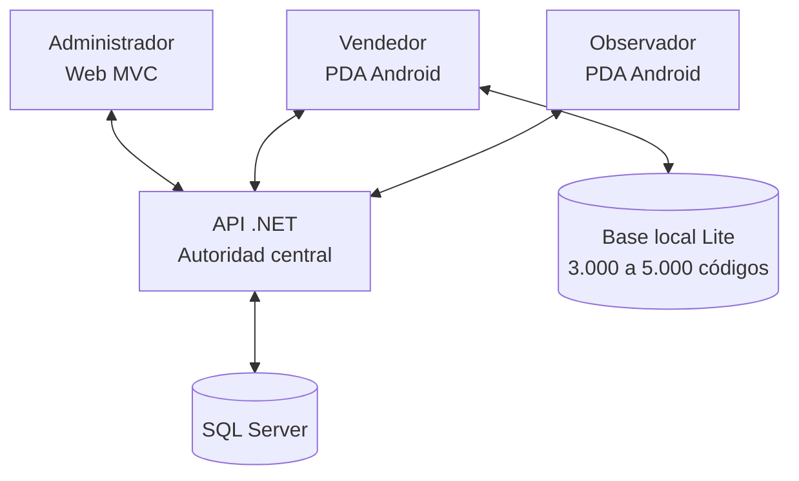

---

## 4. Acceso y autenticación

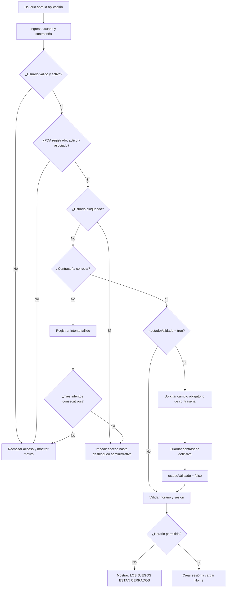

---

## 5. Administración de usuarios, grupos y PDA

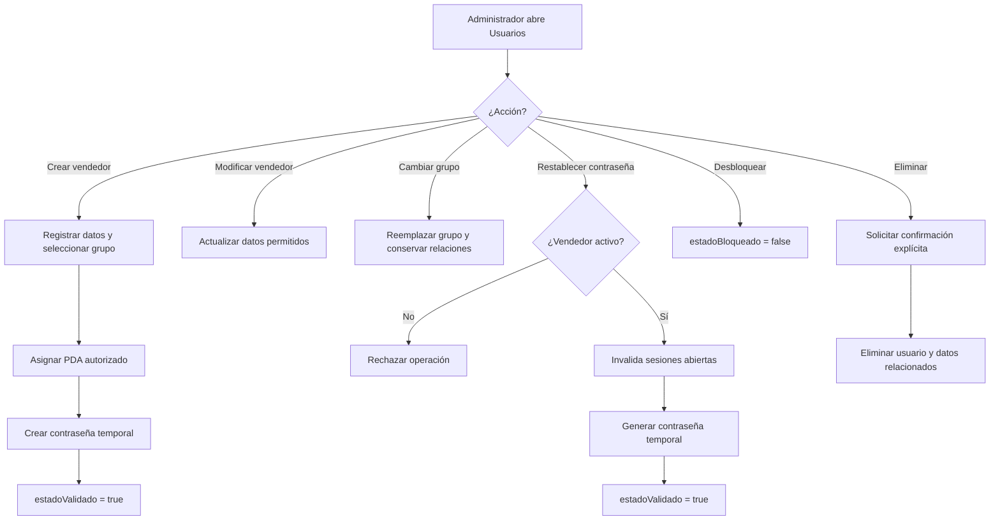

---

## 6. Configuración operativa

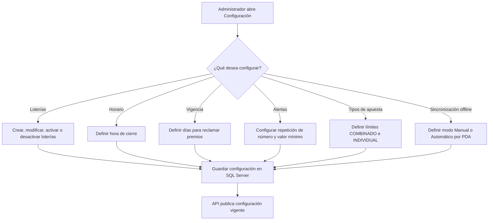

---

## 7. Inicio del vendedor y códigos disponibles

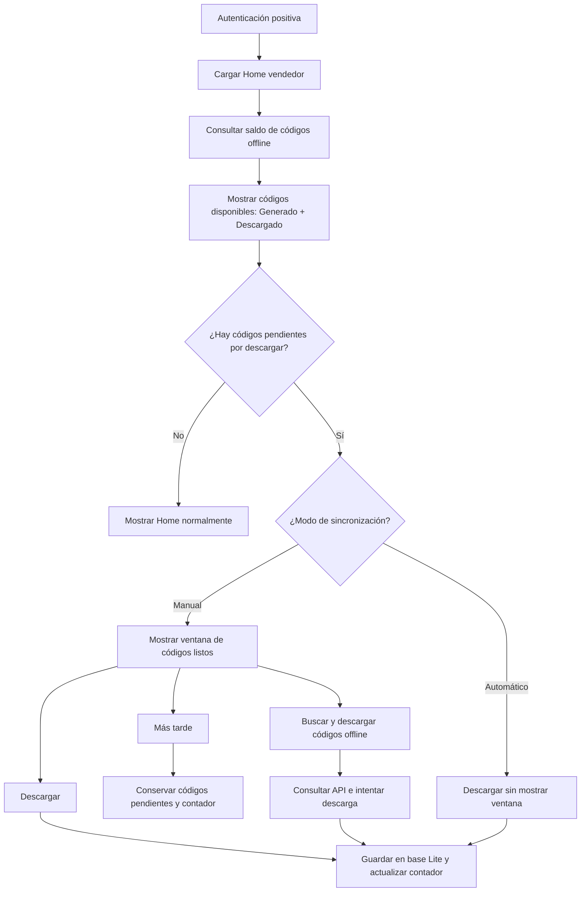

**Mensaje de descarga manual:** `Tiene códigos offline listos para descargar`.

**Configuración:** el vendedor define Manual o Automático directamente en su PDA.

---

## 8. Creación de una apuesta

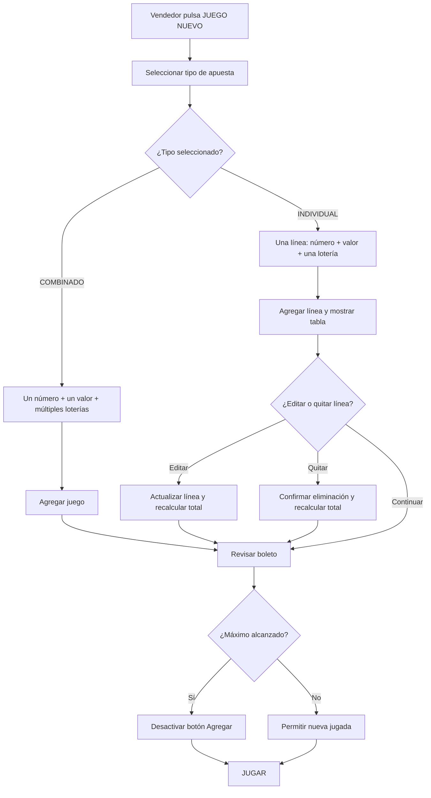

### Reglas de estructura

- **COMBINADO:** un boleto contiene un solo juego por defecto. El administrador puede configurar otro máximo.
- **INDIVIDUAL:** cada línea utiliza una sola lotería y permite hasta 6 líneas como máximo.
- No se pueden mezclar tipos en el mismo boleto.
- Las loterías mostradas son las habilitadas por el administrador para la fecha.

---

## 9. Cálculo y confirmación de la venta

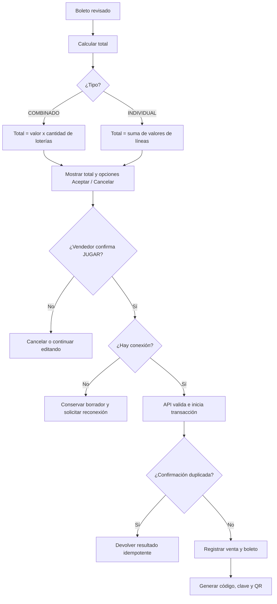

---

## 10. Emisión, impresión y contingencia

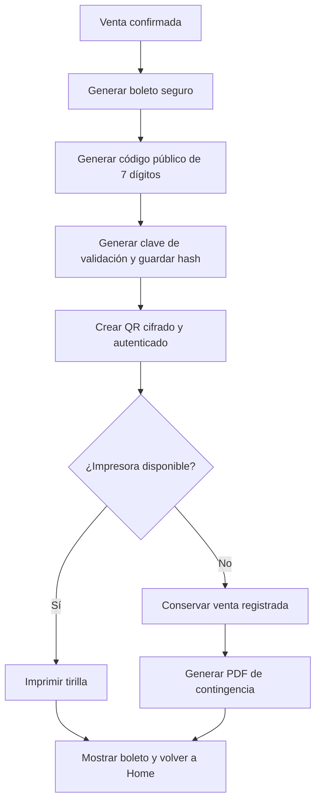

### Formatos de tirilla

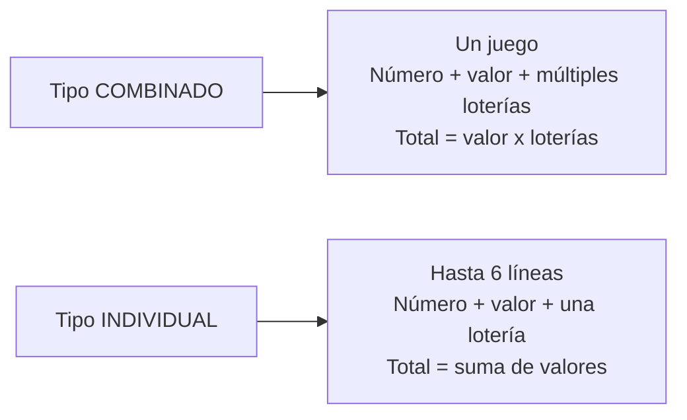

Ambos formatos incluyen código `AOL-1234567`, fecha, hora, tipo de apuesta, estado, total, QR, leyenda de pago al portador y vigencia.

---

## 11. Consulta de resultados y validación QR

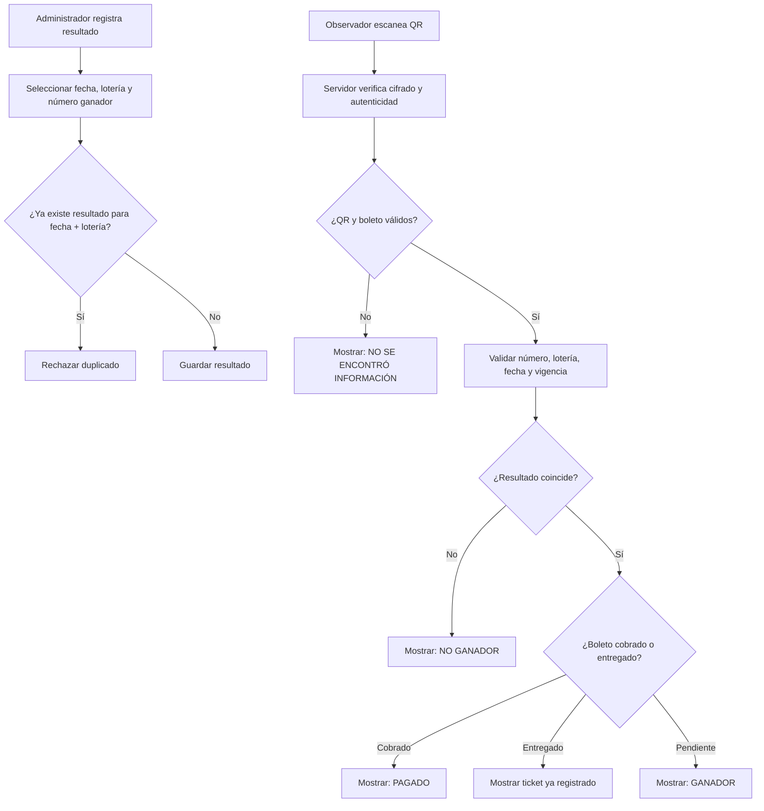

---

## 12. Operación online y pérdida de conexión

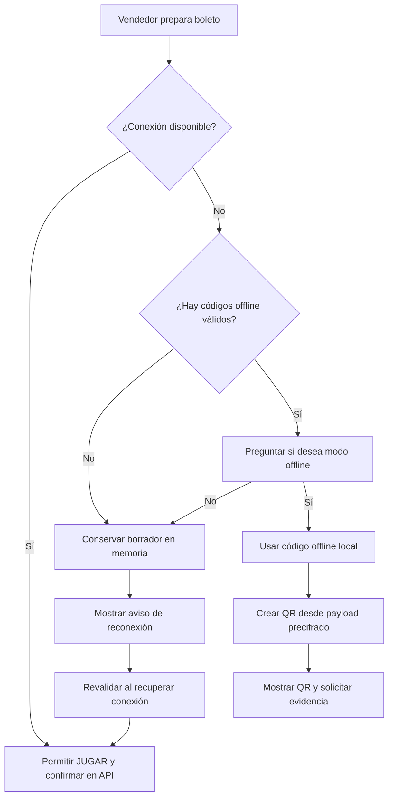

---

## 13. Venta offline con código preasignado

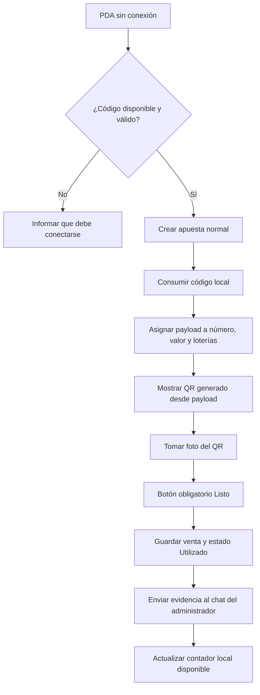

---

## 14. Registro administrativo de códigos offline

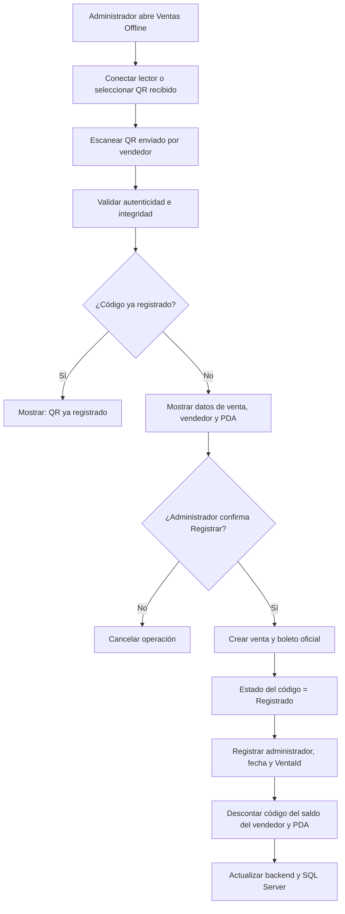

---

## 15. Sincronización y persistencia de códigos offline

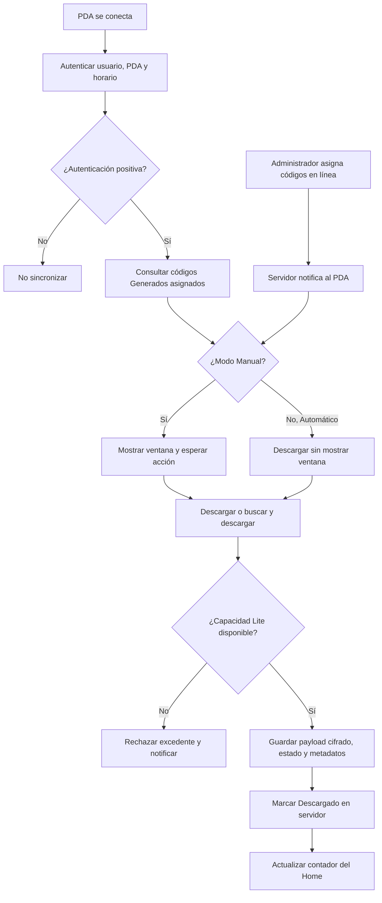

### Persistencia local

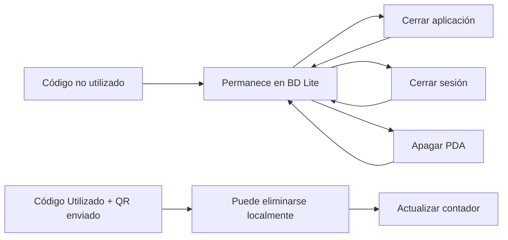

La base Lite almacena entre 3.000 y 5.000 códigos según la capacidad configurada. Los códigos disponibles se calculan como:

`Generado + Descargado`

Los estados `Utilizado` y `Registrado` no forman parte del saldo disponible.

---

## 16. Control de horario offline

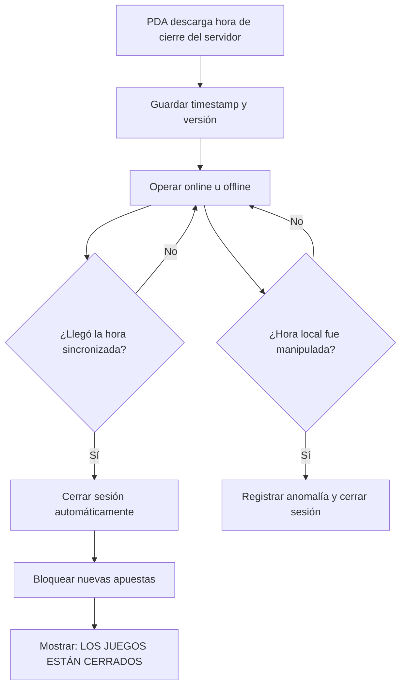

---

## 17. Flujo de validación y entrega de premios

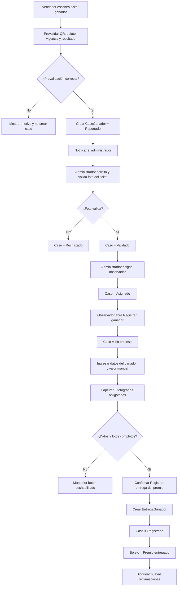

---

## 18. Estados de un código offline

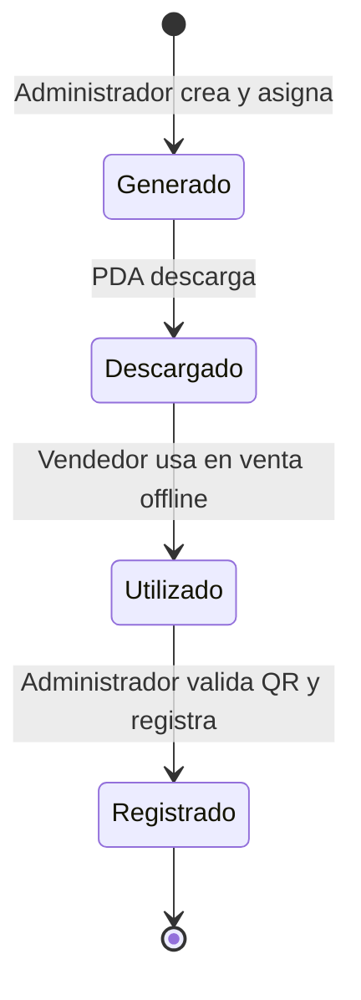

## 19. Estados de un caso ganador

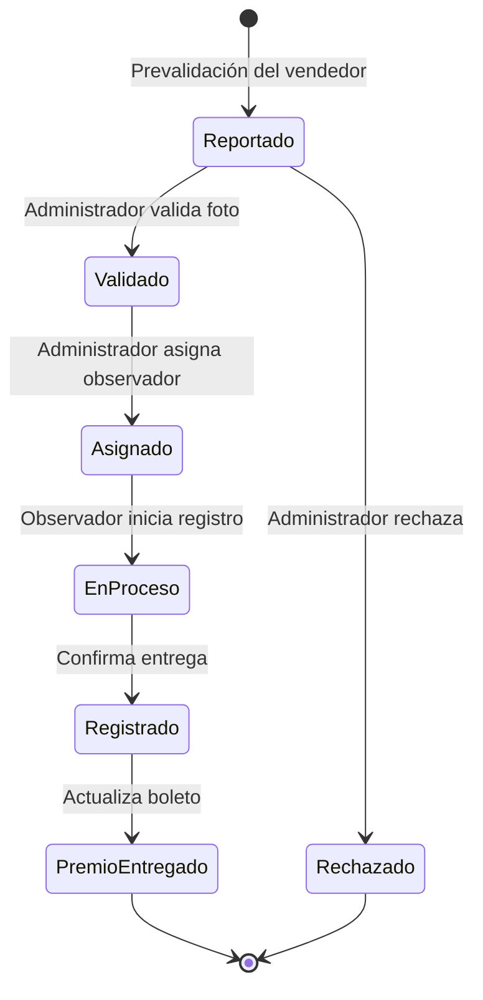

---

## 20. Soporte por chat

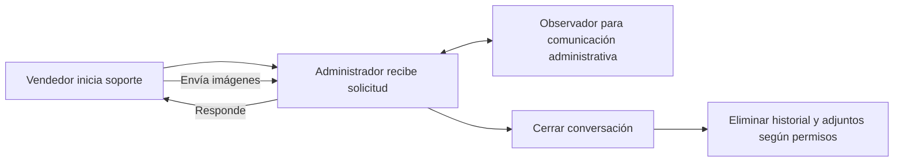

El vendedor no conversa por este canal con observadores. Los mensajes de evidencia de ventas offline marcados como permanentes no se eliminan al cerrar la conversación.

---

## 21. KPI e históricos

```mermaid
flowchart TD
    A[Administrador abre KPI] --> B[Seleccionar período]
    B --> C{¿Filtro?}
    C -->|General| D[Consolidar todos los vendedores]
    C -->|Grupo| E[Consolidar vendedores del grupo]
    C -->|Vendedor| F[Consolidar operación individual]
    D --> G[Mostrar ventas, boletos, números y loterías]
    E --> G
    F --> G
    G --> H[Actualizar indicadores y gráficos]
    H --> I[Descargar informe PDF]

    J[Vendedor abre Histórico] --> K[Seleccionar rango hasta 10 días]
    K --> L[Consultar ventas propias en solo lectura]
```

---

## 22. Reglas transversales

- El servidor es la fuente definitiva de autenticación, ventas, boletos, QR, estados, resultados y códigos offline.
- Una venta confirmada se registra una sola vez mediante una operación transaccional e idempotente.
- El código público del boleto tiene exactamente 7 dígitos y conserva ceros a la izquierda.
- El QR es cifrado y autenticado; el PDA no decide por sí solo la validez de un boleto.
- El tipo de apuesta es inmutable dentro del boleto y no se pueden mezclar modalidades.
- El valor del premio no se calcula ni se liquida automáticamente; el observador puede registrar el valor informado manualmente durante la entrega.
- Un boleto con estado `Premio entregado` no puede iniciar una nueva reclamación.
- Los códigos offline no utilizados permanecen en la base Lite aunque se cierre la aplicación, la sesión o el PDA.
- Solo los códigos utilizados y con evidencia QR enviada al administrador pueden eliminarse de la base local.

---

## 23. Trazabilidad principal

| Flujo | Requisitos relacionados |
| --- | --- |
| Autenticación y PDA | RS-001 a RS-010, RS-028 a RS-030 |
| Configuración administrativa | RS-011 a RS-027, RS-032, RS-040A |
| Venta y boleto | RS-060 a RS-080 |
| Impresión | RS-070 a RS-072, RS-087 |
| Conectividad | RS-081 a RS-086 |
| Operación offline | RS-088 a RS-101 |
| Validación y entrega de premios | RS-102 a RS-117 |
