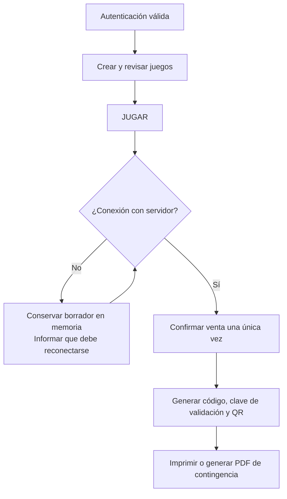
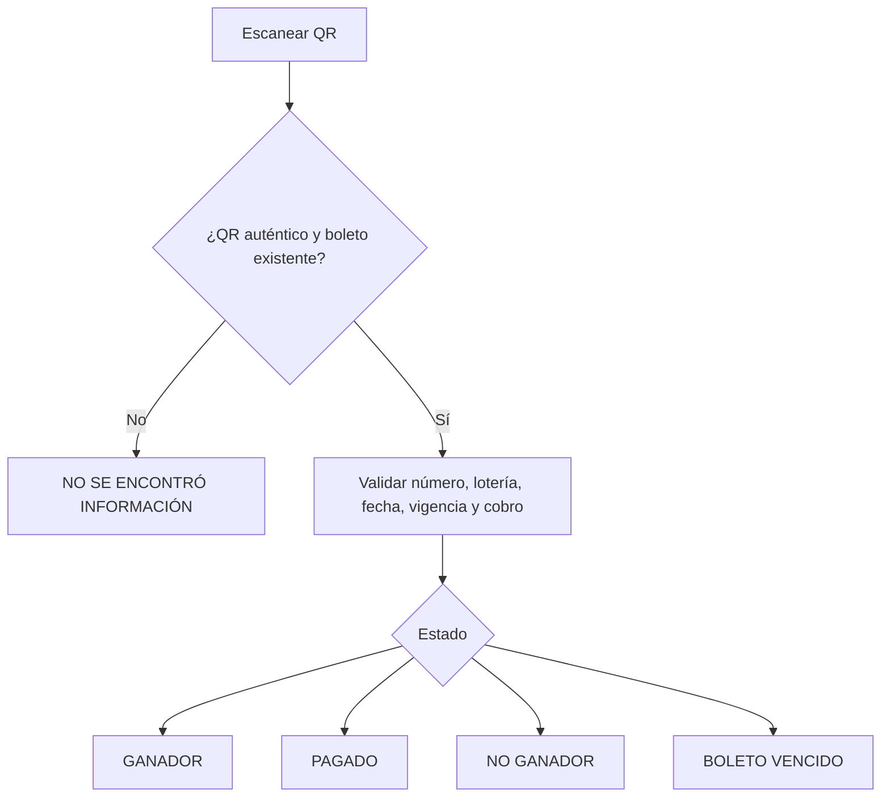
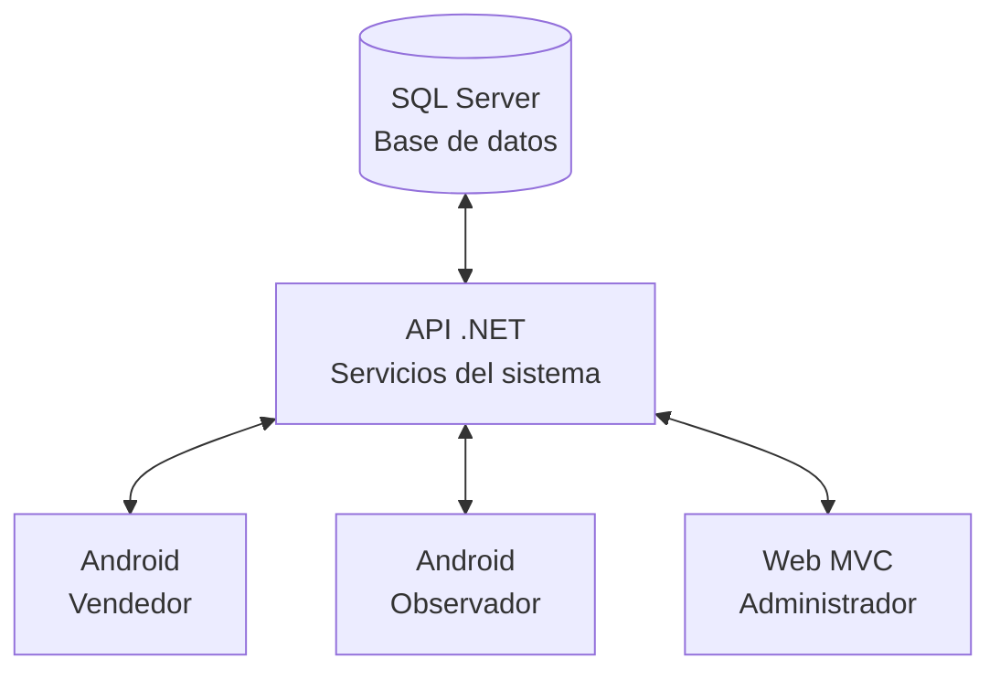
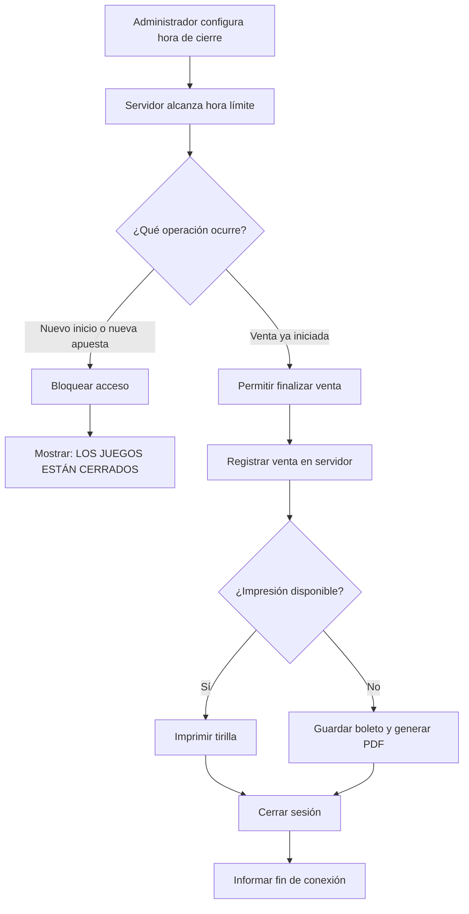
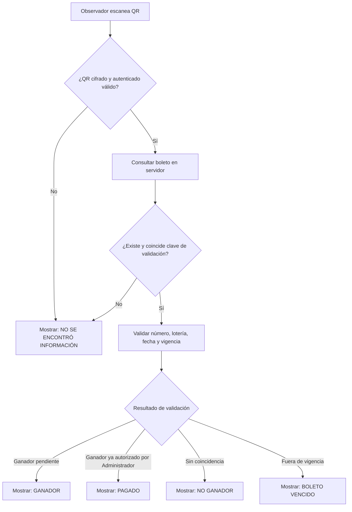
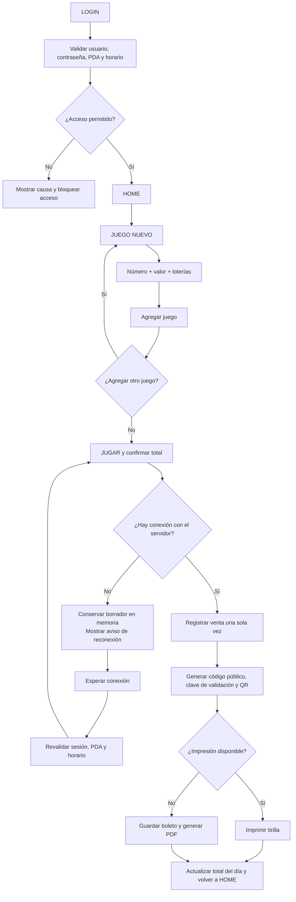

# Historias de usuario — New Rich


## Convenciones

- **Apetito:** tiempo máximo que se decide invertir; no es una estimación de tareas.
- **Obligatorio:** debe estar terminado para cerrar la apuesta.
- **Opcional (~):** se implementa solo si el alcance obligatorio ya está terminado.
- **Fuera de alcance:** no se agrega al ciclo actual.
- Las reglas de seguridad, privacidad y no cálculo de premios aplican a todas las historias.

## Resumen de apuestas

| Código | Apuesta | Apetito | Historias |
| --- | --- | --- | --- |
| A1 | Venta y boleto seguro | 6 semanas | HU-01 a HU-07 |
| A2 | Resultados y validación | 4 semanas | HU-08 a HU-11 |
| A3 | Administración y supervisión | 6 semanas | HU-12 a HU-16 |
| A4 | Conectividad obligatoria y consulta de soporte | 4 semanas | HU-17 a HU-20 |
| A5 | Operación offline empresarial con códigos preasignados | 6 semanas | HU-21 a HU-25 |
| A6 | Proceso de validación y entrega de premios ganadores | 6 semanas | HU-26 a HU-30 |

## Trazabilidad con la especificación maestra

| Perfil | Rango vigente en `REQUERIMIENTOS DE SOFTWARE.MD` |
| --- | --- |
| Administrador | RS-001 a RS-040, RS-088 a RS-101, RS-102 a RS-117 |
| Observador | RS-041 a RS-059 |
| Vendedor | RS-060 a RS-086 |
| Operación Offline | RS-087 a RS-101 |
| Proceso de Premios | RS-102 a RS-117 |
| Tirilla de impresión | RS-087 |

La cobertura detallada de cada RS está incorporada en el anexo normativo de este documento.

---

## Flujos clave de las historias

### Venta con conectividad obligatoria



### Soporte iniciado por vendedor


### Validación de boleto



---

# A1. Venta y boleto seguro

## Resultado de la apuesta

Un vendedor autorizado registra una venta online, obtiene una tirilla o PDF de contingencia y el sistema genera un código público y QR seguros que el servidor puede validar.

## HU-01 — Autenticación desde PDA autorizado

**Como** vendedor,  
**quiero** iniciar sesión únicamente desde el PDA que me fue asignado,  
**para** operar apuestas de forma segura durante el horario habilitado.

### Criterios de aceptación

- La API valida usuario activo, no bloqueado, contraseña correcta, PDA registrado/activo/asociado, sesión y horario permitido.
- Activo/Inactivo, `estadoValidado` y `estadoBloqueado` son independientes: Inactivo impide el acceso; `estadoValidado = true` exige cambiar la contraseña; `estadoBloqueado = true` impide acceso permanentemente hasta que admin desbloquee.
- Si `estadoValidado` es true (usuario nuevo o contraseña restablecida), el vendedor ingresa la contraseña temporal y el sistema obliga a establecer una contraseña definitiva. Al guardarla, `estadoValidado` pasa a false.
- Si el usuario ingresa contraseña incorrecta 3 veces seguidas, queda bloqueado (`estadoBloqueado = true`) y no puede iniciar sesión hasta que el administrador lo desbloquee.
- El contador de intentos fallidos se resetea cuando el usuario ingresa la contraseña correcta.
- Si una condición falla, no se crea sesión ni se permite crear apuestas.
- Si el horario está cerrado, se muestra `LOS JUEGOS ESTÁN CERRADOS`.
- El control horario proviene del servidor, no solo de la hora configurada en el PDA.

### Fuera de alcance

- Recuperación self-service de contraseña, envío de contraseña por correo/SMS/chat y autenticación biométrica. El único restablecimiento es el botón del administrador.

## HU-02 — Consultar el inicio operativo

**Como** vendedor,  
**quiero** ver el total vendido del día y una acción clara para crear un juego,  
**para** iniciar la venta sin navegar por módulos administrativos.

### Criterios de aceptación

- El inicio muestra ventas del día, estado de sesión, menú principal y `JUEGO NUEVO`.
- El Home muestra la cantidad de códigos offline disponibles para el PDA, actualizada después de cada sincronización y cada uso.
- El vendedor puede acceder a sus históricos y resultados desde el menú.
- No se exponen datos de otros vendedores como acción de edición.

## HU-03 — Crear un juego de apuesta

**Como** vendedor,  
**quiero** registrar un número, valor y una o más loterías en un juego,  
**para** vender la combinación solicitada por el cliente.

### Criterios de aceptación

 - Antes de crear el primer juego, el sistema solicita seleccionar **COMBINADA** o **INDIVIDUAL**.
 - El tipo seleccionado queda asociado al boleto y no se puede mezclar con el otro tipo.
 - Las loterías disponibles son únicamente las que el administrador habilitó para la fecha de juego.

### Apuesta COMBINADA

 - El vendedor ingresa un número, un valor y una o más loterías.
 - El mismo número y valor se aplican a todas las loterías seleccionadas.
 - El total del juego es `valor × cantidad de loterías`.
 - El boleto permite el máximo de juegos configurado por el administrador; inicialmente es un solo juego.
 - El botón **Agregar juego** se desactiva al alcanzar ese máximo.

### Apuesta INDIVIDUAL

 - Cada línea solicita un número, un valor y una sola lotería.
 - El vendedor agrega líneas mediante **Agregar línea** y las visualiza en una tabla.
 - Cada línea puede editarse o quitarse antes de confirmar el boleto.
 - El total es la suma de los valores de todas las líneas.
 - El boleto permite hasta 6 líneas, salvo que el administrador configure un límite menor.
 - El botón **Agregar línea** se desactiva al alcanzar el máximo configurado.


## HU-04 — Armar y modificar un boleto

**Como** vendedor,  
**quiero** agregar varios juegos, eliminarlos o cancelar el boleto antes de pagar,  
**para** revisar y corregir la solicitud del cliente.

### Criterios de aceptación

- Un boleto COMBINADO agrupa un número y valor bajo múltiples loterías y admite el máximo de juegos configurado.
- Un boleto INDIVIDUAL admite hasta 6 líneas (o el máximo configurado), cada una con número, valor y una sola lotería.
- En ambos tipos, el total se recalcula después de agregar, editar o quitar un juego o línea.
- Al alcanzar el máximo, el botón correspondiente se desactiva.
- Después de confirmar la venta con **JUGAR**, los juegos y líneas no se pueden modificar.

## HU-05 — Confirmar y registrar una venta

**Como** vendedor,  
**quiero** confirmar el total con `JUGAR`,  
**para** registrar una venta pagada al portador.

### Criterios de aceptación

- Antes de confirmar se muestra el valor total y las opciones Aceptar/Cancelar.
- Al aceptar, la venta se registra de manera transaccional una sola vez.
- Se guardan venta, boleto, vendedor/alias, fecha/hora, juegos, números, valores, loterías, total, estado y sincronización cuando corresponda.
- La venta se considera pagada al momento de confirmar.
- No se almacena información personal del comprador.
- Si llega la hora de cierre mientras la venta ya está abierta, se permite terminar esa venta y después se cierra la sesión.

## HU-06 — Emitir un boleto identificable y seguro

**Como** vendedor,  
**quiero** que cada boleto tenga un código legible y QR verificable,  
**para** entregar un comprobante que no pueda falsificarse alterando sus datos.

### Criterios de aceptación

- Cada boleto tiene un GUID/UUID interno y un código público único de exactamente 7 dígitos.
- Los ceros a la izquierda se conservan; por ejemplo, `0000123` es válido.
- La base de datos tiene una restricción única sobre `CodigoPublico`; ante colisión la API genera otro código antes de confirmar.
- La tirilla presenta el código como `AOL-1234567`; el prefijo no cuenta dentro de los siete dígitos.
- El servidor genera una clave de validación aleatoria y única por boleto.
- El QR contiene un payload cifrado y autenticado con identificador interno, código público, clave de validación, versión e identificador de clave.
- El cifrado usa un mecanismo estándar de cifrado autenticado, como AES-GCM; la clave maestra permanece solo en el servidor.
- La base de datos guarda el hash de la clave de validación y no su valor en texto plano.

### Fuera de alcance

- Exponer claves maestras, claves privadas o secretos dentro del QR, la tirilla o el PDA.
- Usar el código público de siete dígitos como prueba suficiente de autenticidad.

## HU-07 — Imprimir o recuperar el comprobante

**Como** vendedor,  
**quiero** imprimir el boleto y obtener un PDF si la impresora falla,  
**para** no perder la venta ni dejar al cliente sin comprobante.

### Criterios de aceptación

- Al confirmar se intenta imprimir automáticamente en la impresora térmica integrada.
- La tirilla incluye código, fecha/hora, juegos, número, valor, loterías, total, QR y leyenda de pago al portador.
- Si la impresión falla, la venta permanece registrada y el boleto se conserva localmente en el PDA.
- El vendedor puede visualizar el boleto y generar un PDF para compartir manualmente.
- Una falla de impresión nunca duplica ni revierte la venta.

---

# A2. Resultados y validación de boletos

## Resultado de la apuesta

Administración publica resultados por lotería y fecha; observación valida boletos por QR y muestra su estado sin calcular el valor de premios.

## HU-08 — Registrar números ganadores

**Como** administrador,  
**quiero** registrar un número ganador para cada lotería y fecha,  
**para** permitir la posterior validación de los boletos.

### Criterios de aceptación

- Se pueden registrar varios resultados en una misma fecha si pertenecen a loterías distintas.
- La combinación `FechaJuego + LoteriaId` es única en la base de datos.
- El mismo número puede ser ganador en loterías diferentes.
- El administrador puede consultar los números ganadores registrados.

## HU-09 — Consultar resultados como vendedor

**Como** vendedor,  
**quiero** consultar los resultados publicados,  
**para** informar al portador si su combinación coincide con un resultado.

### Criterios de aceptación

- La consulta relaciona número apostado, lotería, fecha de juego, número ganador, vigencia y estado del boleto.
- La consulta no calcula fórmula, multiplicador ni valor monetario del premio.
- El vendedor puede ver información de solo lectura.

## HU-10 — Validar un boleto por QR

**Como** observador,  
**quiero** escanear el QR de una tirilla,  
**para** saber si el boleto existe y cuál es su estado vigente.

### Criterios de aceptación

- El observador puede abrir `VALIDAR BOLETO` y usar la cámara para leer QR.
- El servidor identifica la clave aplicable, descifra el payload y verifica su autenticidad.
- El servidor comprueba existencia del boleto, coincidencia de código público y coincidencia del hash de clave de validación.
- El servidor valida número, lotería, fecha, vigencia y estado de cobro.
- La respuesta muestra código, vendedor, fecha/hora, juegos, loterías, total, estado, resultado y vigencia.
- Un QR inválido, alterado o sin boleto asociado muestra `NO SE ENCONTRÓ INFORMACIÓN`.

## HU-11 — Determinar vigencia y cobro

**Como** administrador,  
**quiero** autorizar el cobro de un boleto ganador y cambiarlo a `PAGADO`,  
**para** impedir que el mismo boleto sea cobrado más de una vez sin registrar datos del portador.

### Criterios de aceptación

- Un boleto es ganador solo si coinciden número, lotería y fecha, el QR es válido, el boleto existe, está vigente y no fue cobrado.
- La vigencia inicial es 30 días calendario y el administrador puede configurarla.
- Un ganador no cobrado muestra `GANADOR`; uno cobrado muestra `PAGADO`.
- Un boleto sin coincidencia muestra `NO GANADOR`; uno fuera de período muestra `BOLETO VENCIDO`.
- Solo el Administrador puede autorizar el cobro y cambiar el estado a `PAGADO`.
- El Observador solo puede consultar el estado de cobrado y no puede modificarlo.
- El sistema no almacena la identidad del cobrador ni el monto del premio.

### Fuera de alcance

- Cálculo, liquidación o registro del valor de un premio.

---

# A3. Administración y supervisión

## Resultado de la apuesta

El administrador gestiona operación y el observador consulta y supervisa, respetando una matriz de permisos simple y auditable.

## HU-12 — Incorporar y administrar vendedores

**Como** administrador,  
**quiero** crear, modificar, activar o eliminar usuarios y asociarles un PDA,  
**para** controlar quién puede operar el sistema.

### Criterios de aceptación

- El administrador revisa solicitudes externas recibidas mediante Google Forms y crea al vendedor manualmente.
- Puede registrar nombre, usuario, alias, documento, celular, correo, rol, estado operativo (Activo/Inactivo), PDA e información técnica.
- Al crear un vendedor es **obligatorio seleccionar un grupo** de la lista de grupos disponibles. Cada vendedor pertenece a un solo grupo.
- El administrador puede crear nuevos grupos con nombre libremente definible.
- Al crear un vendedor, `estadoValidado` queda en true y el sistema muestra en pantalla una contraseña temporal. El sistema no la envía por correo, SMS ni chat.
- En el perfil de cada vendedor existe el botón `Restablecer contraseña`, disponible solo para el perfil Administrador y solo si el vendedor está ACTIVO.
- El vendedor pide el restablecimiento por un medio externo; las validaciones de identidad las define y ejecuta el negocio fuera del sistema.
- Al pulsar `Restablecer contraseña`, el sistema muestra una contraseña temporal solo en pantalla, pone `estadoValidado` en true, cierra de inmediato todas las sesiones abiertas de ese vendedor. El restablecimiento solo funciona si el vendedor está en estado ACTIVO.
- En el perfil de cada vendedor existe el botón `Cambiar grupo`, disponible solo para el perfil Administrador. Al cambiar de grupo, el sistema reemplaza automáticamente el grupo anterior y el vendedor se mueve con todo su histórico y datos asociados al nuevo grupo.
- Esta es la única forma de restablecer contraseña.
- El PDA se asocia al vendedor antes de entregarlo y no opera hasta estar autorizado.
- Solo administrador puede crear, modificar, eliminar usuarios o restablecer contraseña, crear grupos y cambiar grupo de vendedores.
- La eliminación requiere confirmación explícita y elimina accesos, asociación PDA, ventas, boletos, juegos y relaciones del usuario.
- La eliminación es irreversible y no conserva auditoría histórica, conforme a la regla aprobada.

## HU-13 — Administrar configuración operativa

**Como** administrador,  
**quiero** administrar PDA, loterías, horario, vigencia y notificaciones,  
**para** adaptar la operación sin actualizar las aplicaciones.

### Criterios de aceptación

- El administrador puede activar/desactivar PDA y loterías y consultar su estado.
- Puede definir la hora máxima de operación y la vigencia para reclamar premios.
- Puede configurar por separado el máximo de juegos por boleto COMBINADO y el máximo de líneas por boleto INDIVIDUAL; este último no puede superar 6.
- Puede configurar una alerta por repetición de un número para una fecha y una alerta por valor mínimo de apuesta.
- Cuando una regla de alerta se cumple, el centro de notificaciones muestra la notificación y un contador de pendientes en el icono de campana.
- Observador puede consultar configuraciones, pero no modificarlas.
- Los nuevos accesos y apuestas se bloquean después de la hora configurada.

## HU-14 — Consultar operación como observador

**Como** observador,  
**quiero** consultar vendedores, ventas, números, dispositivos y boletos,  
**para** supervisar la operación sin alterar las ventas.

### Criterios de aceptación

- Puede consultar vendedores con nombre, alias, estado y PDA.
- Puede filtrar ventas por vendedor, fecha inicial/final, número y lotería.
- Puede consultar números por valor, vendedor, fecha, loterías y estado.
- Puede consultar PDA conectados/desconectados, usuario asociado y estado.
- Puede consultar las configuraciones definidas por el administrador y el número ganador, lotería y fecha mostrados en su inicio.
- Puede filtrar boletos por por jugar, jugados, ganadores, no ganadores, vencidos y pagados/cobrados.
- Todas sus acciones operativas son de solo lectura: no puede crear, modificar, eliminar, configurar, cobrar ni alterar datos. La única excepción es el chat con el Administrador, que cualquiera de los dos perfiles puede iniciar.

## HU-15 — Buscar y visualizar una tirilla administrativa

**Como** administrador,  
**quiero** buscar por número, vendedor, boleto o lotería y abrir la tirilla equivalente,  
**para** resolver consultas operativas desde la web.

### Criterios de aceptación

- La búsqueda admite número, documento/nombre/alias de vendedor, código de boleto, lotería, fecha y estado.
- Al seleccionar un resultado se visualiza la información completa en formato equivalente a la tirilla impresa.
- La consulta no expone datos personales del comprador porque no existen en el sistema.

## HU-16 — Consultar KPI básicos

**Como** administrador,  
**quiero** consultar indicadores de usuarios, ventas y números, y filtrar por grupos,  
**para** entender el volumen de la operación por período, vendedor y grupo.

### Criterios de aceptación

- Se muestran cantidades de vendedores, observadores, usuarios activos e inactivos.
- Se muestran ventas totales, por rango, vendedor y día.
- Se muestran números jugados, ganadores y fechas de resultados.
- Al elegir vendedor y rango se muestran ventas, total vendido, boletos, números y loterías utilizadas.
- Se agrega un filtro por grupos que permite seleccionar:
  - **General:** muestra información agregada de todos los vendedores sin importar grupo.
  - **Grupo específico:** muestra información solo de los vendedores pertenecientes al grupo seleccionado.
- Los indicadores, gráficos, estadísticas y toda la información de la hoja de informes se actualizan dinámicamente según el filtro de grupo aplicado.
- El administrador puede descargar el informe generado en formato PDF, que conserva absolutamente todos los datos, indicadores, filtros (incluyendo el grupo seleccionado) y el estado de la consulta al momento de la descarga.
- El filtro de grupo es completamente dinámico y reactivo; cualquier cambio en la selección actualiza inmediatamente toda la información mostrada.

### Fuera de alcance

- Analítica predictiva, exportaciones financieras complejas y permisos personalizados por pantalla.

---

# A4. Conectividad obligatoria y consulta de soporte

## Resultado de la apuesta

La venta requiere conexión con el servidor para generar elementos verificables. Si la conexión falla durante una venta en preparación, el vendedor necesita conservar el borrador y reanudarlo solo después de reconectar.

## HU-17 — Pausar una venta cuando se pierde la conexión

**Como** vendedor,  
**quiero** conservar el borrador de una venta cuando se pierde la conexión,  
**para** reanudarlo sin perder los datos una vez el servidor esté disponible.

### Criterios de aceptación

- Si no hay conexión antes de iniciar una venta, el sistema informa que debe conectarse al servidor para realizarla y continuar operando.
- Si la conexión se pierde durante la preparación, los juegos, números, valores y loterías se conservan solo en memoria.
- Mientras no exista conexión no se puede confirmar la venta ni generar boleto, código público, clave de validación, QR, impresión o PDF.
- El borrador en memoria no es una venta registrada ni un boleto válido.

## HU-18 — Reanudar y confirmar después de reconectar

**Como** vendedor,  
**quiero** recuperar el borrador al reconectar y confirmar la venta en el servidor,  
**para** registrar una única venta válida con su QR seguro.

### Criterios de aceptación

- Al recuperar red, el PDA revalida conexión, sesión, dispositivo y horario antes de habilitar la confirmación.
- La API procesa la confirmación de forma idempotente y no registra una venta dos veces ante un reintento.
- Solo después de confirmar en el servidor se generan código público, clave de validación, QR, impresión o PDF.
- No existe sincronización de ventas offline ni cola de ventas pendientes.

## HU-19 — Solicitar soporte por chat

**Como** vendedor,  
**quiero** dejar una solicitud de soporte con una imagen,  
**para** que el administrador la atienda de forma directa.

### Criterios de aceptación

- El vendedor puede iniciar una conversación de soporte directamente con el administrador y adjuntar imágenes desde cámara, galería o almacenamiento.
- El sistema no revisa disponibilidad ni asigna observadores: cualquier vendedor que solicite soporte se conecta con el administrador.
- El administrador atiende y responde el chat del vendedor y puede descargar las imágenes enviadas.
- El observador no participa en el chat de soporte del vendedor ni puede iniciar chats con vendedores.
- El observador no puede modificar información operativa, autorizar pagos, crear configuraciones o cerrar conversaciones.
- El administrador y el observador pueden iniciar y responder chat entre sí.
- Se pueden adjuntar imágenes desde cámara, galería o almacenamiento.
- Las imágenes descargadas usan un nombre basado en fecha/hora.

## HU-20 — Cerrar una conversación y eliminar su historial

**Como** administrador,  
**quiero** cerrar una conversación resuelta,  
**para** eliminar el historial y adjuntos almacenados por el sistema.

### Criterios de aceptación

- El administrador puede cerrar una conversación y eliminar mensajes e imágenes asociadas almacenadas en el sistema.
- El observador no puede cerrar conversaciones ni eliminar contenido.
- No se eliminan archivos originales que permanezcan en los dispositivos de los usuarios.
- La conversación cerrada deja de estar disponible para consulta operativa.

### Fuera de alcance

- Recuperación de mensajes eliminados y eliminación remota de archivos del dispositivo. Las ventas offline se abordan en la Apuesta A5.

---

# A5. Operación offline empresarial con códigos preasignados

## Resultado de la apuesta

El administrador genera y asigna códigos QR preasignados a usuarios y PDA específicos. El PDA descarga estos códigos y los almacena en una base de datos local tipo Lite, con capacidad para conservar entre 3.000 y 5.000 códigos offline, para utilizarlos cuando pierde conexión con el servidor.

## HU-21 — Administrador genera y asigna códigos offline

**Como** administrador,  
**quiero** generar una cantidad de códigos QR offline y asignarlos a un vendedor y PDA específico,  
**para** que dispongan de códigos preasignados para operación offline.

### Criterios de aceptación

- El administrador accede a un módulo **"Ventas Offline"** donde consulta usuarios activos y PDA registrados.
- Puede generar N códigos QR offline en una sola operación, especificando usuario, PDA y cantidad.
- Cada código generado queda registrado en BD con: consecutivo único, fecha/hora de creación, usuario y PDA asignados, estado = **"Generado"**.
- Los códigos se asocian a identificadores internos únicos (GUID/UUID) que permiten trazabilidad completa.
- El sistema calcula un payload cifrado y firmado que incluye el código público, identificador de boleto, y metadatos de seguridad.
- La interfaz muestra un listado de códigos generados con filtros por usuario, PDA, fecha y estado.

### Fuera de alcance

- Generación masiva por lote de archivos externos, exportación directa a Excel y envío automático de códigos por correo.

---

## HU-22 — PDA descarga y almacena códigos offline

**Como** vendedor,  
**quiero** que el PDA descargue automáticamente los códigos offline asignados cuando tenga conexión,  
**para** utilizarlos localmente en caso de pérdida de conectividad.

### Criterios de aceptación

- Cuando el PDA se conecta y autentica correctamente, consulta si existen códigos asignados cuyo estado es **"Generado"**.
- Si existen códigos pendientes y está activa la sincronización manual, muestra: **"Tiene códigos offline listos para descargar"**, con botones **"Descargar"**, **"Más tarde"** y **"Buscar y descargar códigos offline"**.
- El botón **"Buscar y descargar códigos offline"** permite iniciar una búsqueda e intento de descarga de códigos asignados.
- Si el administrador asigna códigos mientras el vendedor está conectado, la misma ventana aparece inmediatamente.
- El vendedor puede configurar en su PDA la sincronización automática. Si está activa, el PDA descarga los códigos sin mostrar la ventana; si está desactivada, conserva el flujo manual.
- Los códigos se almacenan en una base de datos local tipo Lite del PDA con su payload cifrado, estado y metadatos.
- La base local debe soportar una capacidad de entre 3.000 y 5.000 códigos offline, según la capacidad configurada para el PDA.
- El sistema controla la capacidad disponible y no permite descargar códigos por encima del límite; informa cuando se alcanza el máximo.
- Cada código descargado se marca en BD con estado = **"Descargado"** y fecha/hora de descarga.
- Si el vendedor cierra la aplicación, cierra sesión o apaga el PDA, los códigos offline y sus estados permanecen almacenados en la base local tipo Lite.
- El sistema solo puede eliminar de la base local los códigos ya utilizados en una venta offline y cuya evidencia QR haya sido enviada al chat del administrador.
- Los códigos no utilizados nunca se eliminan por cerrar la aplicación, cerrar sesión o apagar el PDA.
- La descarga manual requiere confirmación del vendedor. La sincronización automática es opcional y se configura directamente en el PDA del vendedor.
- El sistema valida que los códigos descargados sean íntegros y auténticos antes de usarlos offline.

### Fuera de alcance

- Resincronización automática con revisión de cambios y sincronización de ventas offline pendientes.

---

## HU-23 — Vendedor usa códigos offline para venta sin conexión

**Como** vendedor,  
**quiero** usar códigos offline para crear ventas cuando no tengo conexión con el servidor,  
**para** no perder ventas durante interrupciones de conectividad.

### Criterios de aceptación

- Cuando el PDA detecta ausencia de conexión, informa al vendedor: **"Conexión no disponible. ¿Desea continuar en modo offline?"**.
- Si el vendedor acepta y existen códigos offline descargados, permite crear una venta offline usando esos códigos.
- Cada venta offline consumirá un código del almacenamiento local y asignará el payload a los datos de la jugada (números, valor, loterías).
- Tras confirmar la venta offline, el sistema genera automáticamente un QR desde el payload descargado (sin cifrar nuevamente).
- El PDA muestra el QR con el mensaje: **"Por favor, tomar foto de este código vendido. GRACIAS."** y un botón obligatorio **"Listo"**.
- Al pulsar **"Listo"**, el sistema guarda la venta offline localmente y envía automáticamente el QR como evidencia al chat interno del administrador en un mensaje que dice: **"CÓDIGO VENDIDO OFFLINE — Favor registrar"**, marcando este mensaje como **permanente** (no se elimina al cerrar chat).
- El código marcado en BD como **"Utilizado"** y se registra fecha/hora de venta offline, datos de la jugada y PDA.
- Si no hay conexión y se agotan los códigos offline, se informa al vendedor que debe conectarse para continuar operando.

### Fuera de alcance

- Generación de QR durante offline (se usa el payload precifrado), sincronización automática inmediata de ventas offline y caché multinivel de códigos.

---

## HU-24 — Administrador registra códigos offline escaneados

**Como** administrador,  
**quiero** escanear el QR fotografiado de la venta offline y registrarlo en el sistema,  
**para** validar la jugada, crear el boleto oficial y actualizar el estado del código.

### Criterios de aceptación

- El módulo **"Ventas Offline"** tiene opción **"Registrar códigos"** donde puede conectar un lector/pistola de códigos.
- El administrador escanea el QR recibido como evidencia. El sistema valida autenticidad, integridad y vigencia del payload cifrado/firmado.
- Si la validación es satisfactoria, desencripta el payload y muestra al administrador: número de código, números jugados, valor, loterías, fecha/hora de venta offline, usuario y PDA.
- Si es válido, habilita botón **"Registrar"**. Al confirmar, el sistema registra la venta oficialmente:
  - Crea registro de venta en BD con todos los datos de la jugada.
  - Crea registro de boleto con estado = **"Jugado"** (vigente).
  - Actualiza el código a estado = **"Registrado"** y registra fecha/hora de registro y usuario administrador que lo procesó.
  - Descuenta el código del saldo disponible del vendedor y PDA asignados en el backend y la base de datos.
  - Genera consecutivo único público de 7 dígitos si no lo tenía asignado previamente.
- Si el administrador escanea un código ya registrado, muestra mensaje: **"QR ya registrado"** y solo permite cerrar la ventana (no permite registrar de nuevo).
- El sistema genera y mantiene un reporte de códigos con trazabilidad completa: generado, descargado, vendido, registrado y por quién.

### Fuera de alcance

- Registro en lote de múltiples QR simultaneadamente y recuperación automática de códigos escaneados duplicados.

---

## HU-25 — Sistema retorna a modo online automáticamente

**Como** vendedor,  
**quiero** que el PDA detecte automáticamente cuando recupera conexión con el servidor,  
**para** reanudar el flujo normal de ventas online sin intervención manual.

### Criterios de aceptación

- Cuando el PDA recupera conexión, revalida sesión, dispositivo y horario de forma automática.
- Si todas las validaciones son satisfactorias, cambia automáticamente al modo online.
- Las ventas nuevas se crean nuevamente con el flujo normal: API genera código público, clave de validación y QR.
- Si hay ventas offline pendientes de sincronización (aunque no las hay en este diseño, el mecanismo está listo para futuras extensiones), se procesarían antes de retornar completamente a online.
- El vendedor recibe notificación: **"Sistema online. Puede continuar operando normalmente."**
- Si la reconexión falla, el sistema retorna automáticamente a modo offline si hay códigos disponibles.

### Fuera de alcance

- Cola automática de reintentos, cierre automático de sesión tras N minutos offline y recuperación de sesiones huérfanas.

---

# A6. Proceso de validación y entrega de premios ganadores

## HU-26 — Vendedor escanea y prevalida ticket ganador

**Como** vendedor,  
**quiero** escanear el código QR de un ticket que un cliente reporta como ganador,  
**para** que el sistema realice una prevalidación automática y reporte el caso al administrador.

### Criterios de aceptación

- El vendedor accede a una opción **"Validar ticket ganador"** desde el menú principal del PDA.
- Selecciona la cámara del dispositivo para escanear el QR del ticket.
- El PDA desencripta el payload del QR y valida:
  - QR válido y perteneciente al sistema.
  - Boleto existe en BD.
  - Boleto tiene estado "Jugado" (no otro estado).
  - Boleto está dentro de vigencia.
  - Boleto no tiene estado "Premio entregado".
  - Número + lotería + fecha coinciden con un resultado ganador registrado.
- **Si prevalidación es exitosa:**
  - Sistema registra automáticamente un caso de ganador con estado = **"Reportado"**.
  - Sistema notifica al administrador que se ha presentado un posible ganador.
  - Muestra al vendedor: **"Ticket validado. Se ha informado al administrador. Queda pendiente su aprobación."**
- **Si prevalidación falla:**
  - Sistema muestra motivo específico (ejemplo: "Boleto vencido", "No es ganador", "Ticket ya registrado", etc.).
  - No registra caso alguno.
  - Vendedor puede intentar de nuevo o cerrar.

### Fuera de alcance

- Registro inmediato del ganador sin validación administrativa.
- Captura automática de datos del cliente en este paso.

---

## HU-27 — Administrador valida ticket ganador fotografiado

**Como** administrador,  
**quiero** recibir la notificación de un posible ganador y solicitar la fotografía física del ticket,  
**para** realizar una validación manual antes de proceder con la asignación a un observador.

### Criterios de aceptación

- El administrador accede a un módulo **"Casos de premios ganadores"** desde la aplicación web.
- Visualiza listado de casos con estado **"Reportado"**.
- Puede filtrar por: fecha, vendedor, estado, PDA donde se reportó.
- Al seleccionar un caso "Reportado", el sistema muestra:
  - Código del ticket (7 dígitos).
  - Números jugados, loterías, valor total apostado, fecha de venta.
  - Vendedor que reportó el caso.
  - Estado actual del caso.
  - Opción para solicitar foto: **"Solicitar fotografía del ticket con QR visible"**.
- El administrador requiere que se envíe la **fotografía del ticket con el código QR claramente visible** antes de proceder.
- Cuando recibe la fotografía (enviada por el vendedor a través del chat de soporte):
  - Valida manualmente que el QR corresponda al ticket reportado.
  - Verifica que la foto sea legible y muestre claramente el código QR y datos del ticket.
- **Si validación es exitosa:**
  - Cambia estado del caso a **"Validado"**.
  - Habilita opción para asignar observador.
- **Si validación es rechazada:**
  - Puede rechazar el caso completamente.
  - El caso queda con estado **"Rechazado"** y no avanza en el proceso.
  - Notifica al vendedor el motivo del rechazo.

### Fuera de alcance

- Extracción automática de datos de la fotografía.
- OCR o procesamiento de imagen.

---

## HU-28 — Administrador asigna observador al caso

**Como** administrador,  
**quiero** asignar un observador específico para que visite al ganador y realice la entrega final,  
**para** garantizar que un tercero independiente valide la identidad y complete el registro.

### Criterios de aceptación

- El administrador accede a un caso con estado **"Validado"**.
- Visualiza opción **"Asignar observador"**.
- Se despliega lista de observadores activos disponibles en el sistema.
- Puede seleccionar un observador de la lista.
- Al confirmar la asignación:
  - Estado del caso cambia a **"Asignado"**.
  - El observador seleccionado recibe notificación en su PDA: **"Tiene un nuevo caso de ganador asignado. Presione aquí para ver detalles."**
  - Se registra fecha/hora de asignación y usuario administrador que asignó.
- El administrador puede cambiar de observador en cualquier momento si es necesario (mientras el caso no esté en estado "Registrado" o "Premio entregado").

### Fuera de alcance

- Rotación automática de observadores o balanceo de carga.
- Notificaciones por SMS o push automáticas.

---

## HU-29 — Observador registra ganador con datos y evidencias fotográficas

**Como** observador,  
**quiero** completar el registro del ganador con datos personales, valor ganado, evidencias fotográficas y una firma de entrega,  
**para** que quede constancia oficial de que el premio fue entregado al ganador correcto.

### Criterios de aceptación

- El observador accede desde su PDA a la opción **"Registrar ganador"**.
- Visualiza listado de casos asignados con estado **"Asignado"** o **"En proceso"**.
- Selecciona un caso y accede a formulario de registro con campos obligatorios:
  - **Nombre completo del ganador** (texto, obligatorio).
  - **Apellido del ganador** (texto, obligatorio).
  - **Número de contacto / celular** (numérico, obligatorio).
  - **Lugar donde ganó** (texto abierto, obligatorio, ej: "Comercio XXX en calle Y", "Punto de venta ubicado en...").
  - **Nombre del vendedor** (autocompleta desde vendedor ligado al ticket, obligatorio).
  - **Valor total ganado** (ingreso manual en moneda del sistema, obligatorio; el sistema NO calcula).
  - **Persona que entrega el premio** (autofill con nombre del observador autenticado, NO editable).
- Estado del caso cambia automáticamente a **"En proceso"** cuando el observador comienza el registro.
- **Captura de tres evidencias fotográficas obligatorias:**
  - **Fotografía 1:** Ticket ganador con código QR claramente visible.
  - **Fotografía 2:** Ganador sosteniendo el ticket.
  - **Fotografía 3:** Cédula de identidad del ganador (documento de identidad).
  - El observador debe capturar las fotos desde la cámara del PDA o seleccionar de galería.
  - Las fotos se almacenan como imágenes asociadas al registro sin procesamiento automático.
- El sistema valida que se hayan cargado las 3 fotografías antes de permitir finalizar.
- **Finalización del registro:**
  - Botón **"Registrar entrega del premio"** solo se habilita cuando TODOS los datos y las 3 fotos están presentes.
  - Al confirmar, el sistema registra oficial la entrega:
    - Estado del caso cambia a **"Registrado"**.
    - Fecha/hora de registro.
    - Marca ticket con estado = **"Premio entregado"**.
    - Crea registro de entrega en BD con todos los datos y referencias a las tres fotografías.
    - Genera comprobante que el observador puede visualizar.
- Si algún campo o foto falta, el botón permanece deshabilitado y el sistema indica cuál es el campo pendiente.

### Fuera de alcance

- Extracción de datos de cédula.
- Reconocimiento facial.
- Firma digital del ganador (aunque está planeado para futuro).

---

## HU-30 — Sistema bloquea ticket después de entrega de premio

**Como** sistema,  
**quiero** marcar un ticket como "Premio entregado" y bloquearlo para cualquier reclamación futura,  
**para** garantizar que un ganador no pueda intentar cobrar dos veces el mismo premio.

### Criterios de aceptación

- Un ticket ganador solamente puede ser registrado y marcado como entregado **una única vez**.
- Una vez que el estado es **"Premio entregado"**, el sistema:
  - No permite escanear el QR para iniciar un nuevo proceso de validación.

### Fuera de alcance

- Desbloqueo de tickets (excepto por error administrativo extremo que requeriría intervención de soporte).

---

# Reglas transversales de aceptación

- Comunicación mediante HTTPS/TLS y contraseñas almacenadas con hash seguro.
- Las ventas se registran transaccionalmente y soportan múltiples vendedores concurrentes.
- El servidor es fuente definitiva para estado de boleto, autenticidad QR, resultado, vigencia, cobro y sincronización.
- El sistema escala mediante una API .NET central y SQL Server como base de datos centralizada.
- Las historias no incluyen el cálculo, liquidación ni determinación automática del valor de los premios. El valor informado manualmente por el observador sí se registra como parte de la entrega.


---


---

# Anexo normativo — Cobertura detallada de los 87 requisitos

Este anexo contiene la especificación completa y vigente de los requisitos RS-001 a RS-087. 

# I. Perfil Administrador

El administrador usa la aplicación web MVC y es responsable de administrar la operación, configuraciones, seguridad, información central y criterios de aceptación.

---

## RS-001 — 1. INFORMACIÓN GENERAL


### 1.1. Nombre del proyecto

New Rich

### 1.2. Objetivo

Desarrollar una plataforma integral para la gestión de apuestas que permita registrar, almacenar, consultar, imprimir y validar boletos de apuestas, así como administrar vendedores, observadores, dispositivos PDA, loterías, números ganadores, configuraciones, notificaciones, históricos, soporte y KPI administrativos.

### 1.3. Tecnologías

| Componente | Tecnología |
| --- | --- |
| Lenguaje principal | C# |
| Framework | .NET |
| Aplicación vendedor | Android |
| Aplicación observador | Android |
| Aplicación administrador | ASP.NET MVC |
| Servidor web | IIS |
| Base de datos | Microsoft SQL Server |
| Comunicación | API .NET |
| Impresión | Impresora térmica integrada del PDA |
| QR | Generación y lectura QR |
| Seguridad | HTTPS/TLS + autenticación + criptografía |


---

## RS-002 — 2. DESCRIPCIÓN GENERAL DEL SISTEMA

El sistema estará compuesto por tres aplicaciones principales:

- **Aplicación Android — Vendedor:** registra apuestas, crea uno o varios juegos por boleto, selecciona números y loterías, registra valores, imprime o genera PDF de contingencia, consulta históricos/resultados y solicita soporte.
- **Aplicación Android — Observador:** consulta vendedores, ventas, boletos, números ganadores, dispositivos, históricos y configuraciones; valida boletos mediante QR y puede chatear con el administrador. No atiende chats de vendedores.
- **Aplicación Web — Administrador:** administra usuarios, PDA, loterías, números ganadores, horarios, vigencia, notificaciones y configuraciones; consulta ventas/boletos/vendedores, visualiza KPI y autoriza el estado `PAGADO` de un boleto ganador.

---

## RS-003 — 3. ARQUITECTURA GENERAL

La solución estará basada en una arquitectura centralizada. La base de datos SQL Server será la fuente central de información del sistema.



---

## RS-004 — 4. PERFILES DEL SISTEMA


El sistema contará con tres perfiles principales:

### 4.1. Vendedor

Responsable de registrar y vender apuestas.

### 4.2. Observador

Responsable de supervisar la operación, consultar información, validar boletos y prestar soporte.

### 4.3. Administrador

Responsable de administrar integralmente la plataforma.


---

## RS-005 — 5. SOLICITUD PARA SER VENDEDOR


RF-001 – Solicitud de adquisición del PDA

Una persona interesada en convertirse en vendedor deberá diligenciar un formulario externo desarrollado mediante Google Forms.

El formulario permitirá recopilar la información necesaria para realizar posteriormente la creación del usuario.


---

## RS-006 — 6. CREACIÓN DEL VENDEDOR


RF-002 – Gestión administrativa

El administrador será responsable de revisar la solicitud recibida y realizar manualmente el proceso de incorporación.

Una vez aprobada la solicitud, el administrador deberá crear el usuario desde el panel administrativo.

RF-003 – Información del vendedor

El administrador podrá registrar:

Nombre completo.

Usuario.

Alias.

Cédula.

Celular.

Email.

Rol.

Estado.

PDA asociado.

Información técnica necesaria para asociar el dispositivo.

Al crear el vendedor, `estadoValidado` quedará en true y el sistema mostrará una contraseña temporal únicamente en pantalla. El sistema no enviará esa contraseña por correo, SMS ni chat.


---

## RS-007 — 7. GESTIÓN Y AUTENTICACIÓN DEL PDA


RF-004 – PDA previamente instalado

El propietario del sistema entregará personalmente al vendedor un PDA que tendrá:

Aplicación instalada.

Configuración inicial.

Identificación del dispositivo.

Sin embargo, el dispositivo no podrá operar hasta ser autorizado por el sistema.

RF-005 – Asociación PDA / vendedor

El administrador deberá asociar el PDA con el vendedor antes de realizar la entrega física del dispositivo.

La relación será:

VENDEDOR

│

└── PDA AUTORIZADO

│

└── APLICACIÓN

RF-006 – Primer inicio de sesión

Cuando el vendedor utilice el PDA por primera vez:

Abrirá la aplicación.

Ingresará usuario.

Ingresará contraseña temporal.

El servidor validará las credenciales.

El servidor validará el PDA.

El sistema solicitará establecer una nueva contraseña.

El vendedor establecerá su contraseña definitiva.

El sistema habilitará el acceso.

RF-007 – Validación del dispositivo

Para permitir el acceso deberán validarse como mínimo:

Usuario existente.

Usuario activo.

Contraseña correcta.

PDA registrado.

PDA activo.

PDA asociado al usuario.

Sesión válida.

Horario permitido.

Si alguna condición no se cumple, el acceso deberá ser rechazado.


---

## RS-008 — 8. HORARIO DE OPERACIÓN


RF-008 – Configuración de hora de cierre

El administrador podrá configurar la hora máxima en la cual los vendedores podrán operar.

Ejemplo:

Hora de cierre: 20:00:00

RF-009 – Bloqueo después del cierre

Una vez alcanzada la hora configurada:

Los PDA no podrán iniciar nuevas sesiones.

Los vendedores no podrán iniciar nuevas apuestas.

El sistema mostrará:

LOS JUEGOS ESTÁN CERRADOS

RF-010 – Venta en curso durante el cierre

Si un vendedor ya tiene una venta en curso cuando llega la hora de cierre:

El sistema permitirá terminar la venta actual.

La venta será almacenada.

El boleto será generado.

El boleto será impreso o almacenado como PDF si existe una falla de impresión.

Finalizada la operación, el sistema cerrará la sesión del vendedor.

El sistema mostrará:

No está disponible la operación

El vendedor deberá volver a autenticarse cuando el sistema se encuentre habilitado.


---

## RS-009 — 48. PERFIL ADMINISTRADOR


RF-058

El administrador utilizará la aplicación web desarrollada con MVC .NET y desplegada sobre IIS.


---

## RS-010 — 49. LOGIN ADMINISTRADOR


RF-059

El administrador deberá autenticarse mediante:

Usuario.

Contraseña.


---

## RS-011 — 50. ADMINISTRACIÓN DE NÚMEROS GANADORES


RF-060

El administrador podrá registrar:

Número ganador.

Lotería.

Fecha de juego.


---

## RS-012 — 51. MÚLTIPLES NÚMEROS GANADORES


RF-061

El sistema deberá permitir registrar múltiples números ganadores para una misma fecha de juego siempre que correspondan a diferentes loterías.

Ejemplo:

30/08/2026

Medellín → 1234

Bogotá   → 4561

Cali     → 7890

Armenia  → 3456

Pasto    → 5678

Todos estos registros serán válidos.


---

## RS-013 — 52. RESTRICCIÓN DE NÚMERO GANADOR


RF-062

Para una misma combinación:

Fecha de juego + Lotería

solo podrá existir un único número ganador.

Ejemplo válido

30/08/2026 → Medellín → 1234

30/08/2026 → Bogotá   → 4561

30/08/2026 → Cali     → 7890

Ejemplo no válido

Si ya existe:

30/08/2026 → Medellín → 1234

el sistema deberá impedir:

30/08/2026 → Medellín → 4561

y también:

30/08/2026 → Medellín → 9999

El número puede ser diferente, pero la combinación:

Medellín + 30/08/2026

ya tiene un número ganador registrado.

Regla de base de datos

La tabla correspondiente deberá implementar una restricción única equivalente a:

UNIQUE (FechaJuego, LoteriaId)

Esto garantizará que no puedan existir dos números ganadores para la misma lotería y fecha.

Consideración

El mismo número sí podrá aparecer como ganador en diferentes loterías.

Ejemplo:

30/08/2026 → Medellín → 1234

30/08/2026 → Bogotá   → 1234

Esto será válido.


---

## RS-014 — 53. ADMINISTRACIÓN DE USUARIOS


RF-063

El administrador podrá:

Crear usuarios.

Modificar usuarios.

Activar usuarios.

Desactivar usuarios.

Eliminar usuarios.

Asociar PDA.


---

## RS-015 — 54. ADMINISTRACIÓN DE PDA


RF-064

El administrador podrá:

Registrar PDA.

Asociar PDA.

Desasociar PDA.

Activar PDA.

Desactivar PDA.

Consultar estado.

Consultar usuario asociado.


---

## RS-016 — 55. ADMINISTRACIÓN DE LOTERÍAS


RF-065

El administrador podrá:

Crear loterías.

Modificar loterías.

Activarlas.

Desactivarlas.

Eliminarlas cuando las reglas de negocio lo permitan.


---

## RS-017 — 56. CONFIGURACIONES VARIABLES


RF-066

El administrador podrá parametrizar:

Hora de cierre.

Vigencia de premios.

Loterías disponibles.

Notificaciones.

Cantidad máxima de veces que se puede jugar un número antes de generar alerta.

Valor mínimo para generar alerta.

Otros parámetros definidos posteriormente.


---

## RS-018 — 57. NOTIFICACIÓN POR REPETICIÓN DE NÚMERO


RF-067

El administrador podrá configurar una cantidad máxima de veces que un número puede ser jugado para una misma fecha.

Ejemplo:

Alertar cuando un número sea jugado 10 veces para una misma fecha.

Cuando se alcance el valor configurado se generará una notificación.


---

## RS-019 — 58. NOTIFICACIÓN POR VALOR ALTO


RF-068

El administrador podrá establecer un valor de alerta.

Ejemplo:

Valor de alerta: $10.000

Si un vendedor registra una apuesta igual o superior:

$10.000

el sistema generará una notificación.


---

## RS-020 — 59. CENTRO DE NOTIFICACIONES


RF-069

El administrador contará con un módulo:

Notificaciones

Además, existirá un icono de campana en la parte superior derecha.

Ejemplo:

🔔 5

El número representará la cantidad de notificaciones pendientes.


---

## RS-021 — 60. BÚSQUEDA ADMINISTRATIVA


RF-070

El administrador podrá buscar información mediante diferentes criterios.

Por número

Número apostado.

Por vendedor

Cédula.

Nombre.

Alias.

Fecha.

Por boleto

Código.

Número.

Vendedor.

Fecha.

Estado.

Por lotería

Lotería.

Fecha.

Número.


---

## RS-022 — 61. VISUALIZACIÓN DE BOLETO


RF-071

Al seleccionar una venta, número o boleto, el administrador podrá visualizar la información completa de la boleta en un formato similar a la tirilla impresa.


---

## RS-023 — 62. KPI ADMINISTRATIVOS


RF-072

Únicamente el administrador tendrá acceso al módulo de KPI.

Podrá consultar:

Usuarios

Cantidad de vendedores.

Cantidad de observadores.

Usuarios activos.

Usuarios inactivos.

Ventas

Ventas totales.

Ventas por rango de fechas.

Ventas por vendedor.

Ventas por día.

Números

Números jugados.

Números ganadores.

Fechas de números ganadores.


---

## RS-024 — 63. KPI POR VENDEDOR


RF-073

El administrador podrá seleccionar un vendedor y un rango de fechas.

El sistema mostrará:

Cantidad de ventas.

Total vendido.

Cantidad de boletos.

Números jugados.

Loterías utilizadas.


---

## RS-025 — 64. ELIMINACIÓN DE USUARIOS


RF-074

Únicamente el administrador podrá eliminar usuarios.

Deberá buscar previamente al usuario mediante los criterios disponibles.


---

## RS-026 — 65. CONFIRMACIÓN DE ELIMINACIÓN


RF-075

Al seleccionar eliminar usuario, el sistema deberá mostrar:

Al eliminar el usuario se perderá absolutamente todo el histórico perteneciente al usuario junto con loterías vendidas y números ganadores, y ya no podrá recuperarlo. ¿Está seguro de eliminar el usuario?

Opciones:

Sí.

No.


---

## RS-027 — 66. ELIMINACIÓN EN CASCADA


RF-076

Al confirmar la eliminación, el sistema deberá eliminar los datos relacionados con el usuario.

Como mínimo:

Accesos.

Usuario.

Asociación PDA.

Boletos.

Ventas.

Juegos.

Relaciones con loterías.

Información relacionada.

No se requiere conservar auditoría histórica de la eliminación.


---

## RS-028 — 72. SEGURIDAD


El sistema deberá implementar como mínimo:

Autenticación.

Autorización.

Control de roles.

Asociación de dispositivos.

Control de sesiones.

HTTPS/TLS.

Hash seguro de contraseñas.

Protección del QR.

Validación de servidor.

Control de duplicidad.

Protección de información sensible.


---

## RS-029 — 73. SEGURIDAD DEL PDA


Un PDA no será considerado autorizado simplemente por tener instalada la aplicación.

El acceso dependerá de:

Usuario válido

+

Contraseña válida

+

PDA autorizado

+

PDA asociado al usuario

+

Usuario activo

+

Horario permitido

=

ACCESO PERMITIDO


---

## RS-030 — 74. CONTROL DE HORARIO EN EL PDA


El horario de operación deberá ser controlado por el servidor.

La aplicación no deberá confiar únicamente en la hora configurada localmente en el PDA.

Esto evitará que un usuario modifique la hora del dispositivo para intentar continuar realizando apuestas después del cierre.


---

## RS-031 — 75. REQUERIMIENTOS NO FUNCIONALES


RNF-001 – Rendimiento

Las operaciones normales deberán responder en tiempos adecuados para permitir una venta rápida.

RNF-002 – Disponibilidad

El sistema deberá estar disponible durante los horarios operativos establecidos.

RNF-003 – Integridad

Las operaciones de venta deberán manejarse de forma transaccional.

RNF-004 – Concurrencia

El sistema deberá soportar múltiples vendedores realizando ventas simultáneamente.

RNF-005 – Seguridad

La comunicación deberá utilizar HTTPS/TLS.

RNF-006 – Escalabilidad

La arquitectura deberá permitir incrementar progresivamente la cantidad de vendedores y dispositivos.

RNF-007 – Base de datos

Todo el sistema utilizará una base de datos centralizada SQL Server.


---

## RS-032 — 76. MATRIZ DE PERMISOS


| Funcionalidad | Vendedor | Observador | Administrador |
| --- | --- | --- | --- |
| Iniciar sesión | ✅ | ✅ | ✅ |
| Restablecer contraseña | Admin solo | Admin solo | Admin solo |
| Desbloquear usuario | Admin solo | Admin solo | Admin solo |
| Crear apuesta | ✅ | ❌ | ❌ |
| Imprimir boleto | ✅ | ❌ | ❌ |
| Generar PDF | ✅ | ❌ | ❌ |
| Consultar propias ventas | ✅ | ❌ | ✅ |
| Consultar ventas | ❌ | ✅ | ✅ |
| Consultar históricos | ✅ | ✅ | ✅ |
| Validar QR | ❌ | ✅ | ✅ |
| Ver vendedores | ❌ | ✅ | ✅ |
| Crear usuarios | ❌ | ❌ | ✅ |
| Modificar usuarios | ❌ | ❌ | ✅ |
| Eliminar usuarios | ❌ | ❌ | ✅ |
| Administrar PDA | ❌ | Lectura | ✅ |
| Administrar loterías | ❌ | Lectura | ✅ |
| Crear y administrar grupos | ❌ | ❌ | ✅ |
| Cambiar grupo de vendedor | ❌ | ❌ | ✅ |
| Registrar números ganadores | ❌ | ❌ | ✅ |
| Configurar horario | ❌ | ❌ | ✅ |
| Configurar vigencia | ❌ | ❌ | ✅ |
| Configurar notificaciones | ❌ | ❌ | ✅ |
| Consultar KPI con filtro por grupos | ❌ | ❌ | ✅ |
| Descargar KPI en PDF | ❌ | ❌ | ✅ |
| Chat | Con administrador | Con administrador | Con vendedores y observadores |


---

## RS-033 — 77. REGLAS DE NEGOCIO


| Código | Regla |
| --- | --- |
| RN-001 | Un vendedor solo podrá operar desde un PDA autorizado. |
| RN-002 | El primer acceso utilizará una contraseña temporal. |
| RN-003 | El vendedor deberá cambiar la contraseña durante el primer acceso. |
| RN-004 | Un boleto debe seleccionar un tipo inmutable: COMBINADA o INDIVIDUAL. No se pueden mezclar tipos. |
| RN-005 | COMBINADA usa un número, un valor y múltiples loterías por juego; INDIVIDUAL usa líneas independientes con número, valor y una sola lotería. |
| RN-006 | En COMBINADA, el total del juego es `valor × cantidad de loterías`; en INDIVIDUAL, el total es la suma de los valores de sus líneas. |
| RN-007 | El administrador configura el máximo de juegos COMBINADA y el máximo de líneas INDIVIDUAL; este último no puede superar 6. |
| RN-008 | Al alcanzar el máximo configurado, el botón Agregar correspondiente se desactiva y la API rechaza excedentes. |
| RN-009 | Cada boleto tendrá un código público único de exactamente 7 dígitos; los ceros a la izquierda se conservarán y la base de datos garantizará su unicidad. |
| RN-010 | El QR contendrá la clave de validación única del boleto dentro de un payload cifrado y autenticado que el servidor pueda descifrar y verificar. |
| RN-011 | El cliente paga la apuesta al momento de confirmar JUGAR. |
| RN-012 | El sistema no almacenará información personal del comprador. |
| RN-013 | El boleto se paga al portador. |
| RN-014 | El sistema no calculará el valor del premio. |
| RN-015 | El vendedor informará directamente el valor del premio al comprador. |
| RN-016 | Para determinar un ganador deberán coincidir número, lotería y fecha de juego. |
| RN-017 | El boleto ganador deberá encontrarse dentro de la vigencia establecida. |
| RN-018 | El QR deberá ser auténtico y pertenecer al sistema. |
| RN-019 | El boleto deberá existir en la base de datos. |
| RN-020 | Un boleto ganador que ya haya sido cobrado deberá mostrar PAGADO. |
| RN-021 | Un boleto ganador pendiente de cobro deberá mostrar GANADOR. |
| RN-022 | La vigencia inicial será de 30 días calendario. |
| RN-023 | El administrador podrá modificar la vigencia. |
| RN-024 | Una misma fecha podrá tener múltiples números ganadores. |
| RN-025 | Para una misma fecha y lotería solo podrá existir un número ganador. |
| RN-026 | El mismo número podrá ser ganador en diferentes loterías. |
| RN-027 | El administrador podrá configurar la hora de cierre. |
| RN-028 | Después del cierre no podrán iniciarse nuevas apuestas. |
| RN-029 | Una venta que ya esté en curso podrá finalizar antes de cerrar la sesión. |
| RN-030 | Finalizada una venta después del cierre, el vendedor será desconectado. |
| RN-031 | El PDA requiere conexión con el servidor para crear y confirmar ventas; no se permiten ventas offline. |
| RN-032 | Si la conexión falla durante una venta en preparación, el borrador se conserva en memoria y solo puede confirmarse después de reconectar y revalidar sesión, dispositivo y horario. |
| RN-033 | El servidor será la fuente definitiva de información. |
| RN-034 | Si la impresión falla, el boleto deberá poder guardarse como PDF. |
| RN-035 | El PDF podrá enviarse manualmente al cliente. |
| RN-036 | El vendedor podrá registrar solicitudes de soporte directamente con el administrador. |
| RN-037 | El observador no atenderá chats de vendedores ni modificará información operativa; podrá iniciar y responder chat únicamente con el administrador. |
| RN-038 | El administrador atenderá el soporte de los vendedores y podrá iniciar y responder chat con observadores. |
| RN-039 | El cierre de una conversación y la eliminación de su historial solo podrán ejecutarse desde un perfil con permiso de modificación definido por el administrador. |
| RN-040 | Las imágenes originales del dispositivo no serán eliminadas. |
| RN-041 | El administrador podrá eliminar usuarios y sus datos relacionados. |
| RN-042 | El sistema no almacenará el valor monetario del premio ganado. |
| RN-043 | El resultado ganador se determina por número + lotería + fecha. |
| RN-044 | Si un usuario ingresa contraseña incorrecta 3 veces seguidas, queda bloqueado (`estadoBloqueado = true`) y no puede iniciar sesión hasta que el administrador lo desbloquee. |
| RN-045 | El contador de intentos fallidos se resetea cuando el usuario ingresa la contraseña correcta, después de que el administrador lo desbloquea, o cuando el administrador restablece la contraseña. |
| RN-046 | Solo los vendedores pertenecen a grupos; observadores y administrador no pertenecen a ningún grupo. |
| RN-047 | Al crear un vendedor es obligatorio asignarle un grupo de la lista disponible; cada vendedor pertenece a un solo grupo. El administrador puede crear grupos con nombre libremente definible. |
| RN-048 | Al cambiar de grupo un vendedor, el sistema reemplaza automáticamente el grupo anterior y el vendedor se mueve con todo su histórico y datos asociados (ventas, boletos, juegos) al nuevo grupo. |
| RN-049 | Los indicadores KPI son completamente dinámicos: pueden filtrar por general (todos los vendedores) o por un grupo específico; todos los datos, gráficos y estadísticas se actualizan en tiempo real según el filtro seleccionado. |
| RN-050 | El administrador puede descargar el informe KPI en PDF, conservando absolutamente todos los datos, indicadores, filtros de grupo y el estado de la consulta al momento de la descarga.

RF-010 — Venta en curso durante el cierre

Cuando llega la hora configurada, se bloquean nuevos accesos y nuevas apuestas. Una venta que ya estaba en curso puede finalizar; después se cierra la sesión del vendedor.



---

## RS-035 — 81. FLUJO DE NÚMEROS GANADORES


Para una fecha determinada se podrán registrar múltiples números ganadores.

Ejemplo:

FECHA: 30/08/2026

┌─────────────┬────────────────┐

│ LOTERÍA     │ GANADOR        │

├─────────────┼────────────────┤

│ Medellín    │ 1234           │

│ Bogotá      │ 4561           │

│ Cali        │ 7890           │

│ Armenia     │ 3456           │

│ Pasto       │ 5678           │

└─────────────┴────────────────┘

No se podrá registrar:

30/08/2026

Medellín

9999

si ya existe:

30/08/2026

Medellín

1234

La restricción será:

FechaJuego + LoteriaId = único


---

## RS-036 — 82. MODELO CONCEPTUAL DE INFORMACIÓN


La solución deberá contemplar, como mínimo, entidades similares a:

Usuarios

Roles

Permisos

UsuariosRoles

Grupos

UsuariosGrupos

Dispositivos

DispositivosUsuarios

Sesiones

Loterias

Ventas

Boletos

Juegos

JuegoLoteria

NumerosGanadores

EstadosBoleto

Configuraciones

Notificaciones

Conversaciones

Mensajes

AdjuntosChat

Sincronizaciones

ClavesValidacionBoleto

IntentosFallidos

La estructura definitiva será definida durante la etapa de diseño de base de datos.


---

## RS-037 — 83. CRITERIOS GENERALES DE ACEPTACIÓN


El sistema será considerado funcionalmente aceptado cuando:

Un vendedor pueda autenticarse desde un PDA autorizado.

Un vendedor pueda cambiar su contraseña durante el primer acceso.

Un vendedor pueda crear un boleto.

Un boleto pueda contener múltiples juegos.

Un juego pueda contener múltiples loterías.

El sistema calcule correctamente el total.

La venta quede almacenada.

Se genere un código público único de exactamente 7 dígitos, preservando ceros a la izquierda y protegido mediante una restricción única en la base de datos.

Se genere una clave de validación única por boleto y su hash sea almacenado en la base de datos.

Se genere un QR cifrado y autenticado que incluya el identificador del boleto, el código público y la clave de validación.

El servidor pueda descifrar el QR y comprobar que la clave de validación corresponda al boleto.

El boleto pueda imprimirse.

El boleto pueda recuperarse como PDF si falla la impresión.

El histórico permita consultar ventas.

El administrador pueda registrar números ganadores.

Puedan existir múltiples ganadores en una misma fecha para diferentes loterías.

No pueda existir más de un ganador para la misma lotería y fecha.

El mismo número pueda ser ganador en diferentes loterías.

El observador pueda validar boletos mediante QR.

El sistema determine si un boleto es ganador.

El sistema determine si está pagado/cobrado.

El sistema determine si está vencido.

El sistema controle el horario de cierre.

Una venta en curso pueda finalizar después de llegar la hora de cierre.

El vendedor sea desconectado después de finalizar dicha venta.

Si no hay conexión, el PDA informe que debe conectarse para realizar una venta y continuar operando.

Si se pierde conexión durante una venta en preparación, el borrador permanezca en memoria y pueda confirmarse solo tras reconectar y revalidar.

El administrador pueda gestionar usuarios.

El administrador pueda gestionar PDA.

El administrador pueda gestionar loterías.

El administrador pueda configurar parámetros.

El sistema pueda generar notificaciones.

El administrador pueda consultar KPI.

El sistema pueda gestionar el chat.

El sistema pueda enviar imágenes.

El historial del chat pueda eliminarse al cerrar la conversación.

El administrador pueda eliminar usuarios y sus datos relacionados.


---

## RS-038 — 84. DEFINICIÓN DE LO QUE EL SISTEMA HACE Y NO HACE


El sistema SÍ:

Registra apuestas.

Registra vendedores.

Registra observadores.

Registra PDA.

Registra loterías.

Registra números ganadores.

Valida boletos.

Determina si un boleto es ganador.

Determina si un boleto está vigente.

Determina si un boleto ya fue cobrado.

Genera códigos únicos.

Genera QR.

Imprime boletos.

Genera PDF de contingencia.

Requiere conexión con el servidor para registrar ventas y generar elementos verificables del boleto.

Conserva en memoria el borrador de una venta interrumpida hasta recuperar conexión.

Gestiona históricos.

Gestiona soporte.

Genera notificaciones.

Genera KPI.

Controla el horario de operación.

El sistema NO:

Calcula premios.

Determina cuánto dinero gana el portador.

Registra el valor del premio.

Registra quién compró el boleto.

Registra información personal del comprador.

Administra diferentes tipos de premios.

Realiza cálculos de multiplicadores de premios.

El vendedor será responsable de informar al comprador el valor correspondiente del premio.


---

## RS-039 — 85. REQUERIMIENTOS EXPLÍCITAMENTE APROBADOS


Como resultado de las aclaraciones realizadas al levantamiento, quedan establecidos los siguientes puntos:

Ganador

Un boleto gana cuando:

Número + Lotería + Fecha coinciden con un resultado ganador válido.

Además:

QR válido.

Boleto existente.

Dentro del período de reclamación.

No cobrado previamente.

Premio

El sistema:

No calcula ni liquida el valor del premio. El valor informado manualmente por el observador sí se registra al confirmar la entrega.

Múltiples loterías

Un número puede jugarse en múltiples loterías.

Números ganadores

Para una misma fecha:

Se pueden registrar múltiples números ganadores.

Pero:

Una misma lotería solo puede tener un número ganador para una fecha determinada.

Pago de la apuesta

El cliente paga la apuesta al momento de presionar:

JUGAR

Cobro del premio

El sistema podrá indicar si un boleto ganador ya fue cobrado.

Código

Cada boleto tendrá un:

Código público único de exactamente 7 dígitos, preservando ceros a la izquierda y garantizado por la base de datos. La autenticidad se comprobará mediante un QR que contiene una clave de validación única por boleto dentro de un payload cifrado y autenticado por el servidor.

Impresión

Si falla la impresora:

El boleto permanece almacenado y puede generarse como PDF.

Conectividad

El PDA requiere conexión con el servidor para confirmar una venta. Si la conexión se pierde durante la preparación, el borrador se conserva en memoria y se informa al vendedor que debe conectarse para realizar la venta y continuar operando el software.

Cierre

Al llegar la hora configurada:

Los nuevos accesos serán bloqueados.

Una venta que ya esté en curso podrá finalizar.

Posteriormente:

El usuario será desconectado.

Eliminación

El administrador podrá eliminar usuarios y sus datos relacionados sin conservar auditoría histórica de la eliminación.


---

## RS-040 — 86. APROBACIÓN DEL DOCUMENTO


La aprobación del presente documento por parte del cliente representa la aceptación del alcance funcional definido.

La aprobación incluye:

Perfiles.

Funcionalidades.

Flujos.

Reglas de negocio.

Operación de vendedores.

Operación de observadores.

Administración.

Gestión de PDA.

Gestión de loterías.

Gestión de apuestas.

Gestión de boletos.

QR.

Validación.

Números ganadores.

Vigencia.

Horarios.

Operación offline.

Sincronización.

Chat.

Notificaciones.

KPI.

Cualquier funcionalidad, modificación o comportamiento no contemplado en este documento deberá ser tratado como una solicitud de cambio y deberá ser evaluado antes de incorporarse al desarrollo.


---

# II. Perfil Observador

El observador usa la aplicación Android en modo lectura para supervisar, consultar y validar boletos. No puede crear, modificar, eliminar, cobrar, configurar ni alterar información operativa del sistema. La única excepción es el chat con el Administrador, que cualquiera de los dos perfiles puede iniciar. El observador no atiende chats de vendedores.

---

## RS-041 — 30. PERFIL OBSERVADOR


RF-040

El observador utilizará una aplicación Android.

La información y las acciones operativas disponibles para el observador serán exclusivamente de lectura.

El observador podrá escanear y consultar la validación de un QR, pero no podrá cambiar el estado de un boleto, autorizar pagos, crear, modificar, eliminar, configurar ni alterar datos. Podrá iniciar y responder chat con el Administrador. No atenderá chats de vendedores.


---

## RS-042 — 31. HOME OBSERVADOR


RF-041

El Home podrá mostrar:

Número ganador.

Lotería.

Fecha.

Información operativa relevante.

Los resultados serán ingresados por el administrador.


---

## RS-043 — 32. CONSULTA DE VENDEDORES


RF-042

El observador podrá consultar todos los vendedores registrados.

Podrá visualizar:

Nombre.

Alias.

Estado.

PDA asociado.

Información operativa disponible.


---

## RS-044 — 33. CONSULTA DE VENTAS


RF-043

El observador podrá consultar las ventas.

Filtros:

Vendedor.

Fecha inicial.

Fecha final.

Número.

Lotería.


---

## RS-045 — 34. CONSULTA DE NÚMEROS


RF-044

El observador podrá consultar:

Número.

Valor apostado.

Vendedor.

Fecha.

Loterías.

Estado.


---

## RS-046 — 35. CONSULTA DE DISPOSITIVOS


RF-045

El observador podrá consultar:

PDA conectados.

PDA desconectados.

Usuario asociado.

Estado del dispositivo.


---

## RS-047 — 36. CONSULTA DE CONFIGURACIONES


RF-046

El observador podrá consultar las configuraciones realizadas por el administrador.

La información será únicamente de lectura.


---

## RS-048 — 37. VALIDACIÓN DE BOLETOS MEDIANTE QR


RF-047

El observador contará con una funcionalidad:

VALIDAR BOLETO

Podrá:

Escanear QR.

Utilizar la cámara.

Leer el QR.

Validar su autenticidad.

Consultar el boleto.


---

## RS-049 — 38. BOLETO INEXISTENTE


RF-048

Si el QR no corresponde a un boleto registrado:

NO SE ENCONTRÓ INFORMACIÓN


---

## RS-050 — 39. BOLETO EXISTENTE


RF-049

Si el boleto existe, el sistema mostrará:

Código del boleto.

Vendedor.

Fecha.

Hora.

Juegos.

Números.

Valores.

Loterías.

Total apostado.

Estado.

Resultado.

Vigencia.


---

## RS-051 — 40. VALIDACIONES DEL BOLETO


RF-050

El sistema deberá validar:

Existencia del boleto.

Autenticidad del QR.

Número.

Lotería.

Fecha del juego.

Resultado.

Vigencia.

Estado de cobro.


---

## RS-052 — 41. FILTROS DE BOLETOS


RF-051

El observador podrá filtrar boletos por:

Por jugar.

Jugados.

Ganadores.

No ganadores.

Vencidos.

Pagados/cobrados.


---

## RS-053 — 42. CHAT INTERNO


RF-052

El vendedor podrá iniciar un chat interno de soporte directamente con el administrador. El sistema no asignará observadores ni revisará disponibilidad.

El flujo principal será:


---

## RS-054 — 43. REGLAS DEL CHAT


RF-053

Vendedor

Podrá iniciar una conversación de soporte directamente con el administrador.

No podrá comunicarse por chat con observadores.

Observador

Podrá iniciar y responder chat con el administrador.

No atenderá chats de vendedores ni podrá iniciar conversaciones con vendedores.

No podrá modificar datos operativos, autorizar pagos, crear configuraciones ni cerrar conversaciones.

Administrador

Atenderá todas las solicitudes de soporte iniciadas por vendedores.

Podrá iniciar y responder chat con observadores. El observador también podrá iniciar chat con el administrador.


---

## RS-055 — 44. CONEXIÓN DIRECTA DE SOPORTE


RF-054

El sistema no revisará quién está desocupado ni asignará un observador a una solicitud de soporte. Cualquier vendedor que necesite soporte se conectará directamente con el administrador.


---

## RS-056 — 45. ENVÍO DE IMÁGENES


RF-055

El chat permitirá enviar imágenes desde:

Galería.

Almacenamiento del dispositivo.

Cámara.


---

## RS-057 — 46. ELIMINACIÓN DEL HISTORIAL DEL CHAT


RF-056

El observador no podrá cerrar conversaciones ni eliminar historial o imágenes. Cualquier acción de cierre o eliminación deberá ejecutarse desde un perfil con permiso de modificación definido por el administrador.


---

## RS-058 — 47. DESCARGA DE IMÁGENES


RF-057

El administrador podrá recibir, consultar y descargar imágenes enviadas por el vendedor, sin modificar ni eliminar su contenido.

En el chat entre administrador y observador, cualquiera de los dos podrá descargar las imágenes compartidas.

El nombre del archivo será generado mediante:

YYYY-MM-DD_HH-MM-SS

Ejemplo:

2026-08-30_14-30-25.jpg


---

## RS-059 — 80. FLUJO DE VALIDACIÓN DEL BOLETO

El Observador consulta y valida el boleto sin modificar datos. El Administrador es el único perfil que puede autorizar el cambio posterior a `PAGADO`.



---

## RS-060 — 9. PERFIL VENDEDOR


RF-011 – Inicio de sesión

El vendedor deberá autenticarse mediante:

Usuario.

Contraseña.

Validación del dispositivo.


---

## RS-061 — 10. HOME DEL VENDEDOR


RF-012 – Dashboard

El Home deberá mostrar:

Total vendido durante el día.

Botón Juego nuevo.

Menú principal.

Estado de sesión.

Ejemplo:

VENTAS DEL DÍA

$250.000

[ JUEGO NUEVO ]


---

## RS-062 — 11. CREACIÓN DE JUEGOS

La creación de juegos se realiza seleccionando un único tipo de boleto: COMBINADA o INDIVIDUAL. No se pueden mezclar tipos.

En COMBINADA, un juego contiene un número, un valor y múltiples loterías activas; su total es `valor × cantidad de loterías`.

En INDIVIDUAL, cada línea contiene un número, un valor y una sola lotería activa; las líneas se muestran en tabla y pueden editarse o eliminarse antes de confirmar.

El máximo de juegos COMBINADA y el máximo de líneas INDIVIDUAL son configurables por el administrador. INDIVIDUAL no puede superar 6 líneas y el botón Agregar se desactiva al alcanzar el máximo.


RF-013 – Juego nuevo

Al seleccionar:

JUEGO NUEVO

el sistema abrirá una ventana con:

Valor.

Número apostado.

Lista de loterías.

Botón Agregar juego.

Botón Cancelar.

RF-014 – Número apostado

El vendedor deberá ingresar el número que desea jugar.

RF-015 – Valor apostado

El vendedor deberá ingresar el valor correspondiente al número.

RF-016 – Selección de loterías

El vendedor podrá seleccionar una o varias loterías.

El mismo número y el mismo valor se aplicarán a todas las loterías seleccionadas.

Ejemplo:

Número: 1234

Valor: $1.000

Loterías:

✓ Bogotá

✓ Cali

✓ Medellín

✓ Armenia

✓ Pasto

Cantidad de loterías:

5

Total:

$1.000 × 5 = $5.000


---

## RS-063 — 12. MÚLTIPLES JUEGOS POR BOLETO


RF-017 – Agregar múltiples juegos

Un boleto COMBINADO podrá contener el máximo de juegos configurado; un boleto INDIVIDUAL podrá contener hasta 6 líneas o el máximo menor configurado.

Ejemplo:

JUEGO 1

NÚMERO: 1234

VALOR: $1.000

BOGOTÁ

CALI

MEDELLÍN

ARMENIA

PASTO

TOTAL: $5.000

JUEGO 2

NÚMERO: 9876

VALOR: $1.000

BOGOTÁ

CALI

MEDELLÍN

TOTAL: $3.000

RF-018 – Total del boleto

El total del boleto será la suma de los valores totales de todos sus juegos.

Ejemplo:

Juego 1 = $5.000

Juego 2 = $3.000

TOTAL APOSTADO = $8.000


---

## RS-064 — 13. MODIFICACIÓN DEL BOLETO


RF-019 – Agregar juego

Mientras el boleto no haya sido confirmado, el vendedor podrá agregar nuevos juegos.

RF-020 – Eliminar juego

El vendedor podrá eliminar un juego antes de confirmar la venta.

El sistema deberá solicitar confirmación mediante un modal:

¿Está seguro de eliminar este juego?

Opciones:

Sí.

No.

Al confirmar, el sistema descontará el valor correspondiente del total.

RF-021 – Cancelar boleto

El vendedor podrá cancelar completamente el boleto antes de confirmar la venta.


---

## RS-065 — 14. CONFIRMACIÓN DE LA VENTA


RF-022 – Botón JUGAR

El vendedor seleccionará:

JUGAR

El sistema mostrará un modal:

VALOR TOTAL A PAGAR: $8.000

Opciones:

Aceptar.

Cancelar.

RF-023 – Pago de la apuesta

El cliente deberá pagar el valor total de la apuesta en el momento en que el vendedor confirme la operación mediante el botón JUGAR.

Por lo tanto, la venta se considerará pagada desde el momento de su confirmación.

El sistema no almacenará información personal del comprador.

El boleto se considera:

PAGADO AL PORTADOR


---

## RS-066 — 15. REGISTRO DE LA VENTA


RF-024

Al confirmar la venta se deberá almacenar:

ID de venta.

ID de boleto.

ID del vendedor.

Nombre o alias del vendedor.

Fecha.

Hora.

Juegos.

Números.

Valores.

Loterías.

Total apostado.

Estado del boleto.

Fecha/hora de creación.

Estado de sincronización cuando corresponda.


---

## RS-067 — 16. ESTADOS DEL BOLETO


El sistema deberá manejar los diferentes estados de negocio del boleto.

Como mínimo deberá contemplar:

Por jugar.

Jugado.

Ganador.

No ganador.

Vencido.

Pagado/cobrado.

La implementación técnica podrá utilizar un catálogo de estados para evitar depender exclusivamente de múltiples campos booleanos.


---

## RS-068 — 17. IDENTIFICADOR DEL BOLETO


RF-025 – Código único

Cada boleto deberá tener un identificador único dentro del sistema.

Se manejarán dos identificadores:

Identificador interno

Identificador técnico de la base de datos, generado como GUID / UUID.

Código público

Código numérico de exactamente 7 dígitos, con valores entre `0000000` y `9999999`.

El código público deberá ser único dentro del sistema, no repetirse, estar asociado inequívocamente al boleto y conservar los ceros a la izquierda. No podrá modificarse después de confirmar la venta.

La base de datos deberá garantizar la unicidad mediante una restricción o índice único sobre `CodigoPublico`. Si se presenta una colisión durante la generación, el sistema deberá generar y validar un nuevo código antes de confirmar la venta.

El código público no reemplaza el GUID / UUID ni constituye por sí solo una prueba de autenticidad del boleto.


---

## RS-069 — 18. CÓDIGO QR


RF-026

Cada boleto deberá contener un código QR.

El QR deberá permitir identificar y validar el boleto.

Al confirmar la venta, el servidor deberá generar una clave de validación única por boleto, aleatoria y criptográficamente segura.

El QR deberá contener un payload cifrado y autenticado con, como mínimo:

- Identificador interno del boleto.
- Código público de 7 dígitos.
- Clave de validación única del boleto.
- Versión del formato e identificador de la clave de cifrado activa.

El payload será cifrado en el servidor con un mecanismo estándar de cifrado autenticado, como AES-GCM. El QR contendrá la versión, identificador de clave, nonce, texto cifrado y etiqueta de autenticación necesarios para que el servidor lo valide.

La clave maestra de cifrado permanecerá exclusivamente en el servidor. No se incluirá en el QR, el PDA ni la tirilla, ni siquiera cifrada. La base de datos almacenará únicamente el hash criptográfico de la clave de validación, no su valor en texto plano.

Durante la validación, el servidor deberá identificar la clave maestra aplicable, descifrar y verificar la autenticidad del payload, comprobar que el boleto exista, comparar el hash de la clave de validación con el almacenado y validar código público, estado, vigencia y reglas de negocio.

No se desarrollará un algoritmo criptográfico propio. El objetivo será impedir que un tercero modifique o fabrique información de un boleto válido.


---

## RS-070 — 19. IMPRESIÓN DEL BOLETO


RF-027

Después de confirmar la venta, el PDA deberá imprimir automáticamente el boleto utilizando la impresora térmica integrada.


---

## RS-071 — 20. FORMATO DEL BOLETO


El boleto deberá contener como mínimo uno de los siguientes formatos.

**Formato COMBINADO: un solo juego**

```
===========================
RECIBO DE VENTA AOL-1234567
===========================
Fecha: YYYY-MM-DD  Hora: HH:MM:SS
Tipo de apuesta: COMBINADO
===========================
JUGADO
===========================
NÚMERO       VALOR       TOTAL
1234         $1000       $5000
LOTERÍAS: BOGOTÁ, CALI, MEDELLÍN, ARMENIA, PASTO
===========================
TOTAL APOSTADO             $5000
===========================
QR
===========================
```

**Formato INDIVIDUAL: varias líneas, hasta el máximo configurado**

```
===========================
RECIBO DE VENTA AOL-1234567
===========================
Fecha: YYYY-MM-DD  Hora: HH:MM:SS
Tipo de apuesta: INDIVIDUAL
===========================
JUGADO
===========================
NÚMERO       VALOR       LOTERÍA
1234         $1000       BOGOTÁ
652          $2000       CALI
3654         $3000       MEDELLÍN
===========================
TOTAL APOSTADO             $6000
===========================
QR
===========================
```

En ambos formatos se imprime la leyenda de pago al portador y la vigencia del boleto.

**GRACIAS POR SU COMPRA.

CONSERVE SU TICKET EN PERFECTO ESTADO.** Será requisito indispensable para el cobro del premio. **Vigencia: 30 días calendario** desde su emisión. Vencido este plazo, **el premio caducará y no será pagado.**


---

## RS-072 — 21. FALLA DE IMPRESIÓN


RF-028

Si la venta se registra correctamente pero la impresora presenta una falla:

La venta deberá permanecer registrada.

El boleto deberá almacenarse localmente en el PDA.

El vendedor podrá visualizar nuevamente el boleto.

El sistema permitirá seleccionar un nombre para el archivo.

Se generará un PDF.

El usuario podrá enviar manualmente el PDF al cliente mediante WhatsApp u otro medio disponible.

La falla de impresión no deberá provocar la pérdida de la venta.


---

## RS-073 — 22. FINALIZACIÓN DE LA VENTA


RF-029

Después de finalizar una venta:

Se registra la venta.

Se registra el boleto.

Se genera el código único.

Se genera la clave de validación única y se almacena únicamente su hash.

Se genera el QR.

Se imprime el boleto.

Si la impresión falla, se habilita el mecanismo PDF.

Se actualiza el total vendido del día.

El sistema retorna al Home.


---

## RS-074 — 23. HISTÓRICO DEL VENDEDOR


RF-030 – Histórico

El menú deberá contener:

Histórico

El vendedor podrá consultar sus ventas anteriores.

RF-031 – Calendario

El histórico mostrará un calendario.

El usuario podrá seleccionar un rango de fechas.

La ventana máxima de consulta será:

Hoy → 10 días atrás.

RF-032 – Información histórica

Para el período seleccionado se mostrará:

Total vendido.

Ventas.

Boletos.

Juegos.

Números.

Valores.

Loterías.

Estado.

La información será de solo lectura.


---

## RS-075 — 24. RESULTADOS Y NÚMEROS GANADORES


RF-033

El vendedor podrá consultar los números ganadores registrados por el administrador.

El sistema comparará:

Número apostado.

Lotería.

Fecha del juego.

Número ganador.

Vigencia.

Estado del boleto.

Autenticidad del QR.


---

## RS-076 — 25. DEFINICIÓN DE BOLETO GANADOR


RF-034

Un boleto será considerado GANADOR cuando se cumplan todas las siguientes condiciones:

El número apostado coincide exactamente con el número ganador.

La lotería apostada coincide con la lotería que tiene registrado dicho número ganador.

La fecha del juego corresponde a la fecha del resultado.

El boleto se encuentra dentro del período de reclamación.

El QR es válido.

El QR pertenece al sistema.

El boleto existe en la base de datos.

El boleto no ha sido cobrado previamente.


---

## RS-077 — 26. CÁLCULO DEL PREMIO


RF-035

El sistema NO realizará cálculo de premios.

No existirá dentro del sistema:

Fórmula de premio.

Multiplicador.

Tabla de premios.

Valor ganado.

Registro del dinero ganado por el portador.

El vendedor será responsable de informar directamente al comprador el valor correspondiente al premio según las reglas comerciales definidas por el propietario del sistema.

El sistema únicamente determinará si el boleto corresponde a un resultado ganador.


---

## RS-078 — 27. COBRO DEL PREMIO


RF-036

El sistema deberá permitir determinar si un boleto ganador ya fue cobrado.

Solo el Administrador podrá autorizar el pago y cambiar el estado de un boleto ganador a `PAGADO`. El Observador únicamente podrá consultar y visualizar ese estado.

El sistema no almacenará información personal del comprador o portador.

El boleto se considera:

Pagado al portador

cuando corresponda.

RF-037 – Estado de premio

Al validar un boleto:

Ganador no cobrado

Mostrar:

GANADOR

En color verde.

Ganador ya cobrado

Mostrar:

PAGADO

En color rojo.

No ganador

Mostrar:

NO GANADOR

Fuera del período

Mostrar:

BOLETO VENCIDO


---

## RS-079 — 28. VIGENCIA DEL PREMIO


RF-038

El administrador podrá configurar la cantidad de días permitidos para reclamar un premio.

Valor inicial:

30 días calendario

El sistema deberá realizar automáticamente la validación de vigencia.


---

## RS-080 — 29. MÚLTIPLES LOTERÍAS POR JUEGO


RF-039

Un mismo número podrá jugarse en diferentes loterías.

Ejemplo:

Número: 1234

Valor: $1.000

Loterías:

Bogotá

Cali

Medellín

Armenia

Pasto

El sistema deberá considerar cada combinación:

Número + Lotería + Fecha de juego

para efectos de validación.

Un número podrá resultar ganador en una lotería y no ganador en otra.

Ejemplo:

Número jugado: 1234

Medellín → 1234 → GANADOR

Bogotá   → 4561 → NO GANADOR

Cali     → 7890 → NO GANADOR


---

## RS-081 — 67. DISPONIBILIDAD DE CONEXIÓN PARA VENTAS


RF-077

El PDA deberá tener conexión con el servidor para crear, confirmar y registrar una venta. No se permitirán ventas offline.

Si el dispositivo no tiene conexión antes de iniciar una venta, el sistema deberá informar al vendedor que debe conectarse para realizar la venta y continuar operando el software.


---

## RS-082 — 68. PÉRDIDA DE CONEXIÓN DURANTE UNA VENTA


Si la conexión se pierde mientras el vendedor está armando una venta, el sistema conservará en memoria el borrador de juegos, números, valores y loterías seleccionadas.

El sistema mostrará un aviso indicando que debe conectarse al servidor para realizar la venta y continuar operando el software.

Mientras no se recupere la conexión, no se podrá confirmar la venta, registrar el boleto, generar código público, clave de validación, QR, impresión ni PDF.


---

## RS-083 — 69. REANUDACIÓN DESPUÉS DE RECUPERAR CONEXIÓN


RF-078

Cuando el PDA recupere la conexión, conservará disponible el borrador en memoria y validará nuevamente el estado del dispositivo, la sesión y el horario de operación.

Solo después de esas validaciones el vendedor podrá confirmar la venta. El servidor registrará la operación una única vez y devolverá la confirmación antes de generar los elementos del boleto.


---

## RS-084 — 70. CONTROL DE DUPLICIDAD DE CONFIRMACIÓN


RF-079

Como no se almacenan ventas offline, no existirá sincronización de ventas pendientes. La API deberá controlar que una confirmación enviada después de reconectar no registre la misma venta más de una vez.

La solución deberá contemplar un identificador de intento de confirmación, control de duplicidad y respuesta idempotente del servidor.


---

## RS-085 — 71. SERVIDOR COMO FUENTE DEFINITIVA


RF-080

La información central del servidor será considerada la fuente definitiva del sistema.

Ante una reconexión o reintento de confirmación, el servidor detectará duplicidad, conservará la integridad y devolverá el resultado de la operación. El PDA no decidirá ni registrará ventas de forma autónoma.


---

## RS-086 — 78. FLUJO COMPLETO DE UNA VENTA

El vendedor requiere conexión con el servidor para confirmar la venta y generar código público, clave de validación y QR. Si la conexión se pierde mientras arma el boleto, el borrador queda solo en memoria hasta reconectar.



---

# IV. Tirilla de impresión

El siguiente requisito conserva el formato de comprobante definido para la impresión y la contingencia PDF.

---

## RS-087 — 87. TIRILLA DE IMPRESIÓN


**Formato COMBINADO: un solo juego**

```
===========================
RECIBO DE VENTA AOL-1234567
===========================
Fecha: YYYY-MM-DD  Hora: HH:MM:SS
Tipo de apuesta: COMBINADO
===========================
JUGADO
===========================
NÚMERO       VALOR       TOTAL
1234         $1000       $5000
LOTERÍAS: BOGOTÁ, CALI, MEDELLÍN, ARMENIA, PASTO
===========================
TOTAL APOSTADO             $5000
===========================
QR
===========================
```

**Formato INDIVIDUAL: varias líneas**

```
===========================
RECIBO DE VENTA AOL-1234567
===========================
Fecha: YYYY-MM-DD  Hora: HH:MM:SS
Tipo de apuesta: INDIVIDUAL
===========================
JUGADO
===========================
NÚMERO       VALOR       LOTERÍA
1234         $1000       BOGOTÁ
652          $2000       CALI
3654         $3000       MEDELLÍN
===========================
TOTAL APOSTADO             $6000
===========================
QR
===========================
```

En ambos formatos se imprime la leyenda de pago al portador y la vigencia del boleto.
**GRACIAS POR SU COMPRA.

CONSERVE SU TICKET EN PERFECTO ESTADO.** Será requisito indispensable para el cobro del premio. Vigencia: 30 días calendario desde su emisión. Vencido este plazo, el premio caducará y no será pagado.
