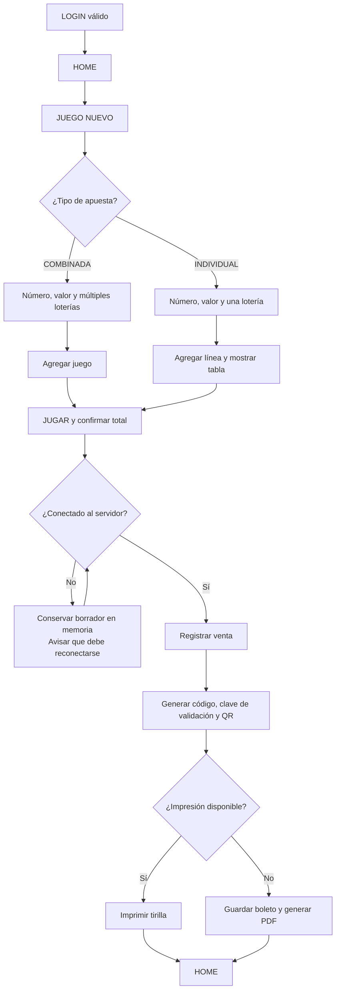
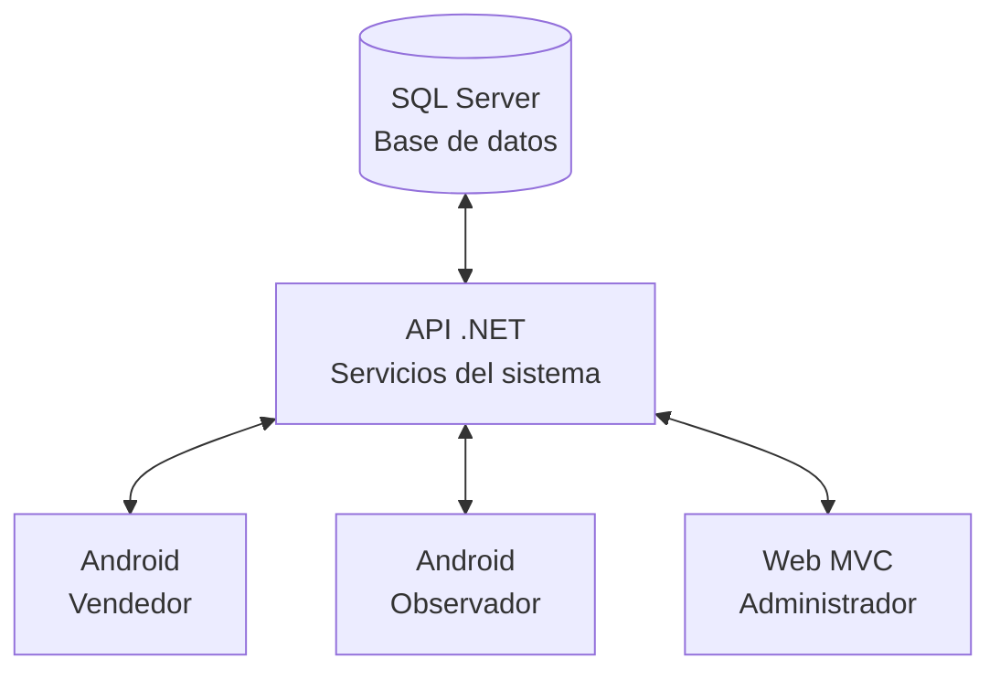
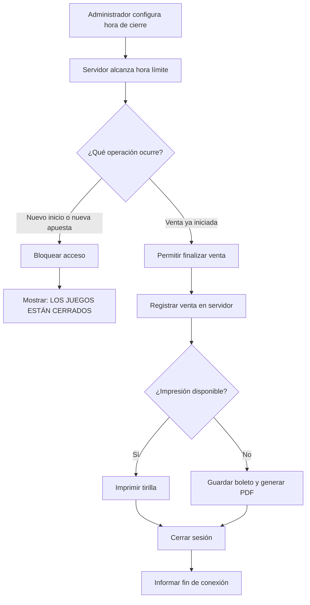
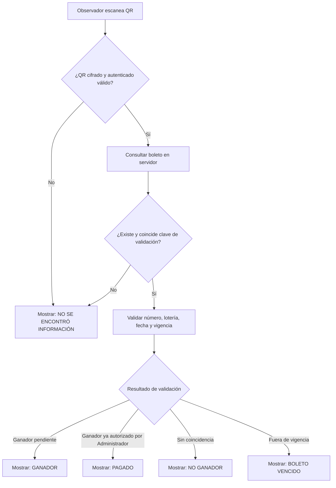
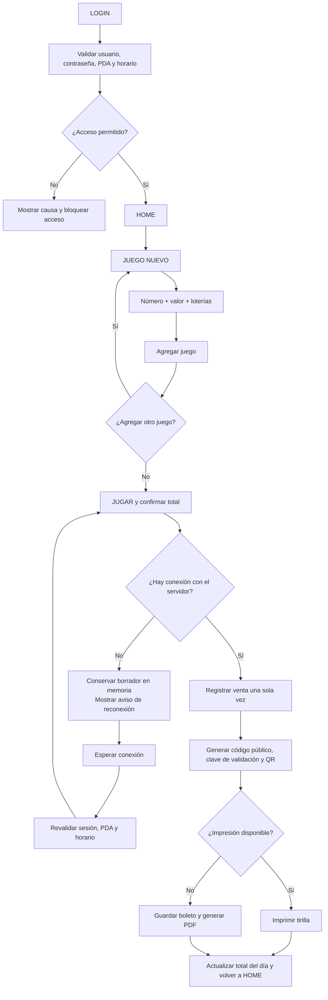

# New Rich — requerimiento refinado

> Estado: listo para decidir apuestas de ciclo.  
> Tecnología objetivo: API .NET, SQL Server, Android para vendedor/observador y ASP.NET MVC sobre IIS para administración.

## 1. Problema

La operación de apuestas necesita registrar ventas desde PDA, emitir un boleto verificable y consultar o validar su resultado sin depender de papel, cálculos manuales ni dispositivos no autorizados. La solución debe mantener la venta disponible cuando una impresora falla o el PDA pierde conexión, y permitir que administración y observación operen con información central y trazable.

El mayor riesgo no es la captura de una apuesta: es permitir boletos falsos, duplicados o cobrados más de una vez; por eso la confirmación y los elementos de seguridad dependen del servidor y no se permiten ventas offline.

## 2. Resultado esperado

Al finalizar los ciclos definidos en este documento, un vendedor autorizado podrá registrar una venta con uno o varios juegos y loterías, imprimir o recuperar la tirilla, y el sistema podrá identificarla y validarla de forma segura. Administración podrá operar usuarios, PDA, loterías, resultados y reportes; observación podrá consultar y validar sin modificar la operación comercial.

## 3. Principios de alcance

- **Tiempo fijo, alcance variable:** cada apuesta tiene un apetito definido; si aparece un riesgo no resuelto, se recorta el alcance opcional antes de extender el ciclo.
- **Trabajo definido, no lista interminable:** el equipo recibe resultados, límites y flujos; decide las tareas técnicas necesarias para terminarlos.
- **Fuente central:** SQL Server y la API son la fuente definitiva. El PDA es una réplica operativa temporal cuando está offline.
- **Seguridad por servidor:** la validez de un boleto, QR, vigencia y cobro se decide en el servidor.
- **No hay cálculo de premios:** el sistema determina ganador, no ganador, vencido o pagado; no calcula ni liquida premios. El valor informado manualmente por el observador sí se registra durante la entrega.

## 4. Apuestas de producto

| Apuesta | Apetito | Resultado que se entrega | Dependencias |
| --- | --- | --- | --- |
| A1. Venta y boleto seguro | 6 semanas | Venta desde PDA autorizado, tirilla/PDF, código y QR validables | API, base de datos, Android vendedor, impresora |
| A2. Resultados y validación | 4 semanas | Registro de ganadores y validación de boleto por QR | A1, administración, Android observador |
| A3. Administración y supervisión | 6 semanas | Gestión de usuarios/PDA/loterías, consultas, KPI y notificaciones | A1, A2 |
| A4. Conectividad obligatoria y soporte | 4 semanas | Pausa y reanudación segura de borradores, más consulta de soporte | A1, A3 |
| A5. Operación offline empresarial con códigos preasignados | 6 semanas | Administrador asigna códigos QR offline, vendedor usa en offline, administrador registra por escaneo | A1, A3, A4 |
| A6. Proceso de validación y entrega de premios ganadores | 6 semanas | Vendedor prevalida ganador, administrador valida y asigna observador, observador registra con datos y 3 fotografías obligatorias | A1, A2, A3 |

Las cinco apuestas conforman el alcance del documento, pero no se deben iniciar simultáneamente. La siguiente apuesta se decide al cierre de la anterior, usando el resultado desplegado y los riesgos descubiertos.

## Trazabilidad con la especificación maestra

| Perfil | Rango vigente en `REQUERIMIENTOS DE SOFTWARE.MD` |
| --- | --- |
| Administrador | RS-001 a RS-040, RS-088 a RS-101, RS-102 a RS-117 |
| Observador | RS-041 a RS-059 |
| Vendedor | RS-060 a RS-086 |
| Operación Offline | RS-087 a RS-101 |
| Proceso de Premios | RS-102 a RS-117 |
| Tirilla de impresión | RS-087 |

La cobertura detallada de estos requisitos se conserva íntegramente en el anexo normativo de este documento.

---

# A1. Venta y boleto seguro

## Problema

El vendedor necesita vender rápido desde un PDA autorizado. La operación debe registrar la venta una sola vez, emitir un comprobante recuperable y resistir una falla de impresión sin perderla.

## Apetito

Seis semanas. El mínimo que debe estar desplegado al cierre es una venta online completa, validable desde el servidor y recuperable como PDF. La capacidad offline completa puede moverse a A4 sin impedir el cierre de A1.

## Solución definida

### Actores y acceso

- El vendedor inicia sesión con usuario, contraseña y PDA previamente asociado.
- Activo/Inactivo controla si puede operar. `estadoValidado` (true/false) controla si debe cambiar la contraseña: true al crear el usuario o al restablecer; false al establecer la contraseña definitiva. `estadoBloqueado` (true/false) controla si el acceso está permanentemente bloqueado por 3 intentos fallidos.
- Si `estadoValidado` es true, ingresa la contraseña temporal y el sistema obliga a definir una contraseña definitiva antes de operar.
- Si ingresa contraseña incorrecta 3 veces, queda bloqueado (`estadoBloqueado = true`) y solo admin puede desbloquearlo.
- La API valida usuario existente y activo, contraseña, PDA registrado/activo/asociado, sesión y horario permitido.
- Fuera del horario no se crean sesiones ni apuestas nuevas; el mensaje es `LOS JUEGOS ESTÁN CERRADOS`.
- Si la hora de cierre llega durante una venta ya iniciada, se permite terminarla; luego se cierra la sesión y se informa que terminó el tiempo de conexión.

### Recorrido de venta



El boleto debe ser de tipo **COMBINADA** o **INDIVIDUAL**, sin mezclar ambos. En COMBINADA, cada juego contiene un número, un valor y múltiples loterías; su total es `valor × cantidad de loterías`. En INDIVIDUAL, cada línea contiene un número, un valor y una sola lotería; el total es la suma de los valores. Los máximos son configurables por el administrador; INDIVIDUAL no puede superar 6 líneas y el botón Agregar se desactiva al alcanzar el máximo. Antes de confirmar se pueden editar o eliminar juegos/líneas.

La confirmación con `JUGAR` registra una venta pagada al portador. No se recopila información personal del comprador.

### Datos mínimos de la venta

La venta guarda: identificadores de venta y boleto, vendedor y alias, fecha/hora, `TipoApuesta` (`COMBINADO` o `INDIVIDUAL`), juegos/líneas, números, valores, loterías, total, estado del boleto, fecha/hora de creación y estado de sincronización cuando aplique.

Estados iniciales del boleto: `Por jugar`, `Jugado`, `Ganador`, `No ganador`, `Vencido` y `Pagado/cobrado`.

### Código público y QR

Cada boleto usa dos identificadores:

| Elemento | Regla |
| --- | --- |
| Identificador interno | GUID/UUID técnico, no expuesto como mecanismo de validación al usuario. |
| Código público | Exactamente 7 dígitos, desde `0000000` hasta `9999999`; conserva ceros a la izquierda, no cambia después de la venta y tiene índice único en la base de datos. |
| Colisión de código | La API genera otro código y vuelve a validar antes de confirmar la transacción. |
| Formato impreso | `RECIBO DE VENTA AOL-1234567`; `AOL-` es solo prefijo visual. |

Al confirmar la venta, el servidor genera una clave de validación aleatoria y única por boleto. El QR transporta un payload cifrado y autenticado que contiene el identificador interno, código público, clave de validación, versión e identificador de clave.

El payload se protege con cifrado autenticado estándar (por ejemplo, AES-GCM). El QR contiene versión, identificador de clave, nonce, texto cifrado y etiqueta de autenticación. La clave maestra de cifrado permanece exclusivamente en el servidor; nunca se incluye en QR, PDA o tirilla. La base de datos almacena el hash de la clave de validación, no su texto plano.

### Tirilla y contingencia

La tirilla muestra código, fecha/hora, juegos, número, valor, loterías, totales, estado, QR y la leyenda `Paga al portador`. Tras confirmar, el PDA intenta imprimir automáticamente en la impresora térmica integrada.

Si falla la impresión, la venta ya confirmada sigue siendo válida: el boleto se guarda localmente, se puede visualizar y se genera PDF para compartir manualmente. La falla nunca revierte ni duplica una venta.

## Límites de A1 (no-gos)

- No calcula fórmulas, multiplicadores ni valores monetarios de premios.
- No incluye operación offline completa ni sincronización automática; eso pertenece a A4.
- No incluye chat, KPI, gestión masiva ni notificaciones.
- No permite que el PDA decida que un QR es válido sin consultar al servidor.

## Riesgos y decisiones

| Riesgo | Decisión de forma |
| --- | --- |
| Dos vendedores reciben el mismo código | Generación dentro de la transacción e índice único; reintento controlado ante colisión. |
| Se falsifica un código de 7 dígitos | El código no acredita autenticidad; solo el QR cifrado y la consulta al servidor la acreditan. |
| Se altera un QR | La verificación de autenticidad del cifrado falla antes de consultar negocio. |
| Impresora no disponible | Persistir la venta primero; PDF es contingencia posterior. |
| Cierre durante pago | Permitir únicamente completar la venta ya abierta y cerrar sesión después. |

## Hecho cuando

- Un vendedor autorizado crea un boleto de varios juegos y loterías y el total es correcto.
- La misma venta no puede confirmarse dos veces.
- Cada boleto tiene GUID/UUID, código público único de 7 dígitos y QR cifrado/autenticado.
- El servidor descifra el QR y compara el hash de su clave de validación con el almacenado.
- La tirilla usa el formato `AOL-1234567`.
- La venta permanece disponible y genera PDF si falla la impresión.

---

# A2. Resultados y validación de boletos

## Problema

El sistema debe responder de forma confiable si un boleto corresponde a un ganador, está vencido o ya fue cobrado, sin calcular cuánto dinero se paga.

## Apetito

Cuatro semanas. La validación debe cubrir QR, existencia, estado, vigencia y coincidencia de número/lotería/fecha. Las reglas comerciales para calcular el premio quedan fuera.

## Solución definida

### Registro de resultados

El administrador registra números ganadores por fecha y lotería. Puede haber varios ganadores en una fecha, pero solo uno por combinación `FechaJuego + LoteriaId`; esa restricción se implementa en la base de datos. El mismo número puede ganar en loterías diferentes.

### Validación por QR

El observador escanea el QR con la cámara. La API:

1. Localiza la clave maestra indicada por el QR y descifra/verifica el payload.
2. Comprueba que boleto, código público y hash de la clave de validación correspondan.
3. Comprueba número, lotería y fecha contra el resultado registrado.
4. Comprueba vigencia y si el boleto fue cobrado previamente.

La vigencia inicial es de 30 días calendario y el administrador la puede cambiar. Solo el Administrador puede autorizar un cobro y cambiar el estado de un boleto ganador a `PAGADO`; el Observador únicamente lo consulta. Estados visuales:

| Resultado | Mensaje |
| --- | --- |
| QR inválido o boleto inexistente | `NO SE ENCONTRÓ INFORMACIÓN` |
| Ganador pendiente | `GANADOR` |
| Ganador ya cobrado | `PAGADO` |
| No coincide | `NO GANADOR` |
| Fuera de vigencia | `BOLETO VENCIDO` |

## Límites de A2 (no-gos)

- No calcula, liquida ni almacena valores de premios.
- No registra identidad del portador.
- No soporta validación autónoma sin red; el estado de cobro debe ser actual.

## Hecho cuando

- El administrador no puede registrar dos resultados para la misma fecha y lotería.
- El observador puede validar un QR y ve el estado correcto.
- Un boleto ganador cobrado deja de mostrarse como pendiente.
- Un QR alterado o un boleto inexistente nunca se valida como auténtico.

---

# A3. Administración y supervisión

## Problema

La operación necesita controlar quién vende, con qué PDA, qué loterías están activas y qué resultados se publican; además debe poder consultar ventas sin dar permisos comerciales a quien solo supervisa.

## Apetito

Seis semanas. La prioridad es operar usuarios, PDA, loterías, resultados, consultas y KPI básicos. Los tableros avanzados o exportaciones se recortan antes de extender el ciclo.

## Solución definida

### Perfiles

| Función | Vendedor | Observador | Administrador |
| --- | --- | --- | --- |
| Crear apuesta / imprimir / PDF | Sí | No | No |
| Consultar ventas e históricos | Propias | Sí | Sí |
| Validar QR | No | Sí | Sí |
| Administrar usuarios, PDA y loterías | No | Solo lectura | Sí |
| Registrar ganadores, horarios y vigencia | No | No | Sí |
| Autorizar cobro y cambiar a `PAGADO` | No | No | Sí |
| Restablecer contraseña | No | No | Sí |
| Crear y administrar grupos | No | No | Sí |
| Cambiar grupo de vendedor | No | No | Sí |
| KPI con filtro por grupos | No | No | Sí |

### Administración

El administrador crea vendedores desde solicitudes externas, con nombre, usuario, alias, documento, contacto, rol, estado operativo (Activo/Inactivo), PDA e información técnica. **Es obligatorio asignar un grupo a cada vendedor** al momento de crearlo. El administrador puede crear nuevos grupos con nombre libremente definible. Al crear un vendedor, `estadoValidado` queda en true y el sistema muestra una contraseña temporal solo en pantalla. Al pulsar `Restablecer contraseña` en el perfil de un vendedor ACTIVO, el sistema muestra una contraseña temporal solo en pantalla, pone `estadoValidado` en true y cierra todas las sesiones abiertas de ese vendedor. Al pulsar `Desbloquear` en el perfil de un vendedor ACTIVO bloqueado, el sistema pone `estadoBloqueado` en false, pone `estadoValidado` en true, resetea el contador de intentos fallidos a 0 y cierra todas las sesiones abiertas de ese vendedor. Al pulsar `Cambiar grupo`, el sistema permite seleccionar un nuevo grupo y reemplaza automáticamente el grupo anterior; el vendedor se mueve con todo su histórico y datos asociados al nuevo grupo. El vendedor solicita el restablecimiento o desbloqueo por un medio externo; el negocio valida la identidad fuera del sistema. Asocia el PDA antes de entregarlo, activa/desactiva usuarios y dispositivos, administra loterías, hora de cierre, vigencia, configuraciones y notificaciones.

Puede consultar por número, vendedor, boleto o lotería; visualizar una tirilla equivalente y revisar ventas, boletos, números, dispositivos y configuraciones. Los KPI mínimos son usuarios activos/inactivos, ventas por período/vendedor/día y números jugados/ganadores, con filtro dinámico por grupo que permite seleccionar información general o de un grupo específico, actualizando todos los indicadores, gráficos y estadísticas en tiempo real. El administrador puede descargar el informe en PDF conservando todos los datos, indicadores y filtros aplicados al momento de la descarga.

Eliminar un usuario elimina en cascada sus accesos, asociación PDA, boletos, ventas, juegos y relaciones. Esta acción es irreversible y requiere confirmación explícita. No se conserva auditoría histórica de esa eliminación, conforme al alcance original.

### Supervisión

El observador opera en modo lectura para vendedores, ventas, números, PDA, configuraciones, históricos, filtros de boletos y validación de QR. No puede crear, modificar, eliminar, configurar, cobrar ni alterar información operativa. La excepción es el chat con el Administrador, que cualquiera de los dos perfiles puede iniciar. El observador no atiende chats de vendedores.

## Límites de A3 (no-gos)

- No incluye permisos personalizados por pantalla; se usa la matriz de tres roles.
- No conserva auditoría de la eliminación de usuarios.
- No incluye recuperación self-service de contraseña ni envío de contraseña por correo, SMS o chat.
- No incluye analítica predictiva, cálculo de premio ni reportes financieros adicionales.
- No permite descargar KPI sin filtro de grupo; el PDF siempre refleja el filtro aplicado al momento de descarga.

## Hecho cuando

- Solo el administrador puede alterar usuarios, PDA, loterías, resultados, vigencia, horario, crear grupos y cambiar grupo de vendedores.
- Crear o restablecer deja `estadoValidado` en true; al establecer la contraseña definitiva pasa a false.
- Desbloquear pone `estadoBloqueado = false`, `estadoValidado = true` y resetea intentos fallidos a 0.
- Restablecer contraseña y desbloquear solo funcionan si el vendedor está ACTIVO.
- Un usuario bloqueado por 3 intentos fallidos solo puede ser desbloqueado por admin.
- Un grupo se puede crear vacío; al crear un vendedor es obligatorio asignarle un grupo.
- Al cambiar de grupo, el vendedor se mueve con todo su histórico al nuevo grupo.
- Los KPI son completamente dinámicos; cambian instantáneamente según el filtro de grupo seleccionado.
- Observador no puede crear apuestas ni modificar configuraciones.
- Las consultas soportan los filtros definidos sin exponer datos de compradores.

---

# A4. Conectividad obligatoria y consulta de soporte

## Problema

La venta requiere conexión con el servidor para preservar la autenticidad del QR y evitar registros locales no verificables. Si la conectividad falla mientras se prepara una venta, el vendedor necesita conservar el borrador y reanudarlo solo cuando el servidor vuelva a estar disponible.

## Apetito

Cuatro semanas. El mínimo es detectar la falta de conexión, conservar el borrador en memoria y revalidar antes de confirmar; además, el Administrador atiende el soporte de los vendedores y puede chatear con observadores. Las mejoras de experiencia no esenciales se recortan primero.

## Solución definida

### Pérdida y recuperación de conexión

Sin conexión, el PDA no puede iniciar ni confirmar ventas. Si la conexión se pierde mientras se arma una venta, el PDA conserva en memoria los juegos, números, valores y loterías seleccionadas, y muestra un aviso que indica que debe conectarse al servidor para realizar la venta y continuar operando el software.

Mientras no se recupere la conexión, no se genera venta, boleto, código público, clave de validación, QR, impresión ni PDF. Al reconectar, el PDA revalida dispositivo, sesión y horario. Solo entonces el vendedor puede confirmar la venta y el servidor registra la operación una única vez mediante una confirmación idempotente.

### Chat de soporte

Los perfiles pueden usar el chat según estos canales:


- El vendedor puede iniciar conversaciones de soporte directamente con el administrador y adjuntar imágenes desde galería, almacenamiento o cámara.
- El sistema no revisa quién está desocupado ni asigna observadores: cualquier vendedor que necesite soporte se conecta con el administrador.
- El administrador atiende y responde el chat del vendedor y puede descargar las imágenes enviadas.
- El observador no participa en el chat de soporte del vendedor ni puede iniciar chats con vendedores.
- El observador no puede modificar información operativa, autorizar pagos, crear configuraciones o cerrar conversaciones.
- El administrador y el observador pueden iniciar y responder chat entre sí.
- Los adjuntos originales en el dispositivo no se eliminan cuando se elimine el contenido almacenado por el sistema.

## Límites de A4 (no-gos)

- No se registran ni sincronizan ventas offline.
- No se elimina contenido original del dispositivo del usuario.
- No se genera QR ni clave de validación fuera del servidor.

## Hecho cuando

- Sin conexión, el sistema informa que debe conectarse para realizar la venta y continuar operando.
- Un borrador en curso se conserva únicamente en memoria hasta recuperar conexión.
- La confirmación posterior no crea ventas duplicadas.
- El vendedor se conecta directamente con el administrador para soporte, sin asignación por disponibilidad.
- El administrador y el observador pueden chatear entre sí; el observador no atiende vendedores.

---

# Modelo mínimo de información

| Área | Entidades principales |
| --- | --- |
| Identidad | Usuarios (Activo/Inactivo, `estadoValidado` y `estadoBloqueado`), Roles, Permisos, UsuariosRoles, Sesiones, IntentosFallidos |
| Grupos | Grupos (nombre, descripción), UsuariosGrupos |
| Dispositivos | Dispositivos, DispositivosUsuarios |
| Juego | Loterias, Ventas, Boletos, Juegos, JuegoLoteria, EstadosBoleto |
| Seguridad de boleto | CodigoPublico (único), ClavesValidacionBoleto (hash), NumerosGanadores |
| Operación | Configuraciones, Notificaciones, Sincronizaciones |
| Soporte | Conversaciones, Mensajes, AdjuntosChat |

Restricciones indispensables: índice único de `CodigoPublico`, índice único de `FechaJuego + LoteriaId` para resultados, y operaciones transaccionales para confirmar venta y asignar identificadores.

# Reglas transversales de seguridad y calidad

- Comunicación HTTPS/TLS; contraseñas con hash seguro; autenticación, autorización y control de sesión.
- La hora que controla la operación viene del servidor; no se confía únicamente en el reloj del PDA.
- Las operaciones de venta son transaccionales y soportan concurrencia de múltiples vendedores.
- La API permite escalar progresivamente vendedores y dispositivos.
- Los datos del comprador no se almacenan.
- El código público es identificador legible; el QR cifrado/autenticado y el servidor son la prueba de autenticidad.

# Cierre de cada apuesta

Cada apuesta se considera terminada cuando está desplegada, sus recorridos mínimos pasan pruebas de aceptación y no quedan riesgos críticos abiertos. Al final del ciclo, el equipo compara lo entregado con el resultado esperado; las mejoras no esenciales se reformulan como una nueva apuesta, no como extensión automática del ciclo.

---

# A5. Operación offline empresarial con códigos preasignados

## Problema

Aunque la arquitectura requiere conexión obligatoria para generar boletos seguros, la realidad operativa puede exigir que el vendedor continúe vendiendo durante interrupciones de conectividad. Sin embargo, permitir la generación de QR offline sin verificación del servidor compromete la seguridad. La solución debe ofrecer un mecanismo empresarial donde códigos y elementos de seguridad se generan en el servidor con anticipación, se distribuyen de forma controlada al PDA, se utilizan solo si hay pérdida de conexión documentada, y se registran formalmente después mediante validación de administrador.

## Apetito

Seis semanas. El mínimo es: administrador genera y asigna códigos offline a usuarios/PDA específicos; PDA sincroniza y almacena los códigos en una base de datos local tipo Lite con capacidad de entre 3.000 y 5.000 códigos; vendedor usa en caso de pérdida de conexión; administrador registra por escaneo de QR fotografiado. Las mejoras de analítica o controles granulares se recortan primero.

## Solución definida

### Módulo Ventas Offline

El administrador accede a un módulo nuevo denominado **"Ventas Offline"** desde la aplicación web. Desde allí:

1. **Generar y asignar códigos:** consulta usuarios activos y PDA registrados, especifica cantidad de códigos a generar, usuario y PDA destino. El sistema genera N códigos con payload cifrado/firmado, los registra en BD con estado **"Generado"**, fecha/hora de creación, usuario y PDA asignados. Cada código tiene un consecutivo único inmutable.

2. **Consultar códigos:** visualiza listado de todos los códigos generados, con filtros por usuario, PDA, fecha, estado y rango de fechas. Puede ver: consecutivo, usuario, PDA, fecha generación, fecha descarga (si la hay), fecha venta (si la hay), estado actual.

3. **Registrar códigos escaneados:** conecta una pistola lectora/escáner al computador, escanea el QR fotografiado que el vendedor envió como evidencia, valida autenticidad e integridad del payload, desencripta y muestra datos de la jugada, habilita botón **"Registrar"**. Al confirmar, registra oficialmente la venta con todos los datos, actualiza estado del código a **"Registrado"**, registra fecha/hora y usuario administrador que lo procesó y descuenta el código del saldo disponible del vendedor y PDA en el backend y la base de datos. Si el código ya estaba registrado, muestra **"QR ya registrado"** sin permitir duplicar.

### Flujo de sincronización y uso en PDA

Cuando el PDA se conecta y autentica correctamente, consulta si existen códigos asignados cuyo estado es **"Generado"**. Por defecto, la descarga es manual: si existen códigos pendientes, muestra **"Tiene códigos offline listos para descargar"**, con botones **"Descargar"**, **"Más tarde"** y **"Buscar y descargar códigos offline"**. Este último inicia una nueva búsqueda e intento de descarga de códigos asignados.

Si el administrador asigna códigos mientras el vendedor está conectado, el PDA muestra inmediatamente la misma ventana. El vendedor puede configurar directamente en su PDA la sincronización automática; cuando está activa, descarga los códigos sin mostrar la ventana.

Los payloads cifrados se almacenan en una base de datos local tipo Lite del PDA, con capacidad de entre 3.000 y 5.000 códigos según la configuración vigente. Los códigos descargados se marcan en BD con estado **"Descargado"** y fecha/hora de descarga.

El Home del vendedor muestra la cantidad de códigos offline disponibles para ese PDA y la actualiza después de cada sincronización y cada uso.

Si el vendedor cierra la aplicación, cierra sesión o apaga el PDA, los códigos offline y sus estados permanecen almacenados en la base local. El sistema solo puede eliminar códigos que ya fueron utilizados y cuya evidencia QR fue enviada al chat del administrador. Los códigos no utilizados no se eliminan por cerrar la aplicación, cerrar sesión o apagar el PDA.

La base local controla la cantidad de códigos almacenados, rechaza descargas que superen su capacidad y notifica al vendedor y al administrador cuando alcanza el límite.

Si durante una venta el PDA detecta ausencia de conexión, informa al vendedor: **"Conexión no disponible. ¿Desea continuar en modo offline?"**. Si acepta y existen códigos offline descargados, consume uno de los códigos locales, asigna su payload a los datos de la jugada (números, valor, loterías), genera el QR desde el payload (sin reencifrar), y muestra: **"Por favor, tomar foto de este código vendido. GRACIAS."** con botón obligatorio **"Listo"**. El vendedor confirma, el sistema guarda la venta localmente, marca el código en BD como **"Utilizado"** con fecha/hora de venta offline, y envía automáticamente el QR fotografiado al chat interno del administrador en un mensaje que dice: **"CÓDIGO VENDIDO OFFLINE — Favor registrar"**. Este mensaje se marca como **permanente** y no se elimina automáticamente al cerrar chat.

### Línea de tiempo de un código

Cada código transita por estos estados:

- **Generado:** acaba de ser creado por el administrador.
- **Descargado:** fue sincronizado al PDA y almacenado localmente.
- **Utilizado:** consumido en una venta offline y enviado como evidencia al administrador.
- **Registrado:** validado y oficialmente registrado en el sistema por el administrador. El consecutivo queda asociado al boleto y a la venta oficial.

El sistema mantiene trazabilidad completa: quién generó cada código, cuándo, a qué usuario/PDA, cuándo fue descargado, cuándo fue vendido, quién lo registró y cuándo.

### Retorno a modo online

Cuando el PDA recupera conexión, revalida sesión, dispositivo y horario automáticamente. Si todo es válido, cambia automáticamente al modo online. Las ventas nuevas utilizan el flujo normal: API genera código, clave de validación y QR; no se consumen códigos offline. Si la reconexión falla, retorna automáticamente a modo offline si hay códigos disponibles.

### Modelo mínimo de información para A5

Se añade a la información existente:

**Nueva tabla central:** `CodigosPreventaOffline` (Consecutivo único, UsuarioId, DispositivoId, PayloadCifrado, EstadoDelCodigo, FechaCreacion, FechaDescarga, FechaVentaOffline, FechaRegistro, AdminQueRegistro, VentaId)

**Base local Lite del PDA:** almacenará una réplica controlada de los códigos asignados, con payload cifrado, estado, metadatos y capacidad de entre 3.000 y 5.000 códigos. La base local no será autoridad del sistema; SQL Server y la API conservarán la fuente definitiva.

---

# A6. Proceso de validación y entrega de premios ganadores

## Problema

Cuando un cliente reporta que ganó un premio, el vendedor necesita validar que el ticket sea genuino y ganador. Sin embargo, la determinación final y la entrega física del premio requiere la intervención de terceros independientes (administrador y observador) para garantizar trazabilidad, prevenir fraude y documentar la entrega. La solución debe permitir validación en etapas: prevalidación por vendedor, validación administrativa con fotografía, asignación a observador, y registro final con datos y pruebas fotográficas obligatorias.

## Apetito

Seis semanas. El mínimo es: vendedor escanea ticket ganador (prevalidación), administrador valida foto y asigna observador, observador registra ganador con datos personales y 3 fotografías obligatorias. Mejoras de análisis granular de rechazos o análisis de fraude se recortan primero.

## Solución definida

### Flujo de validación de ticket ganador

El vendedor accede a **"Validar ticket ganador"** en el menú del PDA. Escanea el QR del ticket. El sistema prevalida:

- QR válido y cifrado correctamente.
- Boleto existe en BD.
- Boleto tiene estado "Jugado" y está vigente.
- Número + lotería + fecha coinciden con un número ganador registrado.
- Boleto no tiene estado "Premio entregado".

Si prevalidación es exitosa, el sistema registra un caso de ganador con estado **"Reportado"** y notifica al administrador. Si falla, muestra motivo específico (boleto vencido, no es ganador, ya registrado, etc.) y no registra caso alguno.

### Etapa administrativa de validación

El administrador accede a **"Casos de premios ganadores"** en la web. Visualiza casos con estado **"Reportado"** con opción de filtrar por fecha, vendedor, PDA. Requiere que se envíe **fotografía del ticket con código QR claramente visible** (a través del chat de soporte). Valida manualmente que la foto corresponda al ticket reportado. Si es válido, cambia estado a **"Validado"** y habilita asignación de observador. Si rechaza, marca como **"Rechazado"** permanentemente.

Desde un caso **"Validado"**, el administrador selecciona observador de la lista de activos y confirma la asignación. Estado cambia a **"Asignado"**. El observador recibe notificación y puede ver el caso en su PDA.

### Etapa de registro por observador

El observador accede a **"Registrar ganador"** en su PDA. Visualiza casos **"Asignado"** o **"En proceso"**. Selecciona un caso y completa formulario con campos obligatorios:

- Nombre completo del ganador.
- Apellido del ganador.
- Número de contacto / celular.
- Lugar donde ganó (texto abierto, ej: "Comercio XXX en calle Y").
- Nombre del vendedor (autocompleta desde datos del ticket).
- Valor total ganado (ingreso manual; el sistema NO calcula premios).
- Persona que entrega el premio (autofill con observador autenticado, NO editable).

El estado cambia a **"En proceso"** cuando comienza el registro. **Tres fotografías obligatorias:**

1. Ticket ganador con código QR visible.
2. Ganador sosteniendo el ticket.
3. Cédula de identidad del ganador.

El observador captura desde cámara o galería. Las fotos se almacenan sin procesamiento automático (sin OCR, sin extracción de datos de cédula). Botón **"Registrar entrega del premio"** solo se habilita cuando todos los campos y las 3 fotos están presentes.

Al confirmar:

- Estado cambia a **"Registrado"**.
- Fecha/hora de registro, observador que registró.
- Marca boleto con estado = **"Premio entregado"**.
- Crea registro de entrega con todos los datos y referencias a fotos.
- Genera comprobante visualizable.

### Estados del caso y cierre permanente

Estados: **Reportado** → **Validado** → **Asignado** → **En proceso** → **Registrado** → **Premio entregado**.

Un ticket con estado **"Premio entregado"** es irreversible:

- No se puede escanear para iniciar nuevo proceso: muestra **"Este ticket ya fue registrado y el premio ya fue entregado."**
- No permite edición de datos.
- Bloquea reclamación múltiple.
- Queda en lectura para auditoría.

### Modelo mínimo de información para A6

Se añaden nuevas entidades:

**Nuevas tablas:**
- `CasosGanadores`: CasoId (GUID, PK), BoletoId (FK), TicketCode (7 dígitos), Estado (enum), FechaReporte, FechaValidacionAdmin, FechaAsignacion, FechaRegistro, VendedorQueReporto, AdminQueValido, ObservadorAsignado, AdminQueAsigno.
- `EntregasGanadores`: EntregaId (GUID, PK), CasoId (FK), NombreGanador, ApellidoGanador, NumeroContacto, LugarGano, NombreVendedor, ValorTotalGanado, PersonaQueEntrega (FK → Usuarios), FechaEntrega, FotoDe evidencias (array de referencias a imágenes).
- `EvidenciasGanador`: EvidenciaId (GUID, PK), EntregaId (FK), TipoEvidencia (enum: TicketConQR, GanadorConTicket, CedulaIdentidad), RutaImagen, FechaCaptura.

**Cambio en tabla existente:**
- `Boletos`: Se agregan campos `EstadoDelPremio` (enum: Vigente, PremioEntregado, Rechazado) y `FechaEntregaPremio` (nullable).

---

# Anexo normativo — Cobertura detallada de los requisitos

Este anexo contiene la especificación completa y vigente de los requisitos RS-001 a RS-087. Ante cualquier diferencia de interpretación, este anexo prevalece sobre el resumen Shape Up o la redacción de la historia de usuario.

# I. Perfil Administrador

El administrador usa la aplicación web MVC y es responsable de administrar la operación, configuraciones, seguridad, información central y criterios de aceptación.

---

## RS-001 — 1. INFORMACIÓN GENERAL


### 1.1. Nombre del proyecto

New Rich

### 1.2. Objetivo

Desarrollar una plataforma integral para la gestión de apuestas que permita registrar, almacenar, consultar, imprimir y validar boletos de apuestas, así como administrar vendedores, observadores, dispositivos PDA, loterías, números ganadores, configuraciones, notificaciones, históricos, soporte y KPI administrativos.

### 1.3. Tecnologías

| Componente | Tecnología |
| --- | --- |
| Lenguaje principal | C# |
| Framework | .NET |
| Aplicación vendedor | Android |
| Aplicación observador | Android |
| Aplicación administrador | ASP.NET MVC |
| Servidor web | IIS |
| Base de datos | Microsoft SQL Server |
| Comunicación | API .NET |
| Impresión | Impresora térmica integrada del PDA |
| QR | Generación y lectura QR |
| Seguridad | HTTPS/TLS + autenticación + criptografía |


---

## RS-002 — 2. DESCRIPCIÓN GENERAL DEL SISTEMA

El sistema estará compuesto por tres aplicaciones principales:

- **Aplicación Android — Vendedor:** registra apuestas, crea uno o varios juegos por boleto, selecciona números y loterías, registra valores, imprime o genera PDF de contingencia, consulta históricos/resultados y solicita soporte.
- **Aplicación Android — Observador:** consulta vendedores, ventas, boletos, números ganadores, dispositivos, históricos y configuraciones; valida boletos mediante QR y puede chatear con el administrador. No atiende chats de vendedores.
- **Aplicación Web — Administrador:** administra usuarios, PDA, loterías, números ganadores, horarios, vigencia, notificaciones y configuraciones; consulta ventas/boletos/vendedores, visualiza KPI y autoriza el estado `PAGADO` de un boleto ganador.

---

## RS-003 — 3. ARQUITECTURA GENERAL

La solución estará basada en una arquitectura centralizada. La base de datos SQL Server será la fuente central de información del sistema.



---

## RS-004 — 4. PERFILES DEL SISTEMA


El sistema contará con tres perfiles principales:

### 4.1. Vendedor

Responsable de registrar y vender apuestas.

### 4.2. Observador

Responsable de supervisar la operación, consultar información, validar boletos y prestar soporte.

### 4.3. Administrador

Responsable de administrar integralmente la plataforma.


---

## RS-005 — 5. SOLICITUD PARA SER VENDEDOR


RF-001 – Solicitud de adquisición del PDA

Una persona interesada en convertirse en vendedor deberá diligenciar un formulario externo desarrollado mediante Google Forms.

El formulario permitirá recopilar la información necesaria para realizar posteriormente la creación del usuario.


---

## RS-006 — 6. CREACIÓN DEL VENDEDOR


RF-002 – Gestión administrativa

El administrador será responsable de revisar la solicitud recibida y realizar manualmente el proceso de incorporación.

Una vez aprobada la solicitud, el administrador deberá crear el usuario desde el panel administrativo.

RF-003 – Información del vendedor

El administrador podrá registrar:

Nombre completo.

Usuario.

Alias.

Cédula.

Celular.

Email.

Rol.

Estado.

PDA asociado.

Información técnica necesaria para asociar el dispositivo.

Al crear el vendedor, `estadoValidado` quedará en true y el sistema mostrará una contraseña temporal únicamente en pantalla. El sistema no enviará esa contraseña por correo, SMS ni chat.


---

## RS-007 — 7. GESTIÓN Y AUTENTICACIÓN DEL PDA


RF-004 – PDA previamente instalado

El propietario del sistema entregará personalmente al vendedor un PDA que tendrá:

Aplicación instalada.

Configuración inicial.

Identificación del dispositivo.

Sin embargo, el dispositivo no podrá operar hasta ser autorizado por el sistema.

RF-005 – Asociación PDA / vendedor

El administrador deberá asociar el PDA con el vendedor antes de realizar la entrega física del dispositivo.

La relación será:

VENDEDOR

│

└── PDA AUTORIZADO

│

└── APLICACIÓN

RF-006 – Primer inicio de sesión

Cuando el vendedor utilice el PDA por primera vez:

Abrirá la aplicación.

Ingresará usuario.

Ingresará contraseña temporal.

El servidor validará las credenciales.

El servidor validará el PDA.

El sistema solicitará establecer una nueva contraseña.

El vendedor establecerá su contraseña definitiva.

El sistema habilitará el acceso.

RF-007 – Validación del dispositivo

Para permitir el acceso deberán validarse como mínimo:

Usuario existente.

Usuario activo.

Contraseña correcta.

PDA registrado.

PDA activo.

PDA asociado al usuario.

Sesión válida.

Horario permitido.

Si alguna condición no se cumple, el acceso deberá ser rechazado.


---

## RS-008 — 8. HORARIO DE OPERACIÓN


RF-008 – Configuración de hora de cierre

El administrador podrá configurar la hora máxima en la cual los vendedores podrán operar.

Ejemplo:

Hora de cierre: 20:00:00

RF-009 – Bloqueo después del cierre

Una vez alcanzada la hora configurada:

Los PDA no podrán iniciar nuevas sesiones.

Los vendedores no podrán iniciar nuevas apuestas.

El sistema mostrará:

LOS JUEGOS ESTÁN CERRADOS

RF-010 – Venta en curso durante el cierre

Si un vendedor ya tiene una venta en curso cuando llega la hora de cierre:

El sistema permitirá terminar la venta actual.

La venta será almacenada.

El boleto será generado.

El boleto será impreso o almacenado como PDF si existe una falla de impresión.

Finalizada la operación, el sistema cerrará la sesión del vendedor.

El sistema mostrará:

No está disponible la operación

El vendedor deberá volver a autenticarse cuando el sistema se encuentre habilitado.


---

## RS-009 — 48. PERFIL ADMINISTRADOR


RF-058

El administrador utilizará la aplicación web desarrollada con MVC .NET y desplegada sobre IIS.


---

## RS-010 — 49. LOGIN ADMINISTRADOR


RF-059

El administrador deberá autenticarse mediante:

Usuario.

Contraseña.


---

## RS-011 — 50. ADMINISTRACIÓN DE NÚMEROS GANADORES


RF-060

El administrador podrá registrar:

Número ganador.

Lotería.

Fecha de juego.


---

## RS-012 — 51. MÚLTIPLES NÚMEROS GANADORES


RF-061

El sistema deberá permitir registrar múltiples números ganadores para una misma fecha de juego siempre que correspondan a diferentes loterías.

Ejemplo:

30/08/2026

Medellín → 1234

Bogotá   → 4561

Cali     → 7890

Armenia  → 3456

Pasto    → 5678

Todos estos registros serán válidos.


---

## RS-013 — 52. RESTRICCIÓN DE NÚMERO GANADOR


RF-062

Para una misma combinación:

Fecha de juego + Lotería

solo podrá existir un único número ganador.

Ejemplo válido

30/08/2026 → Medellín → 1234

30/08/2026 → Bogotá   → 4561

30/08/2026 → Cali     → 7890

Ejemplo no válido

Si ya existe:

30/08/2026 → Medellín → 1234

el sistema deberá impedir:

30/08/2026 → Medellín → 4561

y también:

30/08/2026 → Medellín → 9999

El número puede ser diferente, pero la combinación:

Medellín + 30/08/2026

ya tiene un número ganador registrado.

Regla de base de datos

La tabla correspondiente deberá implementar una restricción única equivalente a:

UNIQUE (FechaJuego, LoteriaId)

Esto garantizará que no puedan existir dos números ganadores para la misma lotería y fecha.

Consideración

El mismo número sí podrá aparecer como ganador en diferentes loterías.

Ejemplo:

30/08/2026 → Medellín → 1234

30/08/2026 → Bogotá   → 1234

Esto será válido.


---

## RS-014 — 53. ADMINISTRACIÓN DE USUARIOS


RF-063

El administrador podrá:

Crear usuarios.

Modificar usuarios.

Activar usuarios.

Desactivar usuarios.

Eliminar usuarios.

Asociar PDA.


---

## RS-015 — 54. ADMINISTRACIÓN DE PDA


RF-064

El administrador podrá:

Registrar PDA.

Asociar PDA.

Desasociar PDA.

Activar PDA.

Desactivar PDA.

Consultar estado.

Consultar usuario asociado.


---

## RS-016 — 55. ADMINISTRACIÓN DE LOTERÍAS


RF-065

El administrador podrá:

Crear loterías.

Modificar loterías.

Activarlas.

Desactivarlas.

Eliminarlas cuando las reglas de negocio lo permitan.


---

## RS-017 — 56. CONFIGURACIONES VARIABLES


RF-066

El administrador podrá parametrizar:

Hora de cierre.

Vigencia de premios.

Loterías disponibles.

Notificaciones.

Cantidad máxima de veces que se puede jugar un número antes de generar alerta.

Valor mínimo para generar alerta.

Otros parámetros definidos posteriormente.


---

## RS-018 — 57. NOTIFICACIÓN POR REPETICIÓN DE NÚMERO


RF-067

El administrador podrá configurar una cantidad máxima de veces que un número puede ser jugado para una misma fecha.

Ejemplo:

Alertar cuando un número sea jugado 10 veces para una misma fecha.

Cuando se alcance el valor configurado se generará una notificación.


---

## RS-019 — 58. NOTIFICACIÓN POR VALOR ALTO


RF-068

El administrador podrá establecer un valor de alerta.

Ejemplo:

Valor de alerta: $10.000

Si un vendedor registra una apuesta igual o superior:

$10.000

el sistema generará una notificación.


---

## RS-020 — 59. CENTRO DE NOTIFICACIONES


RF-069

El administrador contará con un módulo:

Notificaciones

Además, existirá un icono de campana en la parte superior derecha.

Ejemplo:

🔔 5

El número representará la cantidad de notificaciones pendientes.


---

## RS-021 — 60. BÚSQUEDA ADMINISTRATIVA


RF-070

El administrador podrá buscar información mediante diferentes criterios.

Por número

Número apostado.

Por vendedor

Cédula.

Nombre.

Alias.

Fecha.

Por boleto

Código.

Número.

Vendedor.

Fecha.

Estado.

Por lotería

Lotería.

Fecha.

Número.


---

## RS-022 — 61. VISUALIZACIÓN DE BOLETO


RF-071

Al seleccionar una venta, número o boleto, el administrador podrá visualizar la información completa de la boleta en un formato similar a la tirilla impresa.


---

## RS-023 — 62. KPI ADMINISTRATIVOS


RF-072

Únicamente el administrador tendrá acceso al módulo de KPI.

Podrá consultar:

Usuarios

Cantidad de vendedores.

Cantidad de observadores.

Usuarios activos.

Usuarios inactivos.

Ventas

Ventas totales.

Ventas por rango de fechas.

Ventas por vendedor.

Ventas por día.

Números

Números jugados.

Números ganadores.

Fechas de números ganadores.


---

## RS-024 — 63. KPI POR VENDEDOR


RF-073

El administrador podrá seleccionar un vendedor y un rango de fechas.

El sistema mostrará:

Cantidad de ventas.

Total vendido.

Cantidad de boletos.

Números jugados.

Loterías utilizadas.


---

## RS-025 — 64. ELIMINACIÓN DE USUARIOS


RF-074

Únicamente el administrador podrá eliminar usuarios.

Deberá buscar previamente al usuario mediante los criterios disponibles.


---

## RS-026 — 65. CONFIRMACIÓN DE ELIMINACIÓN


RF-075

Al seleccionar eliminar usuario, el sistema deberá mostrar:

Al eliminar el usuario se perderá absolutamente todo el histórico perteneciente al usuario junto con loterías vendidas y números ganadores, y ya no podrá recuperarlo. ¿Está seguro de eliminar el usuario?

Opciones:

Sí.

No.


---

## RS-027 — 66. ELIMINACIÓN EN CASCADA


RF-076

Al confirmar la eliminación, el sistema deberá eliminar los datos relacionados con el usuario.

Como mínimo:

Accesos.

Usuario.

Asociación PDA.

Boletos.

Ventas.

Juegos.

Relaciones con loterías.

Información relacionada.

No se requiere conservar auditoría histórica de la eliminación.


---

## RS-028 — 72. SEGURIDAD


El sistema deberá implementar como mínimo:

Autenticación.

Autorización.

Control de roles.

Asociación de dispositivos.

Control de sesiones.

HTTPS/TLS.

Hash seguro de contraseñas.

Protección del QR.

Validación de servidor.

Control de duplicidad.

Protección de información sensible.


---

## RS-029 — 73. SEGURIDAD DEL PDA


Un PDA no será considerado autorizado simplemente por tener instalada la aplicación.

El acceso dependerá de:

Usuario válido

+

Contraseña válida

+

PDA autorizado

+

PDA asociado al usuario

+

Usuario activo

+

Horario permitido

=

ACCESO PERMITIDO


---

## RS-030 — 74. CONTROL DE HORARIO EN EL PDA


El horario de operación deberá ser controlado por el servidor.

La aplicación no deberá confiar únicamente en la hora configurada localmente en el PDA.

Esto evitará que un usuario modifique la hora del dispositivo para intentar continuar realizando apuestas después del cierre.


---

## RS-031 — 75. REQUERIMIENTOS NO FUNCIONALES


RNF-001 – Rendimiento

Las operaciones normales deberán responder en tiempos adecuados para permitir una venta rápida.

RNF-002 – Disponibilidad

El sistema deberá estar disponible durante los horarios operativos establecidos.

RNF-003 – Integridad

Las operaciones de venta deberán manejarse de forma transaccional.

RNF-004 – Concurrencia

El sistema deberá soportar múltiples vendedores realizando ventas simultáneamente.

RNF-005 – Seguridad

La comunicación deberá utilizar HTTPS/TLS.

RNF-006 – Escalabilidad

La arquitectura deberá permitir incrementar progresivamente la cantidad de vendedores y dispositivos.

RNF-007 – Base de datos

Todo el sistema utilizará una base de datos centralizada SQL Server.


---

## RS-032 — 76. MATRIZ DE PERMISOS


| Funcionalidad | Vendedor | Observador | Administrador |
| --- | --- | --- | --- |
| Iniciar sesión | ✅ | ✅ | ✅ |
| Restablecer contraseña | Admin solo | Admin solo | Admin solo |
| Desbloquear usuario | Admin solo | Admin solo | Admin solo |
| Crear apuesta | ✅ | ❌ | ❌ |
| Imprimir boleto | ✅ | ❌ | ❌ |
| Generar PDF | ✅ | ❌ | ❌ |
| Consultar propias ventas | ✅ | ❌ | ✅ |
| Consultar ventas | ❌ | ✅ | ✅ |
| Consultar históricos | ✅ | ✅ | ✅ |
| Validar QR | ❌ | ✅ | ✅ |
| Ver vendedores | ❌ | ✅ | ✅ |
| Crear usuarios | ❌ | ❌ | ✅ |
| Modificar usuarios | ❌ | ❌ | ✅ |
| Eliminar usuarios | ❌ | ❌ | ✅ |
| Administrar PDA | ❌ | Lectura | ✅ |
| Administrar loterías | ❌ | Lectura | ✅ |
| Registrar números ganadores | ❌ | ❌ | ✅ |
| Configurar horario | ❌ | ❌ | ✅ |
| Configurar vigencia | ❌ | ❌ | ✅ |
| Configurar notificaciones | ❌ | ❌ | ✅ |
| Ver KPI | ❌ | ❌ | ✅ |
| Chat | Con administrador | Con administrador | Con vendedores y observadores |


---

## RS-033 — 77. REGLAS DE NEGOCIO


| Código | Regla |
| --- | --- |
| RN-001 | Un vendedor solo podrá operar desde un PDA autorizado. |
| RN-002 | El primer acceso utilizará una contraseña temporal. |
| RN-003 | El vendedor deberá cambiar la contraseña durante el primer acceso. |
| RN-004 | Un boleto debe seleccionar un tipo inmutable: COMBINADA o INDIVIDUAL. No se pueden mezclar tipos. |
| RN-005 | COMBINADA usa un número, un valor y múltiples loterías por juego; INDIVIDUAL usa líneas independientes con número, valor y una sola lotería. |
| RN-006 | En COMBINADA, el total del juego es `valor × cantidad de loterías`; en INDIVIDUAL, el total es la suma de los valores de sus líneas. |
| RN-007 | El administrador configura el máximo de juegos COMBINADA y el máximo de líneas INDIVIDUAL; este último no puede superar 6. |
| RN-008 | Al alcanzar el máximo configurado, el botón Agregar correspondiente se desactiva y la API rechaza excedentes. |
| RN-009 | Cada boleto tendrá un código público único de exactamente 7 dígitos; los ceros a la izquierda se conservarán y la base de datos garantizará su unicidad. |
| RN-010 | El QR contendrá la clave de validación única del boleto dentro de un payload cifrado y autenticado que el servidor pueda descifrar y verificar. |
| RN-011 | El cliente paga la apuesta al momento de confirmar JUGAR. |
| RN-012 | El sistema no almacenará información personal del comprador. |
| RN-013 | El boleto se paga al portador. |
| RN-014 | El sistema no calculará el valor del premio. |
| RN-015 | El vendedor informará directamente el valor del premio al comprador. |
| RN-016 | Para determinar un ganador deberán coincidir número, lotería y fecha de juego. |
| RN-017 | El boleto ganador deberá encontrarse dentro de la vigencia establecida. |
| RN-018 | El QR deberá ser auténtico y pertenecer al sistema. |
| RN-019 | El boleto deberá existir en la base de datos. |
| RN-020 | Un boleto ganador que ya haya sido cobrado deberá mostrar PAGADO. |
| RN-021 | Un boleto ganador pendiente de cobro deberá mostrar GANADOR. |
| RN-022 | La vigencia inicial será de 30 días calendario. |
| RN-023 | El administrador podrá modificar la vigencia. |
| RN-024 | Una misma fecha podrá tener múltiples números ganadores. |
| RN-025 | Para una misma fecha y lotería solo podrá existir un número ganador. |
| RN-026 | El mismo número podrá ser ganador en diferentes loterías. |
| RN-027 | El administrador podrá configurar la hora de cierre. |
| RN-028 | Después del cierre no podrán iniciarse nuevas apuestas. |
| RN-029 | Una venta que ya esté en curso podrá finalizar antes de cerrar la sesión. |
| RN-030 | Finalizada una venta después del cierre, el vendedor será desconectado. |
| RN-031 | El PDA requiere conexión con el servidor para crear y confirmar ventas; no se permiten ventas offline. |
| RN-032 | Si la conexión falla durante una venta en preparación, el borrador se conserva en memoria y solo puede confirmarse después de reconectar y revalidar sesión, dispositivo y horario. |
| RN-033 | El servidor será la fuente definitiva de información. |
| RN-034 | Si la impresión falla, el boleto deberá poder guardarse como PDF. |
| RN-035 | El PDF podrá enviarse manualmente al cliente. |
| RN-036 | El vendedor podrá registrar solicitudes de soporte directamente con el administrador. |
| RN-037 | El observador no atenderá chats de vendedores ni modificará información operativa; podrá iniciar y responder chat únicamente con el administrador. |
| RN-038 | El administrador atenderá el soporte de los vendedores y podrá iniciar y responder chat con observadores. |
| RN-039 | El cierre de una conversación y la eliminación de su historial solo podrán ejecutarse desde un perfil con permiso de modificación definido por el administrador. |
| RN-040 | Las imágenes originales del dispositivo no serán eliminadas. |
| RN-041 | El administrador podrá eliminar usuarios y sus datos relacionados. |
| RN-042 | El sistema no almacenará el valor monetario del premio ganado. |
| RN-043 | El resultado ganador se determina por número + lotería + fecha. |
| RN-044 | Si un usuario ingresa contraseña incorrecta 3 veces seguidas, queda bloqueado (`estadoBloqueado = true`) y no puede iniciar sesión hasta que el administrador lo desbloquee. |
| RN-045 | El contador de intentos fallidos se resetea cuando el usuario ingresa la contraseña correcta, después de que el administrador lo desbloquea, o cuando el administrador restablece la contraseña. |
| RN-046 | Solo los vendedores pertenecen a grupos; observadores y administrador no pertenecen a ningún grupo. |
| RN-047 | Al crear un vendedor es obligatorio asignarle un grupo de la lista disponible; cada vendedor pertenece a un solo grupo. El administrador puede crear grupos con nombre libremente definible. |
| RN-048 | Al cambiar de grupo un vendedor, el sistema reemplaza automáticamente el grupo anterior y el vendedor se mueve con todo su histórico y datos asociados (ventas, boletos, juegos) al nuevo grupo. |
| RN-049 | Los indicadores KPI son completamente dinámicos: pueden filtrar por general (todos los vendedores) o por un grupo específico; todos los datos, gráficos y estadísticas se actualizan en tiempo real según el filtro seleccionado. |
| RN-050 | El administrador puede descargar el informe KPI en PDF, conservando absolutamente todos los datos, indicadores, filtros de grupo y el estado de la consulta al momento de la descarga. |


---

## RS-034 — 79. FLUJO DE CIERRE DE JORNADA

RF-010 — Venta en curso durante el cierre

Cuando llega la hora configurada, se bloquean nuevos accesos y nuevas apuestas. Una venta que ya estaba en curso puede finalizar; después se cierra la sesión del vendedor.



---

## RS-035 — 81. FLUJO DE NÚMEROS GANADORES


Para una fecha determinada se podrán registrar múltiples números ganadores.

Ejemplo:

FECHA: 30/08/2026

┌─────────────┬────────────────┐

│ LOTERÍA     │ GANADOR        │

├─────────────┼────────────────┤

│ Medellín    │ 1234           │

│ Bogotá      │ 4561           │

│ Cali        │ 7890           │

│ Armenia     │ 3456           │

│ Pasto       │ 5678           │

└─────────────┴────────────────┘

No se podrá registrar:

30/08/2026

Medellín

9999

si ya existe:

30/08/2026

Medellín

1234

La restricción será:

FechaJuego + LoteriaId = único


---

## RS-036 — 82. MODELO CONCEPTUAL DE INFORMACIÓN


La solución deberá contemplar, como mínimo, entidades similares a:

Usuarios

Roles

Permisos

UsuariosRoles

Dispositivos

DispositivosUsuarios

Sesiones

Loterias

Ventas

Boletos

Juegos

JuegoLoteria

NumerosGanadores

EstadosBoleto

Configuraciones

Notificaciones

Conversaciones

Mensajes

AdjuntosChat

Sincronizaciones

ClavesValidacionBoleto

La estructura definitiva será definida durante la etapa de diseño de base de datos.


---

## RS-037 — 83. CRITERIOS GENERALES DE ACEPTACIÓN


El sistema será considerado funcionalmente aceptado cuando:

Un vendedor pueda autenticarse desde un PDA autorizado.

Un vendedor pueda cambiar su contraseña durante el primer acceso.

Un vendedor pueda crear un boleto.

Un boleto pueda contener múltiples juegos.

Un juego pueda contener múltiples loterías.

El sistema calcule correctamente el total.

La venta quede almacenada.

Se genere un código público único de exactamente 7 dígitos, preservando ceros a la izquierda y protegido mediante una restricción única en la base de datos.

Se genere una clave de validación única por boleto y su hash sea almacenado en la base de datos.

Se genere un QR cifrado y autenticado que incluya el identificador del boleto, el código público y la clave de validación.

El servidor pueda descifrar el QR y comprobar que la clave de validación corresponda al boleto.

El boleto pueda imprimirse.

El boleto pueda recuperarse como PDF si falla la impresión.

El histórico permita consultar ventas.

El administrador pueda registrar números ganadores.

Puedan existir múltiples ganadores en una misma fecha para diferentes loterías.

No pueda existir más de un ganador para la misma lotería y fecha.

El mismo número pueda ser ganador en diferentes loterías.

El observador pueda validar boletos mediante QR.

El sistema determine si un boleto es ganador.

El sistema determine si está pagado/cobrado.

El sistema determine si está vencido.

El sistema controle el horario de cierre.

Una venta en curso pueda finalizar después de llegar la hora de cierre.

El vendedor sea desconectado después de finalizar dicha venta.

Si no hay conexión, el PDA informe que debe conectarse para realizar una venta y continuar operando.

Si se pierde conexión durante una venta en preparación, el borrador permanezca en memoria y pueda confirmarse solo tras reconectar y revalidar.

El administrador pueda gestionar usuarios.

El administrador pueda gestionar PDA.

El administrador pueda gestionar loterías.

El administrador pueda configurar parámetros.

El sistema pueda generar notificaciones.

El administrador pueda consultar KPI.

El sistema pueda gestionar el chat.

El sistema pueda enviar imágenes.

El historial del chat pueda eliminarse al cerrar la conversación.

El administrador pueda eliminar usuarios y sus datos relacionados.


---

## RS-038 — 84. DEFINICIÓN DE LO QUE EL SISTEMA HACE Y NO HACE


El sistema SÍ:

Registra apuestas.

Registra vendedores.

Registra observadores.

Registra PDA.

Registra loterías.

Registra números ganadores.

Valida boletos.

Determina si un boleto es ganador.

Determina si un boleto está vigente.

Determina si un boleto ya fue cobrado.

Genera códigos únicos.

Genera QR.

Imprime boletos.

Genera PDF de contingencia.

Requiere conexión con el servidor para registrar ventas y generar elementos verificables del boleto.

Conserva en memoria el borrador de una venta interrumpida hasta recuperar conexión.

Gestiona históricos.

Gestiona soporte.

Genera notificaciones.

Genera KPI.

Controla el horario de operación.

El sistema NO:

Calcula premios.

Determina cuánto dinero gana el portador.

Registra el valor del premio.

Registra quién compró el boleto.

Registra información personal del comprador.

Administra diferentes tipos de premios.

Realiza cálculos de multiplicadores de premios.

El vendedor será responsable de informar al comprador el valor correspondiente del premio.


---

## RS-039 — 85. REQUERIMIENTOS EXPLÍCITAMENTE APROBADOS


Como resultado de las aclaraciones realizadas al levantamiento, quedan establecidos los siguientes puntos:

Ganador

Un boleto gana cuando:

Número + Lotería + Fecha coinciden con un resultado ganador válido.

Además:

QR válido.

Boleto existente.

Dentro del período de reclamación.

No cobrado previamente.

Premio

El sistema:

No calcula ni liquida el valor del premio. El valor informado manualmente por el observador sí se registra al confirmar la entrega.

Múltiples loterías

Un número puede jugarse en múltiples loterías.

Números ganadores

Para una misma fecha:

Se pueden registrar múltiples números ganadores.

Pero:

Una misma lotería solo puede tener un número ganador para una fecha determinada.

Pago de la apuesta

El cliente paga la apuesta al momento de presionar:

JUGAR

Cobro del premio

El sistema podrá indicar si un boleto ganador ya fue cobrado.

Código

Cada boleto tendrá un:

Código público único de exactamente 7 dígitos, preservando ceros a la izquierda y garantizado por la base de datos. La autenticidad se comprobará mediante un QR que contiene una clave de validación única por boleto dentro de un payload cifrado y autenticado por el servidor.

Impresión

Si falla la impresora:

El boleto permanece almacenado y puede generarse como PDF.

Conectividad

El PDA requiere conexión con el servidor para confirmar una venta. Si la conexión se pierde durante la preparación, el borrador se conserva en memoria y se informa al vendedor que debe conectarse para realizar la venta y continuar operando el software.

Cierre

Al llegar la hora configurada:

Los nuevos accesos serán bloqueados.

Una venta que ya esté en curso podrá finalizar.

Posteriormente:

El usuario será desconectado.

Eliminación

El administrador podrá eliminar usuarios y sus datos relacionados sin conservar auditoría histórica de la eliminación.


---

## RS-040 — 86. APROBACIÓN DEL DOCUMENTO


La aprobación del presente documento por parte del cliente representa la aceptación del alcance funcional definido.

La aprobación incluye:

Perfiles.

Funcionalidades.

Flujos.

Reglas de negocio.

Operación de vendedores.

Operación de observadores.

Administración.

Gestión de PDA.

Gestión de loterías.

Gestión de apuestas.

Gestión de boletos.

QR.

Validación.

Números ganadores.

Vigencia.

Horarios.

Operación offline.

Sincronización.

Chat.

Notificaciones.

KPI.

Cualquier funcionalidad, modificación o comportamiento no contemplado en este documento deberá ser tratado como una solicitud de cambio y deberá ser evaluado antes de incorporarse al desarrollo.


---

# II. Perfil Observador

El observador usa la aplicación Android en modo lectura para supervisar, consultar y validar boletos. No puede crear, modificar, eliminar, cobrar, configurar ni alterar información operativa del sistema. La única excepción es el chat con el Administrador, que cualquiera de los dos perfiles puede iniciar. El observador no atiende chats de vendedores.

---

## RS-041 — 30. PERFIL OBSERVADOR


RF-040

El observador utilizará una aplicación Android.

La información y las acciones operativas disponibles para el observador serán exclusivamente de lectura.

El observador podrá escanear y consultar la validación de un QR, pero no podrá cambiar el estado de un boleto, autorizar pagos, crear, modificar, eliminar, configurar ni alterar datos. Podrá iniciar y responder chat con el Administrador. No atenderá chats de vendedores.


---

## RS-042 — 31. HOME OBSERVADOR


RF-041

El Home podrá mostrar:

Número ganador.

Lotería.

Fecha.

Información operativa relevante.

Los resultados serán ingresados por el administrador.


---

## RS-043 — 32. CONSULTA DE VENDEDORES


RF-042

El observador podrá consultar todos los vendedores registrados.

Podrá visualizar:

Nombre.

Alias.

Estado.

PDA asociado.

Información operativa disponible.


---

## RS-044 — 33. CONSULTA DE VENTAS


RF-043

El observador podrá consultar las ventas.

Filtros:

Vendedor.

Fecha inicial.

Fecha final.

Número.

Lotería.


---

## RS-045 — 34. CONSULTA DE NÚMEROS


RF-044

El observador podrá consultar:

Número.

Valor apostado.

Vendedor.

Fecha.

Loterías.

Estado.


---

## RS-046 — 35. CONSULTA DE DISPOSITIVOS


RF-045

El observador podrá consultar:

PDA conectados.

PDA desconectados.

Usuario asociado.

Estado del dispositivo.


---

## RS-047 — 36. CONSULTA DE CONFIGURACIONES


RF-046

El observador podrá consultar las configuraciones realizadas por el administrador.

La información será únicamente de lectura.


---

## RS-048 — 37. VALIDACIÓN DE BOLETOS MEDIANTE QR


RF-047

El observador contará con una funcionalidad:

VALIDAR BOLETO

Podrá:

Escanear QR.

Utilizar la cámara.

Leer el QR.

Validar su autenticidad.

Consultar el boleto.


---

## RS-049 — 38. BOLETO INEXISTENTE


RF-048

Si el QR no corresponde a un boleto registrado:

NO SE ENCONTRÓ INFORMACIÓN


---

## RS-050 — 39. BOLETO EXISTENTE


RF-049

Si el boleto existe, el sistema mostrará:

Código del boleto.

Vendedor.

Fecha.

Hora.

Juegos.

Números.

Valores.

Loterías.

Total apostado.

Estado.

Resultado.

Vigencia.


---

## RS-051 — 40. VALIDACIONES DEL BOLETO


RF-050

El sistema deberá validar:

Existencia del boleto.

Autenticidad del QR.

Número.

Lotería.

Fecha del juego.

Resultado.

Vigencia.

Estado de cobro.


---

## RS-052 — 41. FILTROS DE BOLETOS


RF-051

El observador podrá filtrar boletos por:

Por jugar.

Jugados.

Ganadores.

No ganadores.

Vencidos.

Pagados/cobrados.


---

## RS-053 — 42. CHAT INTERNO


RF-052

El vendedor podrá iniciar un chat interno de soporte directamente con el administrador. El sistema no asignará observadores ni revisará disponibilidad.

El flujo principal será:


---

## RS-054 — 43. REGLAS DEL CHAT


RF-053

Vendedor

Podrá iniciar una conversación de soporte directamente con el administrador.

No podrá comunicarse por chat con observadores.

Observador

Podrá iniciar y responder chat con el administrador.

No atenderá chats de vendedores ni podrá iniciar conversaciones con vendedores.

No podrá modificar datos operativos, autorizar pagos, crear configuraciones ni cerrar conversaciones.

Administrador

Atenderá todas las solicitudes de soporte iniciadas por vendedores.

Podrá iniciar y responder chat con observadores. El observador también podrá iniciar chat con el administrador.


---

## RS-055 — 44. CONEXIÓN DIRECTA DE SOPORTE


RF-054

El sistema no revisará quién está desocupado ni asignará un observador a una solicitud de soporte. Cualquier vendedor que necesite soporte se conectará directamente con el administrador.


---

## RS-056 — 45. ENVÍO DE IMÁGENES


RF-055

El chat permitirá enviar imágenes desde:

Galería.

Almacenamiento del dispositivo.

Cámara.


---

## RS-057 — 46. ELIMINACIÓN DEL HISTORIAL DEL CHAT


RF-056

El observador no podrá cerrar conversaciones ni eliminar historial o imágenes. Cualquier acción de cierre o eliminación deberá ejecutarse desde un perfil con permiso de modificación definido por el administrador.


---

## RS-058 — 47. DESCARGA DE IMÁGENES


RF-057

El administrador podrá recibir, consultar y descargar imágenes enviadas por el vendedor, sin modificar ni eliminar su contenido.

En el chat entre administrador y observador, cualquiera de los dos podrá descargar las imágenes compartidas.

El nombre del archivo será generado mediante:

YYYY-MM-DD_HH-MM-SS

Ejemplo:

2026-08-30_14-30-25.jpg


---

## RS-059 — 80. FLUJO DE VALIDACIÓN DEL BOLETO

El Observador consulta y valida el boleto sin modificar datos. El Administrador es el único perfil que puede autorizar el cambio posterior a `PAGADO`.



---

## RS-060 — 9. PERFIL VENDEDOR


RF-011 – Inicio de sesión

El vendedor deberá autenticarse mediante:

Usuario.

Contraseña.

Validación del dispositivo.


---

## RS-061 — 10. HOME DEL VENDEDOR


RF-012 – Dashboard

El Home deberá mostrar:

Total vendido durante el día.

Botón Juego nuevo.

Menú principal.

Estado de sesión.

Ejemplo:

VENTAS DEL DÍA

$250.000

[ JUEGO NUEVO ]


---

## RS-062 — 11. CREACIÓN DE JUEGOS

La creación de juegos se realiza seleccionando un único tipo de boleto: COMBINADA o INDIVIDUAL. No se pueden mezclar tipos.

En COMBINADA, un juego contiene un número, un valor y múltiples loterías activas; su total es `valor × cantidad de loterías`.

En INDIVIDUAL, cada línea contiene un número, un valor y una sola lotería activa; las líneas se muestran en tabla y pueden editarse o eliminarse antes de confirmar.

El máximo de juegos COMBINADA y el máximo de líneas INDIVIDUAL son configurables por el administrador. INDIVIDUAL no puede superar 6 líneas y el botón Agregar se desactiva al alcanzar el máximo.


RF-013 – Juego nuevo

Al seleccionar:

JUEGO NUEVO

el sistema abrirá una ventana con:

Valor.

Número apostado.

Lista de loterías.

Botón Agregar juego.

Botón Cancelar.

RF-014 – Número apostado

El vendedor deberá ingresar el número que desea jugar.

RF-015 – Valor apostado

El vendedor deberá ingresar el valor correspondiente al número.

RF-016 – Selección de loterías

El vendedor podrá seleccionar una o varias loterías.

El mismo número y el mismo valor se aplicarán a todas las loterías seleccionadas.

Ejemplo:

Número: 1234

Valor: $1.000

Loterías:

✓ Bogotá

✓ Cali

✓ Medellín

✓ Armenia

✓ Pasto

Cantidad de loterías:

5

Total:

$1.000 × 5 = $5.000


---

## RS-063 — 12. MÚLTIPLES JUEGOS POR BOLETO


RF-017 – Agregar múltiples juegos

Un boleto COMBINADO podrá contener el máximo de juegos configurado; un boleto INDIVIDUAL podrá contener hasta 6 líneas o el máximo menor configurado.

Ejemplo:

JUEGO 1

NÚMERO: 1234

VALOR: $1.000

BOGOTÁ

CALI

MEDELLÍN

ARMENIA

PASTO

TOTAL: $5.000

JUEGO 2

NÚMERO: 9876

VALOR: $1.000

BOGOTÁ

CALI

MEDELLÍN

TOTAL: $3.000

RF-018 – Total del boleto

El total del boleto será la suma de los valores totales de todos sus juegos.

Ejemplo:

Juego 1 = $5.000

Juego 2 = $3.000

TOTAL APOSTADO = $8.000


---

## RS-064 — 13. MODIFICACIÓN DEL BOLETO


RF-019 – Agregar juego

Mientras el boleto no haya sido confirmado, el vendedor podrá agregar nuevos juegos.

RF-020 – Eliminar juego

El vendedor podrá eliminar un juego antes de confirmar la venta.

El sistema deberá solicitar confirmación mediante un modal:

¿Está seguro de eliminar este juego?

Opciones:

Sí.

No.

Al confirmar, el sistema descontará el valor correspondiente del total.

RF-021 – Cancelar boleto

El vendedor podrá cancelar completamente el boleto antes de confirmar la venta.


---

## RS-065 — 14. CONFIRMACIÓN DE LA VENTA


RF-022 – Botón JUGAR

El vendedor seleccionará:

JUGAR

El sistema mostrará un modal:

VALOR TOTAL A PAGAR: $8.000

Opciones:

Aceptar.

Cancelar.

RF-023 – Pago de la apuesta

El cliente deberá pagar el valor total de la apuesta en el momento en que el vendedor confirme la operación mediante el botón JUGAR.

Por lo tanto, la venta se considerará pagada desde el momento de su confirmación.

El sistema no almacenará información personal del comprador.

El boleto se considera:

PAGADO AL PORTADOR


---

## RS-066 — 15. REGISTRO DE LA VENTA


RF-024

Al confirmar la venta se deberá almacenar:

ID de venta.

ID de boleto.

ID del vendedor.

Nombre o alias del vendedor.

Fecha.

Hora.

Juegos.

Números.

Valores.

Loterías.

Total apostado.

Estado del boleto.

Fecha/hora de creación.

Estado de sincronización cuando corresponda.


---

## RS-067 — 16. ESTADOS DEL BOLETO


El sistema deberá manejar los diferentes estados de negocio del boleto.

Como mínimo deberá contemplar:

Por jugar.

Jugado.

Ganador.

No ganador.

Vencido.

Pagado/cobrado.

La implementación técnica podrá utilizar un catálogo de estados para evitar depender exclusivamente de múltiples campos booleanos.


---

## RS-068 — 17. IDENTIFICADOR DEL BOLETO


RF-025 – Código único

Cada boleto deberá tener un identificador único dentro del sistema.

Se manejarán dos identificadores:

Identificador interno

Identificador técnico de la base de datos, generado como GUID / UUID.

Código público

Código numérico de exactamente 7 dígitos, con valores entre `0000000` y `9999999`.

El código público deberá ser único dentro del sistema, no repetirse, estar asociado inequívocamente al boleto y conservar los ceros a la izquierda. No podrá modificarse después de confirmar la venta.

La base de datos deberá garantizar la unicidad mediante una restricción o índice único sobre `CodigoPublico`. Si se presenta una colisión durante la generación, el sistema deberá generar y validar un nuevo código antes de confirmar la venta.

El código público no reemplaza el GUID / UUID ni constituye por sí solo una prueba de autenticidad del boleto.


---

## RS-069 — 18. CÓDIGO QR


RF-026

Cada boleto deberá contener un código QR.

El QR deberá permitir identificar y validar el boleto.

Al confirmar la venta, el servidor deberá generar una clave de validación única por boleto, aleatoria y criptográficamente segura.

El QR deberá contener un payload cifrado y autenticado con, como mínimo:

- Identificador interno del boleto.
- Código público de 7 dígitos.
- Clave de validación única del boleto.
- Versión del formato e identificador de la clave de cifrado activa.

El payload será cifrado en el servidor con un mecanismo estándar de cifrado autenticado, como AES-GCM. El QR contendrá la versión, identificador de clave, nonce, texto cifrado y etiqueta de autenticación necesarios para que el servidor lo valide.

La clave maestra de cifrado permanecerá exclusivamente en el servidor. No se incluirá en el QR, el PDA ni la tirilla, ni siquiera cifrada. La base de datos almacenará únicamente el hash criptográfico de la clave de validación, no su valor en texto plano.

Durante la validación, el servidor deberá identificar la clave maestra aplicable, descifrar y verificar la autenticidad del payload, comprobar que el boleto exista, comparar el hash de la clave de validación con el almacenado y validar código público, estado, vigencia y reglas de negocio.

No se desarrollará un algoritmo criptográfico propio. El objetivo será impedir que un tercero modifique o fabrique información de un boleto válido.


---

## RS-070 — 19. IMPRESIÓN DEL BOLETO


RF-027

Después de confirmar la venta, el PDA deberá imprimir automáticamente el boleto utilizando la impresora térmica integrada.


---

## RS-071 — 20. FORMATO DEL BOLETO


El boleto deberá contener como mínimo uno de los siguientes formatos.

**Formato COMBINADO: un solo juego**

```
===========================
RECIBO DE VENTA AOL-1234567
===========================
Fecha: YYYY-MM-DD  Hora: HH:MM:SS
Tipo de apuesta: COMBINADO
===========================
JUGADO
===========================
NÚMERO       VALOR       TOTAL
1234         $1000       $5000
LOTERÍAS: BOGOTÁ, CALI, MEDELLÍN, ARMENIA, PASTO
===========================
TOTAL APOSTADO             $5000
===========================
QR
===========================
```

**Formato INDIVIDUAL: varias líneas, hasta el máximo configurado**

```
===========================
RECIBO DE VENTA AOL-1234567
===========================
Fecha: YYYY-MM-DD  Hora: HH:MM:SS
Tipo de apuesta: INDIVIDUAL
===========================
JUGADO
===========================
NÚMERO       VALOR       LOTERÍA
1234         $1000       BOGOTÁ
652          $2000       CALI
3654         $3000       MEDELLÍN
===========================
TOTAL APOSTADO             $6000
===========================
QR
===========================
```

En ambos formatos se imprime la leyenda de pago al portador y la vigencia del boleto.

**GRACIAS POR SU COMPRA.

CONSERVE SU TICKET EN PERFECTO ESTADO.** Será requisito indispensable para el cobro del premio. **Vigencia: 30 días calendario** desde su emisión. Vencido este plazo, **el premio caducará y no será pagado.**


---

## RS-072 — 21. FALLA DE IMPRESIÓN


RF-028

Si la venta se registra correctamente pero la impresora presenta una falla:

La venta deberá permanecer registrada.

El boleto deberá almacenarse localmente en el PDA.

El vendedor podrá visualizar nuevamente el boleto.

El sistema permitirá seleccionar un nombre para el archivo.

Se generará un PDF.

El usuario podrá enviar manualmente el PDF al cliente mediante WhatsApp u otro medio disponible.

La falla de impresión no deberá provocar la pérdida de la venta.


---

## RS-073 — 22. FINALIZACIÓN DE LA VENTA


RF-029

Después de finalizar una venta:

Se registra la venta.

Se registra el boleto.

Se genera el código único.

Se genera la clave de validación única y se almacena únicamente su hash.

Se genera el QR.

Se imprime el boleto.

Si la impresión falla, se habilita el mecanismo PDF.

Se actualiza el total vendido del día.

El sistema retorna al Home.


---

## RS-074 — 23. HISTÓRICO DEL VENDEDOR


RF-030 – Histórico

El menú deberá contener:

Histórico

El vendedor podrá consultar sus ventas anteriores.

RF-031 – Calendario

El histórico mostrará un calendario.

El usuario podrá seleccionar un rango de fechas.

La ventana máxima de consulta será:

Hoy → 10 días atrás.

RF-032 – Información histórica

Para el período seleccionado se mostrará:

Total vendido.

Ventas.

Boletos.

Juegos.

Números.

Valores.

Loterías.

Estado.

La información será de solo lectura.


---

## RS-075 — 24. RESULTADOS Y NÚMEROS GANADORES


RF-033

El vendedor podrá consultar los números ganadores registrados por el administrador.

El sistema comparará:

Número apostado.

Lotería.

Fecha del juego.

Número ganador.

Vigencia.

Estado del boleto.

Autenticidad del QR.


---

## RS-076 — 25. DEFINICIÓN DE BOLETO GANADOR


RF-034

Un boleto será considerado GANADOR cuando se cumplan todas las siguientes condiciones:

El número apostado coincide exactamente con el número ganador.

La lotería apostada coincide con la lotería que tiene registrado dicho número ganador.

La fecha del juego corresponde a la fecha del resultado.

El boleto se encuentra dentro del período de reclamación.

El QR es válido.

El QR pertenece al sistema.

El boleto existe en la base de datos.

El boleto no ha sido cobrado previamente.


---

## RS-077 — 26. CÁLCULO DEL PREMIO


RF-035

El sistema NO realizará cálculo de premios.

No existirá dentro del sistema:

Fórmula de premio.

Multiplicador.

Tabla de premios.

Valor ganado.

Registro del dinero ganado por el portador.

El vendedor será responsable de informar directamente al comprador el valor correspondiente al premio según las reglas comerciales definidas por el propietario del sistema.

El sistema únicamente determinará si el boleto corresponde a un resultado ganador.


---

## RS-078 — 27. COBRO DEL PREMIO


RF-036

El sistema deberá permitir determinar si un boleto ganador ya fue cobrado.

Solo el Administrador podrá autorizar el pago y cambiar el estado de un boleto ganador a `PAGADO`. El Observador únicamente podrá consultar y visualizar ese estado.

El sistema no almacenará información personal del comprador o portador.

El boleto se considera:

Pagado al portador

cuando corresponda.

RF-037 – Estado de premio

Al validar un boleto:

Ganador no cobrado

Mostrar:

GANADOR

En color verde.

Ganador ya cobrado

Mostrar:

PAGADO

En color rojo.

No ganador

Mostrar:

NO GANADOR

Fuera del período

Mostrar:

BOLETO VENCIDO


---

## RS-079 — 28. VIGENCIA DEL PREMIO


RF-038

El administrador podrá configurar la cantidad de días permitidos para reclamar un premio.

Valor inicial:

30 días calendario

El sistema deberá realizar automáticamente la validación de vigencia.


---

## RS-080 — 29. MÚLTIPLES LOTERÍAS POR JUEGO


RF-039

Un mismo número podrá jugarse en diferentes loterías.

Ejemplo:

Número: 1234

Valor: $1.000

Loterías:

Bogotá

Cali

Medellín

Armenia

Pasto

El sistema deberá considerar cada combinación:

Número + Lotería + Fecha de juego

para efectos de validación.

Un número podrá resultar ganador en una lotería y no ganador en otra.

Ejemplo:

Número jugado: 1234

Medellín → 1234 → GANADOR

Bogotá   → 4561 → NO GANADOR

Cali     → 7890 → NO GANADOR


---

## RS-081 — 67. DISPONIBILIDAD DE CONEXIÓN PARA VENTAS


RF-077

El PDA deberá tener conexión con el servidor para crear, confirmar y registrar una venta. No se permitirán ventas offline.

Si el dispositivo no tiene conexión antes de iniciar una venta, el sistema deberá informar al vendedor que debe conectarse para realizar la venta y continuar operando el software.


---

## RS-082 — 68. PÉRDIDA DE CONEXIÓN DURANTE UNA VENTA


Si la conexión se pierde mientras el vendedor está armando una venta, el sistema conservará en memoria el borrador de juegos, números, valores y loterías seleccionadas.

El sistema mostrará un aviso indicando que debe conectarse al servidor para realizar la venta y continuar operando el software.

Mientras no se recupere la conexión, no se podrá confirmar la venta, registrar el boleto, generar código público, clave de validación, QR, impresión ni PDF.


---

## RS-083 — 69. REANUDACIÓN DESPUÉS DE RECUPERAR CONEXIÓN


RF-078

Cuando el PDA recupere la conexión, conservará disponible el borrador en memoria y validará nuevamente el estado del dispositivo, la sesión y el horario de operación.

Solo después de esas validaciones el vendedor podrá confirmar la venta. El servidor registrará la operación una única vez y devolverá la confirmación antes de generar los elementos del boleto.


---

## RS-084 — 70. CONTROL DE DUPLICIDAD DE CONFIRMACIÓN


RF-079

Como no se almacenan ventas offline, no existirá sincronización de ventas pendientes. La API deberá controlar que una confirmación enviada después de reconectar no registre la misma venta más de una vez.

La solución deberá contemplar un identificador de intento de confirmación, control de duplicidad y respuesta idempotente del servidor.


---

## RS-085 — 71. SERVIDOR COMO FUENTE DEFINITIVA


RF-080

La información central del servidor será considerada la fuente definitiva del sistema.

Ante una reconexión o reintento de confirmación, el servidor detectará duplicidad, conservará la integridad y devolverá el resultado de la operación. El PDA no decidirá ni registrará ventas de forma autónoma.


---

## RS-086 — 78. FLUJO COMPLETO DE UNA VENTA

El vendedor requiere conexión con el servidor para confirmar la venta y generar código público, clave de validación y QR. Si la conexión se pierde mientras arma el boleto, el borrador queda solo en memoria hasta reconectar.



---

# IV. Tirilla de impresión

El siguiente requisito conserva el formato de comprobante definido para la impresión y la contingencia PDF.

---

## RS-087 — 87. TIRILLA DE IMPRESIÓN


**Formato COMBINADO: un solo juego**

```
===========================
RECIBO DE VENTA AOL-1234567
===========================
Fecha: YYYY-MM-DD  Hora: HH:MM:SS
Tipo de apuesta: COMBINADO
===========================
JUGADO
===========================
NÚMERO       VALOR       TOTAL
1234         $1000       $5000
LOTERÍAS: BOGOTÁ, CALI, MEDELLÍN, ARMENIA, PASTO
===========================
TOTAL APOSTADO             $5000
===========================
QR
===========================
```

**Formato INDIVIDUAL: varias líneas**

```
===========================
RECIBO DE VENTA AOL-1234567
===========================
Fecha: YYYY-MM-DD  Hora: HH:MM:SS
Tipo de apuesta: INDIVIDUAL
===========================
JUGADO
===========================
NÚMERO       VALOR       LOTERÍA
1234         $1000       BOGOTÁ
652          $2000       CALI
3654         $3000       MEDELLÍN
===========================
TOTAL APOSTADO             $6000
===========================
QR
===========================
```

En ambos formatos se imprime la leyenda de pago al portador y la vigencia del boleto.
**GRACIAS POR SU COMPRA.

CONSERVE SU TICKET EN PERFECTO ESTADO.** Será requisito indispensable para el cobro del premio. Vigencia: 30 días calendario desde su emisión. Vencido este plazo, el premio caducará y no será pagado.
